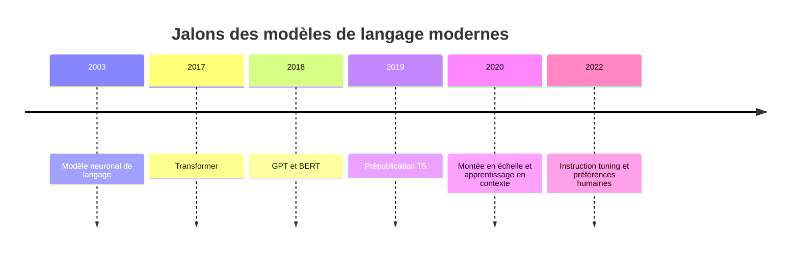
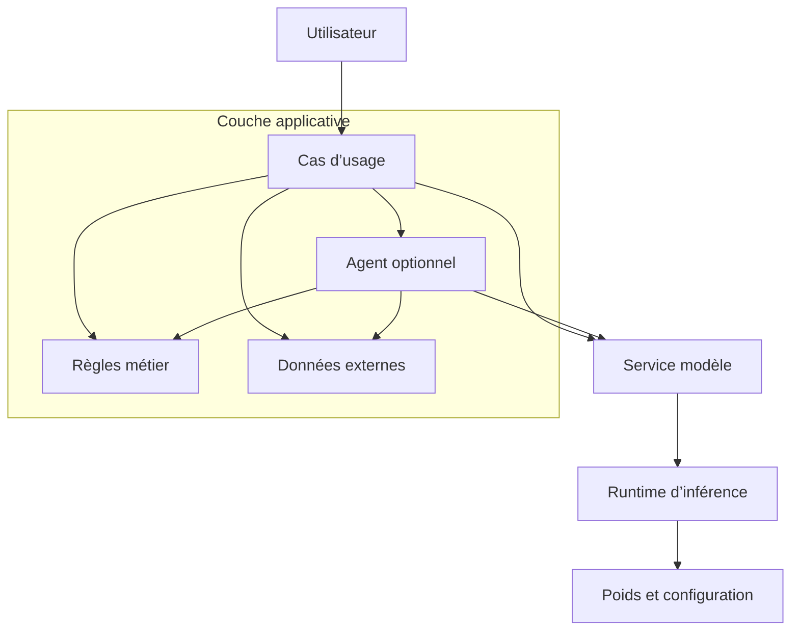
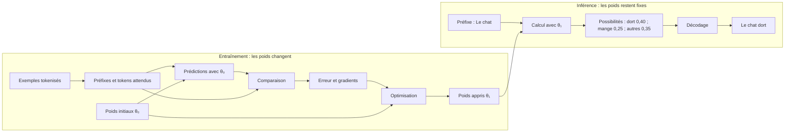
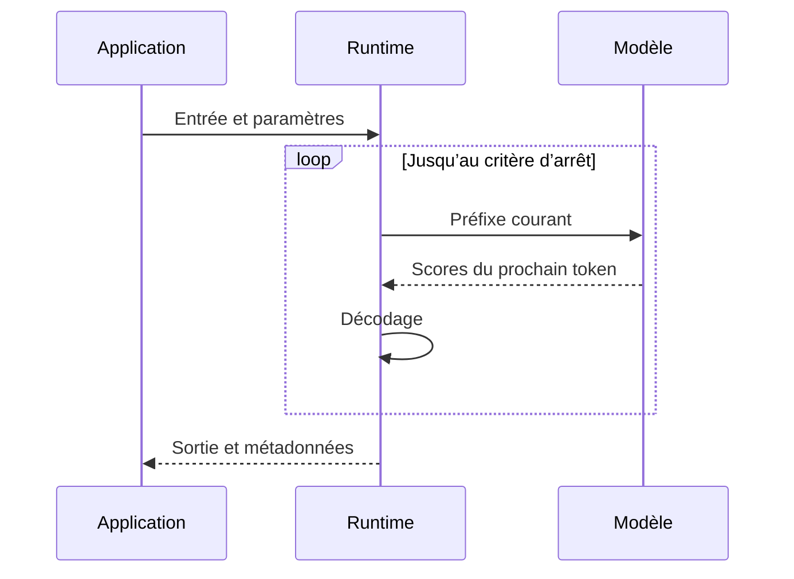
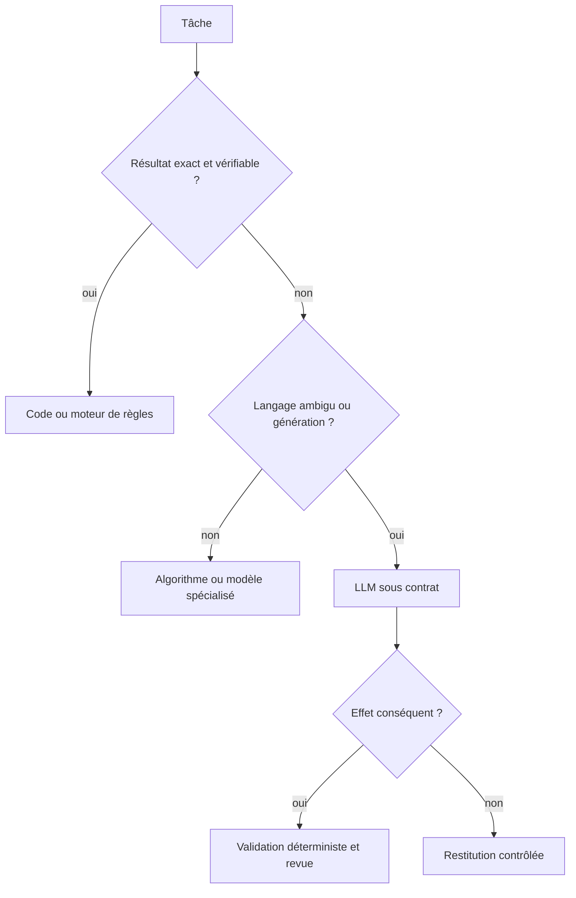
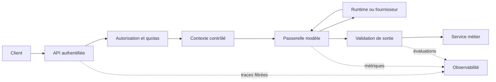

# Qu’est-ce qu’un LLM ?

## Objectifs pédagogiques

À la fin de ce chapitre, vous saurez :

- définir un grand modèle de langage sans le confondre avec son service ou son application ;
- distinguer les principales familles de modèles et leurs objectifs d’entraînement ;
- séparer entraînement, inférence et décodage ;
- placer un composant probabiliste derrière des contrats déterministes ;
- reconnaître les tâches adaptées à un LLM et celles qui exigent une règle métier ;
- esquisser une architecture exploitable en production.

## Introduction

Un client peut décrire le même incident de dizaines de façons. Avant de définir
un LLM, observons la petite transformation qu’il peut proposer. Elle ne prend
encore aucune décision financière.

!!! transformation "Transformation — Du message libre à une proposition structurée"

    1. **Entrée** — `J’ai été débité deux fois de 49,90 € pour la commande A-1042.`
    2. **Opération** — le LLM repère une catégorie, extrait les éléments mentionnés et normalise le montant
    3. **Sortie** — `{"categorie_proposee": "double_debit", "commande": "A-1042", "montant_evoque": 49.90, "devise_evoquee": "EUR"}`

    | Élément du message | Champ proposé |
    |---|---|
    | `débité deux fois` | `categorie_proposee = "double_debit"` |
    | `49,90 €` | `montant_evoque = 49.90` et `devise_evoquee = "EUR"` |
    | `commande A-1042` | `commande = "A-1042"` |

    **Lecture linéaire** — message en français → extraction et normalisation
    proposées par le LLM → brouillon structuré.

    **Statut de l’exemple** — Valeurs pédagogiques : la sortie est inventée,
    aucun modèle n’a été exécuté et rien n’a été vérifié.

Le séparateur décimal a changé, mais la devise a été conservée. Le montant et
la commande proviennent toujours du récit du client, pas d’un registre
comptable. Le code doit vérifier l’existence de la commande, la présence de
deux débits et le droit de l’utilisateur à agir sur ce dossier.

!!! definition "Définition — Grand modèle de langage (LLM)"

    Un [grand modèle de langage, ou LLM](../glossaire.md#llm), est un modèle
    neuronal préentraîné à grande échelle sur des données séquentielles. Il
    apprend des régularités statistiques et produit des représentations ou des
    distributions conditionnelles utiles à des tâches de langage. Le mot
    « grand » n’a pas de seuil universel : il décrit une combinaison de
    capacité, de volume de données et de coût d’apprentissage qui évolue avec
    l’état de l’art.

Pour construire une première intuition, lisez le schéma suivant de gauche à
droite. Les cercles représentent des nombres, pas des mots. Les connexions
transportent des valeurs pondérées apprises. Un LLM réel contient bien davantage
de couches et des mécanismes spécialisés ; cette figure montre seulement l’idée
d’une transformation numérique progressive.

{ .aia-figure loading=lazy }

*Figure 1 — Réseau neuronal volontairement simplifié. `Input`, `Hidden` et
`Output` signifient entrée, couche intermédiaire et sortie. Source : [Cburnett,
Wikimedia Commons](https://commons.wikimedia.org/wiki/File:Artificial_neural_network.svg),
[CC BY-SA 3.0](https://creativecommons.org/licenses/by-sa/3.0/).*

Cette définition parle d’un **modèle**, pas d’un produit. Les poids ne fournissent seuls ni API, ni authentification, ni mémoire persistante, ni accès à des outils. Ils n’accordent aucune garantie de vérité ou de conformité métier. Une application LLM ajoute ces responsabilités autour du modèle.

Cette frontière est fondamentale pour l’architecte. Une faiblesse du modèle se traite par l’évaluation, le contexte ou le choix d’un autre modèle. Une erreur d’autorisation se traite dans l’application. Confondre les deux conduit à demander au composant probabiliste des garanties qu’il ne peut pas fournir.

## Historique

Les modèles de langage probabilistes précèdent l’apprentissage profond. Ils estiment la plausibilité d’une séquence à partir de ce qui la précède ou l’entoure. Les modèles neuronaux ont ensuite remplacé une partie des tables de fréquences par des représentations apprises, capables de partager de l’information entre des contextes proches.

En 2003, [Bengio et ses coauteurs](https://www.jmlr.org/papers/v3/bengio03a.html) formalisent un modèle neuronal de langage qui apprend simultanément une représentation distribuée des mots et une distribution sur le mot suivant. En 2017, [l’architecture Transformer](https://proceedings.neurips.cc/paper/2017/hash/3f5ee243547dee91fbd053c1c4a845aa-Abstract.html) se passe de récurrence au profit de mécanismes d’attention et facilite le calcul parallèle pendant l’entraînement. Elle devient la base de la plupart des LLM contemporains, sans faire partie pour autant de la définition éternelle d’un LLM.

La période suivante fait apparaître plusieurs trajectoires. [BERT](https://aclanthology.org/N19-1423/) popularise le préentraînement d’encodeurs par masquage. [GPT-1](https://cdn.openai.com/research-covers/language-unsupervised/language_understanding_paper.pdf) combine préentraînement autorégressif et adaptation supervisée, puis [GPT-3](https://proceedings.neurips.cc/paper/2020/hash/1457c0d6bfcb4967418bfb8ac142f64a-Abstract.html) documente l’apprentissage en contexte avec peu d’exemples à plus grande échelle. [T5](https://www.jmlr.org/papers/v21/20-074.html) traite de nombreuses tâches comme une transformation texte-vers-texte avec un encodeur-décodeur. L’ajustement par instructions et l’apprentissage à partir de préférences rendent ensuite les modèles génératifs plus faciles à piloter en conversation.



Cette chronologie ne raconte pas une marche automatique vers une intelligence générale. Elle montre plutôt l’évolution des objectifs d’apprentissage, des architectures et des interfaces d’usage.

## Le problème

Un logiciel traditionnel manipule des symboles selon des règles explicites. Cette approche est excellente lorsque le contrat est stable : vérifier un plafond, calculer une taxe ou refuser une permission. Elle devient coûteuse face à la variabilité du langage. Deux demandes sémantiquement proches peuvent employer des mots, des langues et des structures très différents.

Un LLM apporte une interface probabiliste à cette variabilité. Il peut résumer un récit, extraire des intentions, reformuler une réponse ou proposer une suite plausible. Il peut généraliser au-delà des cas écrits un à un par le développeur. En échange, sa sortie varie avec l’entrée, le contexte, la version du modèle et la stratégie de décodage. Une formulation convaincante peut être inexacte.

Le choix d’architecture n’est donc pas « règles ou LLM » pour tout le système. Il consiste à placer chaque responsabilité au bon endroit :

- le LLM peut traiter l’ambiguïté et le langage non structuré ;
- le code vérifie les invariants, les permissions et les effets ;
- les données externes apportent les faits qui ne résident pas dans la requête ;
- l’orchestrateur décide de l’ordre, des délais et des reprises ;
- l’évaluation mesure le comportement observé.

Un modèle plus puissant ne supprime pas ces responsabilités. Il peut réduire certaines erreurs, jamais transformer une prédiction en preuve.

## Architecture générale

Une architecture saine distingue cinq responsabilités. L’**artefact modèle** contient poids, configuration et tokenisation. Le **runtime d’inférence** le charge et exécute les opérations numériques. Le **service modèle** expose un contrat réseau et gère versions, quotas et isolation. L’**application** construit la requête, applique les règles et consomme la réponse. Un **agent** relève de cette couche applicative : il compose modèle, état et outils dans une boucle contrôlée.



Dans cette vue, les flèches représentent un appel ou une dépendance entre
responsabilités. Elles ne décrivent pas l’ordre chronologique d’une requête.

Un fournisseur managé peut regrouper artefact, runtime et service sans fusionner leurs responsabilités. Ces frontières permettent de changer de fournisseur, d’exécution ou de boucle agentique sans réécrire le domaine.

!!! warning
    Un modèle n’acquiert pas une permission parce qu’il a proposé une action. L’application doit authentifier le sujet, autoriser l’effet et valider les arguments avant toute exécution.

## Fonctionnement détaillé

Le fonctionnement devient plus clair en séparant la famille du modèle, son apprentissage et le cycle d’une requête.

### Trois familles, trois axes

Il faut séparer l’architecture, l’objectif de préentraînement et le
post-entraînement. Pour rendre les trois familles observables, le tableau part
de trois entrées concrètes. Les sorties sont pédagogiques : elles montrent leur
forme, pas les valeurs d’un modèle commercial.

| Famille | Entrée concrète | Transformation fréquente | Sortie visible |
|---|---|---|---|
| Encodeur | `Le paiement est bloqué.` | Le texte entier devient une représentation contextualisée | Une liste de nombres par unité, réutilisable par un classifieur ou un moteur de recherche |
| Décodeur | `Le paiement a été` | Une distribution est calculée pour la prochaine unité | Une possibilité : `refusé` avec \(0{,}51\), puis la génération peut continuer |
| Encodeur-décodeur | `Résume : le client décrit deux débits pour A-1042.` | L’entrée est encodée, puis une nouvelle séquence est générée | `Double débit signalé pour A-1042.` |

Un encodeur ne « répond » donc pas nécessairement avec du texte. Un décodeur
propose une suite possible. Un encodeur-décodeur transforme explicitement une
séquence d’entrée en une autre séquence.

Pour un décodeur causal, la probabilité d’une séquence finie se factorise selon
la règle de la chaîne :

\[
P_\theta(x_1,\ldots,x_T) =
\prod_{t=1}^{T} P_\theta\!\left(x_t \mid x_1,\ldots,x_{t-1}\right)
\]

où :

- \(T\) est un entier strictement positif : la longueur de la séquence, mesurée
  en tokens ;
- \(t\) est un indice entier compris entre \(1\) et \(T\), sans unité ;
- \(x_t\) est le token à la position \(t\), choisi dans le vocabulaire fini du
  modèle ;
- \(x_1,\ldots,x_{t-1}\) est le préfixe déjà observé ; pour \(t=1\), ce
  préfixe est vide ;
- \(\theta\) désigne l’ensemble des poids appris, considérés comme fixes pendant
  une inférence ordinaire ;
- \(P_\theta\) est la distribution de probabilité discrète définie par ces
  poids ; chaque probabilité appartient à \([0,1]\) et n’a pas d’unité.

Cette égalité se lit ainsi : la probabilité attribuée aux \(T\) positions
considérées est le produit, position après position, de la probabilité du token
courant conditionnée par tous les tokens qui le précèdent. Elle exprime la
factorisation causale d’un décodeur, pas une approximation du comportement de
toutes les familles de modèles. Sans token de fin, elle mesure un préfixe et ne
dit pas que la génération s’arrête après \(x_T\).

Un exemple numérique rend ce produit observable. Le symbole `␠` rend visible
l’espace qui appartient ici au token suivant ; ce découpage est fictif et sera
expliqué au [chapitre 2](02-les-tokens.md).

!!! transformation "Transformation — Des probabilités locales à celle d’une suite"

    1. **Entrée** — trois tokens pédagogiques : `Le`, `␠chat`, `␠dort`
    2. **Opération** — multiplier chaque probabilité conditionnelle
    3. **Sortie** — probabilité attribuée à ce préfixe de trois tokens : \(0{,}04\), soit \(4\,\%\)

    | Position | Préfixe déjà observé | Token évalué | Probabilité | Produit cumulé |
    |---:|---|---|---:|---:|
    | 1 | préfixe vide | `Le` | \(0{,}20\) | \(0{,}20\) |
    | 2 | `Le` | `␠chat` | \(0{,}50\) | \(0{,}10\) |
    | 3 | `Le␠chat` | `␠dort` | \(0{,}40\) | \(0{,}04\) |

    \[
    0{,}20 \times 0{,}50 \times 0{,}40 = 0{,}04
    \]

    **Lecture linéaire** — probabilités par position → multiplication →
    probabilité du préfixe considéré.

    **Statut de l’exemple** — Valeurs pédagogiques, inventées pour le calcul.

Ces \(4\,\%\) ne signifient ni « la phrase est vraie », ni « le modèle est sûr
à \(4\,\%\) ». Ils mesurent seulement la masse de probabilité attribuée à ce
préfixe par ce modèle fictif.

La relation ne décrit ni l’objectif masqué d’un encodeur comme BERT, ni tout le
calcul d’un encodeur-décodeur. Dans ce livre, « LLM » inclut les trois familles ;
certains usages réservent pourtant le terme aux grands modèles génératifs. La
convention doit donc être explicite.

### De l’entraînement à l’inférence

Pendant le préentraînement, un pipeline sélectionne des données, les transforme en unités discrètes, calcule une erreur selon un objectif, puis ajuste les poids par optimisation. Des étapes ultérieures peuvent spécialiser le modèle avec des exemples d’instructions, des préférences ou des données métier. La qualité dépend du protocole de données et d’évaluation, pas du seul nombre de paramètres.

Le visuel suivant sépare les deux temps qu’un débutant confond souvent.
Pendant `TRAINING`, ou entraînement, les données contribuent à produire un
modèle entraîné. Pendant `INFERENCE`, ou inférence, de nouvelles entrées
traversent ce modèle pour produire des sorties : l’entraînement n’est pas relancé
pour chaque demande.

{ .aia-figure .aia-figure--wide loading=lazy }

*Figure 2 — Vue d’ensemble du cycle apprentissage puis utilisation. Les libellés
anglais se lisent `inputs` = entrées, `training` = entraînement, `trained model`
= modèle entraîné, `inference` = inférence et `outputs` = sorties. Source :
[YOKOTA Kuniteru, Wikimedia Commons](https://commons.wikimedia.org/wiki/File:Workflow_of_a_machine-learning-based_AI_system.png),
[CC BY-SA 4.0](https://creativecommons.org/licenses/by-sa/4.0/).*

La figure donne l’intuition globale. Le diagramme suivant zoome sur ce qui change
réellement : les poids pendant l’entraînement, puis le préfixe pendant une
génération.



Les flèches montrent ici le passage des données ou d’un état de poids à
l’opération suivante. Les probabilités sont pédagogiques. La transformation
\(\theta_0 \rightarrow \theta_1\) résume en pratique de très nombreuses
itérations d’entraînement. Pendant la transformation `Le chat` → `Le chat dort`,
\(\theta_1\) ne change pas.

!!! definition "Définition — Inférence"

    Une [inférence](../glossaire.md#inference) est l’exécution d’un modèle
    entraîné afin de calculer une sortie à partir d’une entrée. Lors d’une
    inférence ordinaire, les poids restent fixes. Elle ne doit être confondue ni
    avec l’entraînement, qui ajuste ces poids, ni avec l’application complète
    qui entoure le modèle.

Le runtime calcule des scores ou des représentations. Pour une génération, une
politique de décodage transforme les scores en tokens ; elle peut être
déterministe ou échantillonner. Avec un décodeur, le cycle continue jusqu’à
l’arrêt. L’historique d’une conversation ne constitue donc pas un apprentissage
durable.

Les mêmes poids peuvent réagir différemment au contexte et au décodage ; une sortie répétable n’est pas nécessairement correcte. Le contrat sépare contenu, modèle, configuration, ressources consommées et cause d’arrêt.

### Repères avancés

Les distinctions précédentes suffisent pour comprendre le cycle. Pour
dimensionner un système, il faut ensuite considérer d’autres axes.

Indépendamment de sa famille, un modèle peut être **dense** ou n’activer qu’un
sous-ensemble d’experts. Il peut être **de base**, ajusté aux instructions,
conversationnel ou spécialisé. Un LLM devient aussi un **modèle de fondation**
lorsqu’un préentraînement large permet de nombreux usages. Les termes ne sont
pas synonymes : des modèles de fondation couvrent d’autres modalités, et un
modèle de langage peut rester petit ou spécialisé.

Les [lois d’échelle](https://arxiv.org/abs/2001.08361) relient empiriquement
perte, calcul, données et paramètres dans un protocole donné.
[Chinchilla](https://proceedings.neurips.cc/paper_files/paper/2022/file/c1e2faff6f588870935f114ebe04a3e5-Paper-Conference.pdf)
souligne l’allocation entre taille et données. Dans des couches à
[experts clairsemés](https://www.jmlr.org/papers/v23/21-0998.html), l’architecte
distingue paramètres totaux et activés par token, tout en comptant routage,
communications et composants denses. Précision, séquence, matériel et
regroupement des requêtes influencent aussi le coût. Seule l’évaluation mesure
l’usage réel.

## Diagrammes

Ces deux vues isolent le cycle génératif, puis le choix du composant de contrôle.

### Cycle de génération autorégressive

La sortie partielle revient dans l’entrée logique, mais cette boucle ne modifie pas les poids.



### Choix du composant

Ce diagramme aide à décider où placer une responsabilité. Les systèmes utiles sont souvent hybrides.



## Études de cas architecturales

Les trois cas suivants ne sont pas des recettes. Chacun isole une frontière
d’architecture et suit le même raisonnement : ce qui entre, ce qui se transforme,
ce qui sort, puis ce qu’il manque pour rendre le service exploitable.

### Cas 1 — Un assistant exécuté localement

Une équipe veut résumer des notes sans envoyer leur contenu à un service
externe. Elle place un modèle local derrière une petite interface.

!!! transformation "Transformation — De la note au brouillon local"

    1. **Entrée** — `Réunion : livraison décalée au 18 juin ; prévenir Léa.`
    2. **Opération** — l’application transmet la note au runtime local, qui génère un résumé
    3. **Sortie** — `Livraison reportée au 18 juin ; Léa doit être prévenue.`

    **Lecture linéaire** — note → appel au modèle local → brouillon de résumé.

    **Statut de l’exemple** — Valeurs pédagogiques ; aucune inférence réelle n’a
    été exécutée.

Le modèle local réduit un transfert réseau, mais ne crée ni identité, ni
persistance, ni politique de rétention. En production, il faut encore gérer le
cycle de vie du runtime, le démarrage, les limites de ressources, les délais,
l’authentification, l’évaluation et les traces filtrées. La décision durable
n’est pas « utiliser un modèle local » : c’est **isoler la capacité de génération
derrière un contrat exploitable**.

### Cas 2 — Produire plusieurs brouillons puis les agréger

Une équipe cherche à réduire la dépendance à une réponse unique. Quatre appels
indépendants proposent un brouillon ; un cinquième appel reçoit ces brouillons et
compose une synthèse.

!!! transformation "Transformation — De l’éventail à la synthèse"

    1. **Entrée** — une question, quatre modèles candidats et un budget de cinq appels
    2. **Opération** — lancer quatre générations en parallèle, puis transmettre leurs résultats à un agrégateur
    3. **Sortie** — quatre brouillons conservés et une synthèse finale traçable

    **Lecture linéaire** — question → éventail de quatre appels → agrégation →
    synthèse accompagnée des brouillons.

    **Statut de l’exemple** — Topologie pédagogique ; le nombre d’appels ne
    garantit aucun gain de qualité.

Cette topologie est un **fan-out/fan-in applicatif**. Elle ne correspond pas à un
modèle à experts, dont le routage se produit à l’intérieur des poids. Elle
multiplie le coût et les possibilités d’échec. Un service robuste borne chaque
appel, annule les tâches devenues inutiles, conserve les résultats partiels,
protège les secrets et mesure le gain réel de l’agrégation face à un appel
unique.

### Cas 3 — Normaliser un récit sans décider à sa place

Un utilisateur décrit un incident à l’oral. Le LLM peut proposer une structure ;
le code doit valider cette structure et garder la décision conséquente hors du
modèle.

!!! transformation "Transformation — Du récit au dossier à vérifier"

    1. **Entrée** — `J’ai payé deux fois la même commande hier.`
    2. **Opération** — transcrire, extraire un brouillon, valider le schéma, puis appliquer une règle de routage
    3. **Sortie** — `{"motif_propose": "double_debit", "statut": "a_verifier"}`

    **Lecture linéaire** — récit → proposition probabiliste → validation
    déterministe → dossier en attente de preuve.

    **Statut de l’exemple** — Valeurs pédagogiques ; le brouillon ne prouve pas
    qu’un double débit existe.

La validation de schéma garantit une **forme**, pas une vérité métier. La
production ajoute un état durable, des politiques versionnées, un journal
d’audit intègre, des contrôles d’accès, une reprise après erreur et un chemin
humain. Le cas révèle la frontière centrale du chapitre : le LLM traite la
variabilité du récit ; les composants déterministes protègent la décision.

| Cas | Ce que le LLM apporte | Garantie conservée hors du modèle |
|---|---|---|
| Assistant local | Reformulation d’un texte variable | Identité, ressources, rétention et disponibilité |
| Éventail puis agrégation | Diversité de brouillons et synthèse | Budgets, délais, annulation et mesure du gain |
| Récit vers dossier | Proposition de structure | Preuve, règle métier, état durable et autorisation |

## Implémentation sans framework

Avant de choisir un framework, un petit contrat typé suffit à matérialiser la frontière :

```python
from dataclasses import dataclass
from typing import Literal, Protocol

FinishReason = Literal["length", "end_of_sequence"]

@dataclass(frozen=True)
class ModelResponse:
    text: str
    model_id: str
    finish_reason: FinishReason
    input_tokens: int
    output_tokens: int

class LanguageModel(Protocol):
    @property
    def model_id(self) -> str: ...

    def generate(
        self,
        prompt: str,
        *,
        max_output_tokens: int,
        seed: int | None = None,
    ) -> ModelResponse: ...
```

Ce port cible volontairement la **génération** d’un décodeur ; un encodeur exposerait une autre capacité, par exemple `encode` ou `classify`. Le nom `LanguageModel` reste ici pédagogique et local à l’exemple.

L’application dépend d’une capacité, non d’un fournisseur. Un faux déterministe peut tester les erreurs et les limites sans appel réseau. L’exemple placé dans `examples/python-pur/modele-langage/` emploie exactement ce contrat et un minuscule modèle bigramme pour rendre visible une distribution et un décodage reproductible. Ce modèle n’est ni un Transformer ni un LLM ; il sert uniquement à observer le contrat.

## Implémentation avec les frameworks

Pour une génération isolée, ajouter un framework complet augmente souvent la surface de dépendances sans créer de frontière utile. Les six frameworks ci-dessous deviennent pertinents lorsque le flux gagne des sources, des étapes, de l’état ou des outils.

### LangChain

[LangChain](https://docs.langchain.com/oss/python/langchain/overview) compose modèles, messages et sorties. Un adaptateur direct suffit ici ; le chapitre 32 étudiera ses abstractions.

### LangGraph

[LangGraph](https://docs.langchain.com/oss/python/langgraph/overview) représente état, transitions et reprise. Une inférence isolée n’est pas un graphe ; voir le chapitre 33.

### Agno

[Agno](https://docs.agno.com/) assemble modèle, outils, mémoire et interface agentique. Cette commodité ne doit pas effacer les frontières détaillées au chapitre 34.

### LlamaIndex

[LlamaIndex](https://developers.llamaindex.ai/python/framework/) organise l’ingestion et l’accès aux données. Sans corpus externe ici, son abstraction attend le chapitre 35.

### Haystack

[Haystack](https://docs.haystack.deepset.ai/docs/intro) compose des pipelines mesurables de retrieval et de génération. Envelopper un appel unique serait artificiel ; voir le chapitre 36.

### OpenAI Agents SDK

L’[OpenAI Agents SDK](https://openai.github.io/openai-agents-python/) coordonne outils, délégations, garde-fous et traces. Une inférence isolée n’en a pas besoin ; voir le chapitre 40.

## Comparaison des approches

| Approche | Couplage fournisseur | Flux de contrôle | État et reprise | Bon usage |
|---|---|---|---|---|
| SDK direct | Diffus sans enveloppe locale | Écrit par l’application | À construire | Une capacité, un fournisseur |
| Port et adaptateur | Isolé dans l’adaptateur | Écrit par l’application | À construire | Tests et remplacement ciblé |
| Chaîne ou graphe | Déplacé vers le framework | Pipeline ou graphe déclaré | Primitives dédiées | Plusieurs étapes et reprise |
| Agent avec outils | Modèle et runtime agentique | Dynamique, mais borné | Runtime agentique | Décision dynamique évaluée |

Le port applicatif n’impose pas de rendre tous les fournisseurs interchangeables. Il stabilise le besoin métier. Les différences de modèles restent visibles dans l’adaptateur et dans les tests d’acceptation.

## Cas d’usage

Un LLM convient à une transformation sémantique tolérant une incertitude mesurée : classer des demandes libres, extraire un brouillon structuré, résumer, traduire ou assister l’exploration d’un corpus.

Une règle, une requête ou un algorithme classique convient mieux aux calculs exacts, aux contrôles d’accès, à l’unicité, aux soldes, aux seuils réglementaires et aux transitions irréversibles. Un système hybride peut faire proposer une catégorie par le modèle, puis vérifier sa validité et ses effets par du code.

Le critère n’est pas l’impression produite par une démonstration. Il faut une distribution de cas représentative, un coût d’erreur explicite et une solution de référence plus simple.

## Anti-patterns

- **Le modèle comme application entière.** Un prompt ne remplace ni identité, ni stockage, ni règles, ni supervision.
- **La prose comme contrat.** Demander « respecte la politique » ne garantit pas un invariant ; celui-ci doit être codé et testé.
- **La cohérence comme preuve.** Une réponse fluide peut contenir un fait inventé ou une conclusion non justifiée.
- **Le changement silencieux.** Utiliser un alias de modèle sans enregistrer sa révision empêche d’expliquer une régression.
- **Les nouvelles tentatives aveugles.** Répéter une requête sans budget, délai ni idempotence peut amplifier coût et effets.
- **Le contexte sans gouvernance.** Accumuler historique et documents augmente exposition, coût et bruit.
- **Le framework avant le problème.** Une abstraction choisie avant les exigences impose ses concepts au domaine.

## Architecture de production

Le principe directeur est une enveloppe déterministe autour d’un composant probabiliste. L’interface authentifie la demande. L’application vérifie l’autorisation et classe les données. Un constructeur de contexte sélectionne uniquement l’information permise. Une passerelle modèle fixe le fournisseur, la révision, les délais et les budgets. La sortie est validée avant tout effet métier.



Les flèches pleines représentent le parcours de la requête et les appels entre
composants. Les flèches pointillées transportent uniquement de la télémétrie
filtrée vers l’observabilité.

Reprenons le message du double débit et suivons-le sans saut implicite.

!!! transformation "Transformation — Du message à un dossier contrôlé"

    1. **Entrée** — message du client et session
    2. **Opération** — authentifier, autoriser, charger les données permises, proposer avec le LLM, puis valider
    3. **Sortie** — `{"commande": "A-1042", "debits_correspondants": 2, "decision_financiere": "en_attente"}`

    | Étape | Valeur reçue | Valeur produite |
    |---|---|---|
    | API authentifiée | message + session | demande liée à `client-27` |
    | Autorisation | `client-27` + `A-1042` | accès à la commande autorisé |
    | Contexte contrôlé | registre de `A-1042` | deux débits de `49,90 €` |
    | Passerelle modèle | message + contexte minimal | catégorie proposée `double_debit` |
    | Validation et domaine | proposition + registre | dossier à revoir, décision financière en attente |

    **Lecture linéaire** — message et session → authentification et contrôles →
    proposition du LLM → vérification métier → dossier à revoir.

    **Statut de l’exemple** — Valeurs pédagogiques. Aucun remboursement n’est
    exécuté automatiquement.

Le premier bloc du chapitre montrait seulement une extraction plausible. Ici,
les données autorisées et la validation métier transforment cette proposition
en dossier exploitable, tout en laissant l’effet financier hors du modèle.

La passerelle doit appliquer des délais séparés pour la file, la connexion et la génération. Elle impose une limite de sortie, un budget de nouvelles tentatives et une politique de repli explicite. Le contrôle de débit et la contre-pression empêchent qu’un ralentissement du modèle sature toute l’application.

Chaque réponse exploitable doit pouvoir être reliée à la révision du modèle, aux versions du prompt et de la politique, aux sources de contexte et aux résultats de validation. Les journaux excluent ou masquent les secrets et données sensibles. Dans un système multi-tenant, le contexte, les caches et les traces restent isolés.

Toute entrée, y compris un document récupéré, est une donnée non fiable. Comme le rappelle [OWASP LLM01](https://genai.owasp.org/llmrisk/llm01-prompt-injection/), une instruction système ne suffit pas à neutraliser une injection de prompt. Les secrets restent hors du prompt et des journaux ; les sorties sont traitées comme non fiables ; les outils et sorties réseau suivent le moindre privilège. Une classification des données, la réduction du contexte et des contrôles d’exfiltration complètent l’autorisation métier.

L’évaluation précède et accompagne le déploiement. Un jeu de cas mesure la qualité fonctionnelle, les refus attendus, la sécurité, la latence et le coût. Un changement de modèle passe par comparaison hors ligne, déploiement progressif et possibilité de retour arrière. Les erreurs importantes prévoient une dégradation contrôlée : demander une précision, retourner un résultat partiel identifié ou transférer à un humain.

!!! tip
    Commencez par la chaîne déterministe la plus courte qui résout le besoin. Introduisez une boucle agentique seulement si une décision dynamique mesurée apporte davantage de valeur que de risque.

## Exercices

Les trois exercices suivants vérifient successivement le modèle mental, le contrat de code et le découpage d’un système.

### Compréhension

Expliquez pourquoi la présence de l’historique d’une conversation ne signifie pas que les poids du modèle ont été mis à jour.

### Application

Définissez un port `LanguageModel` et deux faux adaptateurs : l’un retourne une réponse valide, l’autre simule une interruption par limite de sortie. Testez le comportement applicatif.

### Architecture

Concevez l’assistance au tri de demandes d’indemnisation. Répartissez explicitement entre LLM, règles, données, revue humaine et observabilité. Justifiez chaque frontière par le coût d’une erreur.

## Résumé

Un LLM est un composant neuronal préentraîné qui calcule des représentations ou des distributions utiles au traitement du langage. Les encodeurs, décodeurs et encodeurs-décodeurs répondent à des objectifs distincts. L’entraînement ajuste les poids ; l’inférence ordinaire les utilise sans les modifier.

Une application fiable sépare artefact, runtime, service, domaine et éventuelle boucle agentique. Elle confie l’ambiguïté au modèle et conserve les garanties conséquentes dans des composants déterministes, observables et testables. Le choix du modèle ou du framework vient après la définition du contrat et de l’évaluation.

## Points clés à retenir

- Un LLM n’est ni une API, ni une mémoire, ni un agent.
- « Prédire la suite » décrit les décodeurs causaux, pas toutes les familles de LLM.
- Le modèle calcule des scores probabilistes ; les effets et permissions restent déterministes.
- Un modèle se choisit sur des cas évalués, pas sur une démonstration.
- Version, contexte, validation, coût et latence font partie du contrat de production.

## Bibliographie

1. Bengio, Y. et al. (2003). [*A Neural Probabilistic Language Model*](https://www.jmlr.org/papers/v3/bengio03a.html).
2. Vaswani, A. et al. (2017). [*Attention Is All You Need*](https://proceedings.neurips.cc/paper/2017/hash/3f5ee243547dee91fbd053c1c4a845aa-Abstract.html).
3. Radford, A. et al. (2018). [*Improving Language Understanding by Generative Pre-Training*](https://cdn.openai.com/research-covers/language-unsupervised/language_understanding_paper.pdf).
4. Devlin, J. et al. (2019). [*BERT: Pre-training of Deep Bidirectional Transformers for Language Understanding*](https://aclanthology.org/N19-1423/).
5. Raffel, C. et al. (2020). [*Exploring the Limits of Transfer Learning with a Unified Text-to-Text Transformer*](https://www.jmlr.org/papers/v21/20-074.html).
6. Brown, T. B. et al. (2020). [*Language Models are Few-Shot Learners*](https://proceedings.neurips.cc/paper/2020/hash/1457c0d6bfcb4967418bfb8ac142f64a-Abstract.html).
7. Kaplan, J. et al. (2020). [*Scaling Laws for Neural Language Models*](https://arxiv.org/abs/2001.08361).
8. Bommasani, R. et al. (2021). [*On the Opportunities and Risks of Foundation Models*](https://crfm.stanford.edu/report.html).
9. Fedus, W., Zoph, B. et Shazeer, N. (2022). [*Switch Transformers: Scaling to Trillion Parameter Models with Simple and Efficient Sparsity*](https://www.jmlr.org/papers/v23/21-0998.html).
10. Hoffmann, J. et al. (2022). [*Training Compute-Optimal Large Language Models*](https://proceedings.neurips.cc/paper_files/paper/2022/file/c1e2faff6f588870935f114ebe04a3e5-Paper-Conference.pdf).
11. Ouyang, L. et al. (2022). [*Training Language Models to Follow Instructions with Human Feedback*](https://proceedings.neurips.cc/paper_files/paper/2022/hash/b1efde53be364a73914f58805a001731-Abstract.html).
12. OWASP GenAI Security Project (2025). [*LLM01: Prompt Injection*](https://genai.owasp.org/llmrisk/llm01-prompt-injection/).
13. Cburnett. [*Artificial neural network*](https://commons.wikimedia.org/wiki/File:Artificial_neural_network.svg), CC BY-SA 3.0.
14. YOKOTA Kuniteru. [*Workflow of a machine-learning-based AI system*](https://commons.wikimedia.org/wiki/File:Workflow_of_a_machine-learning-based_AI_system.png), CC BY-SA 4.0.

## Chapitres connexes

La [vue d’ensemble des fondations](index.md) situe les prolongements directs :
le [chapitre 2 — Les tokens](02-les-tokens.md), le
[chapitre 3 — Le contexte](03-contexte.md), puis les chapitres 8 — Prompt
Engineering, 12 — Context Engineering et 13 — RAG : principes.
