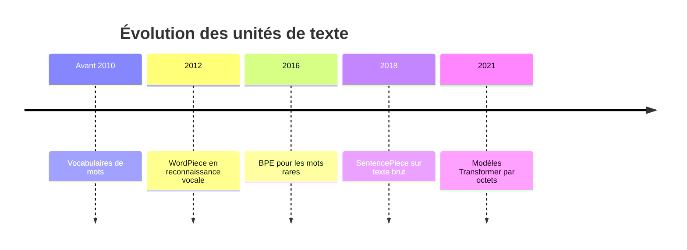
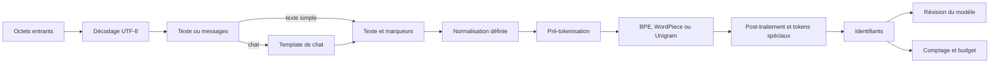
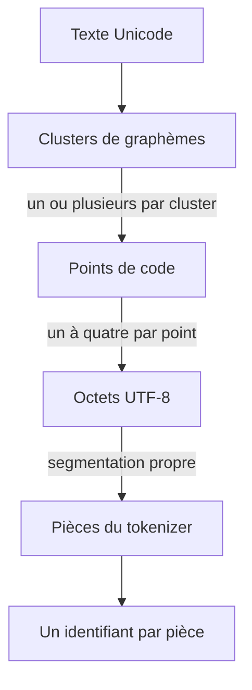
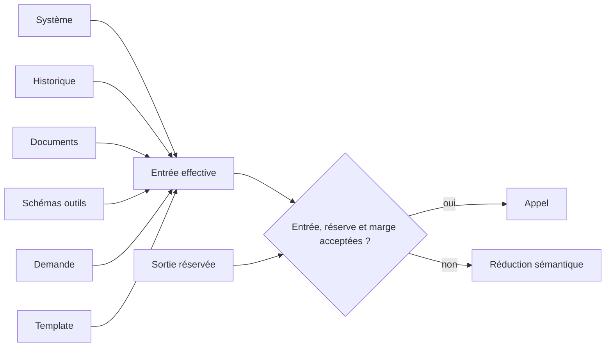
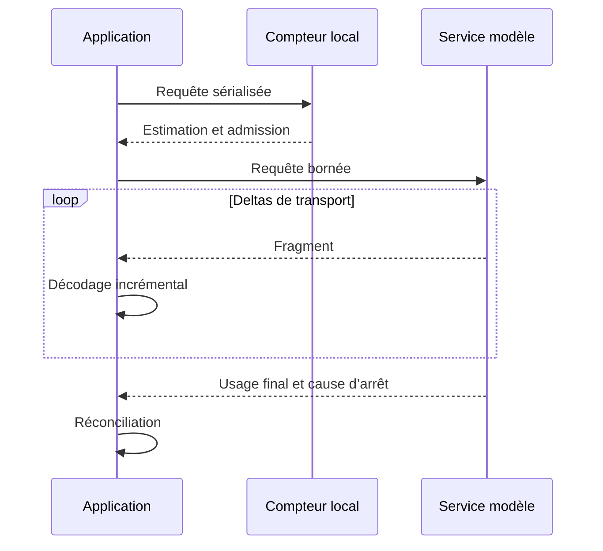
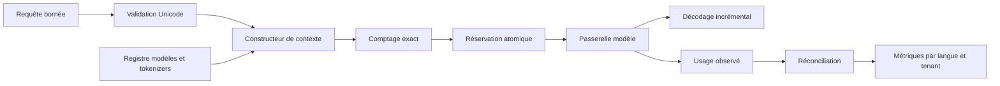

# Les tokens

## Objectifs pédagogiques

À la fin de ce chapitre, vous saurez :

- distinguer octet, caractère, graphème, mot, sous-mot et token ;
- expliquer le pipeline qui transforme un texte Unicode en identifiants de vocabulaire ;
- comparer les compromis des tokenisations par mots, caractères, sous-mots et octets ;
- associer tokenizer, template de chat et révision du modèle ;
- établir un budget incluant entrées, sortie et surcoûts invisibles ;
- mesurer les effets sur le coût, la latence, les langues et la sécurité ;
- concevoir une admission et une troncature adaptées à la production.

## Introduction

Un modèle ne lit pas directement des mots. Il reçoit une séquence
d’identifiants entiers.

Commençons avec deux lettres. Dans cette configuration pédagogique, aucun octet
n’est regroupé avec son voisin.

!!! transformation "Transformation — Du texte `IA` aux identifiants `[73, 65]`"

    1. **Entrée** — texte `IA`
    2. **Opération** — encodage UTF-8, puis conservation de chaque octet comme pièce séparée
    3. **Sortie** — pièces `I`, `A` ; identifiants décimaux `[73, 65]`

    | Fragment visible | Octet UTF-8 en hexadécimal | Identifiant décimal |
    |---|---:|---:|
    | `I` | `49` | `73` |
    | `A` | `41` | `65` |

    **Lecture linéaire** — `IA` → octets `49 41` → pièces `I`, `A` →
    identifiants `[73, 65]`.

    **Statut de l’exemple** — Octets : faits UTF-8. Pièces et identifiants :
    valeurs reproductibles avec
    `EducationalByteBPETokenizer`, `max_merges=0`,
    `min_pair_frequency=2`, révision
    `educational-byte-bpe-v1-850ba1825dbd8375`.

L’octet hexadécimal `49` vaut `73` en décimal ; il ne s’agit pas de deux
valeurs différentes pour la lettre `I`.

!!! definition "Définition — Token"

    Un **token** est une unité discrète d’un vocabulaire versionné, représentée
    par un identifiant entier. Il peut correspondre à un mot, un fragment, un
    signe, un marqueur spécial ou une suite issue d’octets. Sa frontière et son
    identifiant n’ont de sens qu’avec le tokenizer et la révision du modèle
    associés. Voir aussi l’entrée [Token](../glossaire.md#token) du glossaire.

Dans l’exemple, les couples pièce-identifiant `I:73` et `A:65` sont donc les
deux tokens. Le composant qui applique ce découpage et ce vocabulaire est le
[tokenizer](../glossaire.md#tokenizer). Une lettre ne produit pas toujours un
token : la configuration a été choisie exprès pour rendre le premier trajet
évident.

Cette distinction gouverne la capacité du contexte, la facture, le temps de
réponse et certaines disparités linguistiques. Compter des caractères ou diviser
un nombre de mots par une constante ne garantit donc pas un appel valide.

Le token est à la fois une interface numérique du modèle et une unité de
consommation du service. L’architecte doit conserver ces deux sens séparés :
l’identifiant sert au calcul ; le compteur sert au budget et à l’observabilité.

## Historique

Les premiers modèles statistiques manipulaient surtout des mots, au prix d’un
vaste lexique et d’inconnus. Les caractères offrent la couverture, mais
allongent les séquences.

En 2016, Sennrich et ses coauteurs adaptent le **Byte Pair Encoding** (BPE) à la
traduction neuronale pour représenter les mots rares par sous-unités. WordPiece
et Unigram proposent d’autres sélections. En 2018,
[SentencePiece](https://aclanthology.org/D18-2012/) montre un pipeline entraînable
à partir de phrases brutes et prenant en charge BPE comme Unigram. Des modèles
comme [ByT5](https://aclanthology.org/2022.tacl-1.17/) déplacent ensuite la
frontière en traitant directement des octets.



Ces familles coexistent : longueur, vocabulaire, couverture et calcul sont des
compromis, pas une hiérarchie universelle.

## Le problème

Le mot « caractère » masque plusieurs niveaux numériques.

!!! definition "Définition — Point de code Unicode"

    Un [point de code](../glossaire.md#point-de-code-unicode) est un entier
    attribué par Unicode à un élément abstrait, noté par exemple `U+0049` pour
    `I`. Ce nombre n’est ni le dessin produit par une police, ni son encodage en
    octets. UTF-8 transforme ensuite un point de code en un à quatre octets.

La figure suivante montre cette dernière transformation pour `ñ`. Lisez-la de
gauche à droite : le point de code `U+00F1` est écrit sur les onze positions
utiles d’une séquence UTF-8 à deux octets. Les cinq premiers bits suivent le
préfixe `110` ; les six suivants suivent le préfixe `10`.

{ .aia-figure loading=lazy }

*Figure 1 — UTF-8 transforme ici le point de code `U+00F1` en deux octets,
`C3 B1`. Cette étape encode le texte ; elle ne détermine pas encore les tokens.
Adaptation française originale pour le livre, d’après [Marco Regueira,
Wikimedia Commons](https://commons.wikimedia.org/wiki/File:Codificaci%C3%B3n_UTF-8.svg),
source dans le domaine public.*

!!! definition "Définition — Octet"

    Un [**octet**](../glossaire.md#octet) est un groupe de huit bits utilisé pour
    stocker ou transporter une valeur comprise entre 0 et 255. Deux chiffres
    hexadécimaux, comme `C3`, suffisent à l’écrire de façon compacte. En UTF-8,
    un point de code occupe de un à quatre octets.

Un `é` visible peut être le point de code précomposé `U+00E9` ou la suite
`U+0065 U+0301`, c’est-à-dire `e` plus un accent combinant. Il faut encore une
notion pour décrire ce que le lecteur perçoit comme une unité.

!!! definition "Définition — Graphème"

    Dans ce chapitre, un **graphème** désigne le
    [cluster de graphèmes étendu défini par Unicode](https://www.unicode.org/reports/tr29/) :
    une suite de points de code traitée par défaut comme une seule unité perçue
    lors de l’affichage ou de la saisie. Cette frontière algorithmique constitue
    une approximation adaptable aux langues et aux interfaces. Un graphème peut
    donc contenir plusieurs points de code, plusieurs octets UTF-8 et produire
    plusieurs tokens. Voir aussi l’entrée [Graphème](../glossaire.md#grapheme).

Un emoji familial peut ainsi former un seul graphème tout en contenant plusieurs
points de code reliés par des caractères invisibles. UTF-8 encode ensuite chaque
point de code sur un à quatre octets. Le tokenizer applique enfin ses propres
règles.

Deux chaînes peuvent même paraître identiques tout en suivant des trajets
numériques différents. Le premier `é` ci-dessous est précomposé ; le second est
la lettre `e` suivie d’un accent combinant.

!!! transformation "Transformation — Deux `é` visibles, deux encodages"

    1. **Entrée** — `é` précomposé et `é` décomposé
    2. **Opération** — encodage UTF-8 sans normalisation, puis tokenisation sans fusion
    3. **Sortie** — respectivement `[195, 169]` et `[101, 204, 129]`

    | Forme | Points de code | Octets UTF-8 en hexadécimal | Identifiants décimaux | Nombre de tokens |
    |---|---|---|---|---:|
    | `é` précomposé | `U+00E9` | `c3 a9` | `[195, 169]` | 2 |
    | `é` décomposé | `U+0065 U+0301` | `65 cc 81` | `[101, 204, 129]` | 3 |

    **Lecture linéaire** — rendu visuel proche → points de code différents →
    octets différents → nombres de tokens différents.

    **Statut de l’exemple** — Équivalence canonique et octets : faits
    Unicode/UTF-8. Identifiants et comptes : valeurs reproductibles avec la
    révision `educational-byte-bpe-v1-850ba1825dbd8375`.

Les deux formes sont canoniquement équivalentes et chacune est généralement
perçue comme un seul graphème. Le tokenizer pédagogique ne les normalise pas et
son code ne segmente pas les graphèmes : cette couche sert ici à expliquer ce
que perçoit le lecteur, pas une étape réellement exécutée par l’exemple.

Il n’existe donc pas de conversion stable « un mot égale tant de tokens ». Deux
révisions peuvent segmenter différemment un texte, et deux traductions
équivalentes occuper des budgets très différents.

Avant l’appel, l’application identifie le tokenizer du modèle, le texte produit
par le template, la place réservée à la sortie et la politique de dépassement.
Sinon, elle découvre trop tard l’erreur ou la troncature.

## Architecture générale

La tokenisation est un pipeline, pas une fonction universelle `texte → nombre`.
Une implémentation peut omettre ou combiner certaines étapes, mais le contrat doit
en conserver les décisions.



Les flèches représentent ici une transformation de données dans l’ordre du
pipeline. La branche `chat` ajoute une sérialisation ; la branche `texte simple`
la contourne. Elles convergent avant la normalisation éventuelle.

Le texte brut reste utile à l’audit. Une vue normalisée peut servir à la
recherche sans écraser l’original. Vocabulaire, normalisation, tokens spéciaux et
template forment un artefact versionné avec le modèle.

## Fonctionnement détaillé

Le pipeline se comprend en séparant unités textuelles, artefacts du modèle et
contraintes d’exploitation.

### Des octets aux identifiants

Unicode définit des points de code ; UTF-8 les transporte en octets. Les
graphèmes regroupent ces points de code selon des frontières destinées à
approcher les unités perçues. Ces niveaux ne coïncident pas toujours.
La [normalisation Unicode](https://unicode.org/reports/tr15/) définit notamment
NFC, NFD, NFKC et NFKD. NFC rapproche des représentations canoniquement
équivalentes. NFKC peut effacer des distinctions de compatibilité pertinentes ;
elle ne doit pas être appliquée aveuglément.



Les trois premières flèches changent de niveau d’observation ; elles ne
prétendent pas que le tokenizer pédagogique segmente les graphèmes. La flèche
des points de code vers les octets représente l’encodage UTF-8. Les deux
dernières dépendent du tokenizer et de sa révision.

Suivons maintenant un mot fréquent du corpus, puis un emoji que le tokenizer
n’a jamais appris à fusionner. Le symbole `␠` rend l’espace final visible.

!!! transformation "Transformation — Du texte aux identifiants, sans étape cachée"

    1. **Entrée** — texte `architecture 🏗️`
    2. **Opération** — encodage UTF-8, puis application des fusions BPE apprises
    3. **Sortie** — huit tokens ; identifiants `[268, 240, 159, 143, 151, 239, 184, 143]`

    | Niveau | Valeur |
    |---|---|
    | Texte | `architecture 🏗️` |
    | Octets UTF-8 en hexadécimal | `61 72 63 68 69 74 65 63 74 75 72 65 20` \| `f0 9f 8f 97 ef b8 8f` |
    | Pièces — octets non fusionnés en hexadécimal | `[architecture␠] [0xf0] [0x9f] [0x8f] [0x97] [0xef] [0xb8] [0x8f]` |
    | Identifiants décimaux | `[268, 240, 159, 143, 151, 239, 184, 143]` |

    **Lecture linéaire** — texte → octets UTF-8 → fusions connues pour
    `architecture␠` → octets non fusionnés pour `🏗️` → huit identifiants.

    **Statut de l’exemple** — Valeurs reproductibles avec le corpus
    `architecture ia moderne` + `architecture des llm`,
    `max_merges=24`, `min_pair_frequency=2`, révision
    `educational-byte-bpe-v1-de2615552ff63833`.

La pièce `268` représente exactement `architecture` suivie d’une espace.
L’emoji `🏗️` contient deux points de code, `U+1F3D7` et `U+FE0F`, soit sept
octets UTF-8. Dans **cette** révision, aucune fusion ne les couvre : chaque
octet devient donc un token. Il serait faux d’en déduire qu’un emoji vaut
toujours sept tokens.

Les **mots** sont lisibles, mais gèrent mal variantes et inconnus. Les
**caractères** couvrent mieux avec des séquences longues. Les **octets** couvrent
UTF-8 avec un vocabulaire compact, mais fragmentent certaines écritures. Les
**sous-mots** cherchent un compromis.

Les trois figures suivantes conservent exactement la même phrase anglaise :
`Let’s do tokenization!`. Ne cherchez pas encore les identifiants. Observez
seulement comment le nombre et la taille des cases changent lorsque l’unité de
découpage devient plus petite.

{ .aia-figure .aia-figure--wide loading=lazy }

*Figure 2a — Par mots : les unités restent lisibles, mais l’apostrophe et la
ponctuation exigent déjà des règles. Source : [Hugging Face Course, fichier
versionné](https://huggingface.co/datasets/huggingface-course/documentation-images/blob/96e71ad956904da670e6827274fc2c9b735b09d5/en/chapter2/word_based_tokenization.svg),
Apache-2.0.*

{ .aia-figure .aia-figure--wide loading=lazy }

*Figure 2b — Par caractères : le vocabulaire nécessaire diminue, mais la
séquence s’allonge. Cette illustration simplifie Unicode et ne représente pas
une segmentation rigoureuse en graphèmes. Source : [Hugging Face Course,
fichier versionné](https://huggingface.co/datasets/huggingface-course/documentation-images/blob/96e71ad956904da670e6827274fc2c9b735b09d5/en/chapter2/character_based_tokenization.svg),
Apache-2.0.*

{ .aia-figure .aia-figure--wide loading=lazy }

*Figure 2c — Par sous-mots : les fragments fréquents restent groupés et les
formes plus rares sont décomposées. Le marqueur `</w>` signifie ici fin de mot ;
ce n’est pas un token spécial universel. Source : [Hugging Face Course, fichier
versionné](https://huggingface.co/datasets/huggingface-course/documentation-images/blob/96e71ad956904da670e6827274fc2c9b735b09d5/en/chapter2/bpe_subword.svg),
Apache-2.0.*

Cette comparaison rend le compromis visible : de grandes cases raccourcissent la
séquence mais demandent un vaste vocabulaire ; de petites cases couvrent plus de
formes mais augmentent le nombre d’étapes de calcul.

BPE apprend des fusions fréquentes d’unités élémentaires. WordPiece apprend un
lexique de sous-unités et emploie couramment un appariement glouton. Unigram
estime des pièces candidates puis élimine celles dont l’absence dégrade le moins
son objectif. Tables, règles et détails d’implémentation appartiennent à
l’artefact ; ces noms ne désignent pas des algorithmes interchangeables.

Le mot « fusion » devient concret avec un corpus composé de deux lignes
`abababab`. Les identifiants `0` à `255` sont réservés aux octets ; la première
pièce apprise reçoit donc `256`.

!!! transformation "Transformation — Trois fusions BPE de `abababab`"

    1. **Entrée** — octets `[97, 98, 97, 98, 97, 98, 97, 98]`
    2. **Opération** — apprendre puis appliquer trois fusions de paires fréquentes
    3. **Sortie** — une pièce `abababab` ; identifiant `[258]`

    | Étape | Fusion appliquée | Séquence obtenue |
    |---:|---|---|
    | 0 | aucune | `[a:97] [b:98] [a:97] [b:98] [a:97] [b:98] [a:97] [b:98]` |
    | 1 | `97 + 98 → 256` | `[ab:256] [ab:256] [ab:256] [ab:256]` |
    | 2 | `256 + 256 → 257` | `[abab:257] [abab:257]` |
    | 3 | `257 + 257 → 258` | `[abababab:258]` |

    **Lecture linéaire** — huit octets → quatre pièces `ab` → deux pièces
    `abab` → une pièce `abababab`.

    **Statut de l’exemple** — Valeurs reproductibles avec le corpus
    `["abababab", "abababab"]`, `max_merges=3`,
    `min_pair_frequency=2`, révision
    `educational-byte-bpe-v1-e7d54e95528501e0`.

Cette compression en un token vient du corpus et des trois fusions autorisées,
pas d’une propriété naturelle de la chaîne `abababab`.

| Famille | Atout | Coût principal |
|---|---|---|
| Mot | Lecture et alignement simples | Vocabulaire et inconnus |
| Caractère | Bonne couverture | Séquences longues |
| Sous-mot | Compromis courant | Artefact complexe et biais du corpus |
| Octet | Couverture universelle | Longueur et calcul accrus |

### Vocabulaire, tokens spéciaux et chat

L’identifiant `42` ne possède aucune sémantique universelle. Il indexe une ligne
des représentations apprises et dépend du vocabulaire exact. Remplacer le
tokenizer sans adapter les poids relie les entrées aux mauvaises représentations.
Une référence exploitable doit donc inclure au minimum le modèle, sa révision,
le tokenizer et le template.

Le nombre seul ne permet même pas de reconstruire la pièce.

!!! transformation "Transformation — Le même identifiant sous deux révisions"

    1. **Entrée** — identifiant décimal `256`
    2. **Opération** — rechercher cet identifiant dans le vocabulaire de la révision
    3. **Sortie** — pièce `ab` avec une révision, pièce `ar` avec l’autre

    | Corpus d’apprentissage | Révision du tokenizer | Pièce associée à `256` |
    |---|---|---|
    | `abab abab` | `educational-byte-bpe-v1-0f2cb1400cf11371` | `ab` |
    | `architecture architecture` | `educational-byte-bpe-v1-f711deb649f84de0` | `ar` |

    **Lecture linéaire** — `256` + révision du vocabulaire → pièce
    interprétable ; `256` seul → information insuffisante.

    **Statut de l’exemple** — Valeurs reproductibles avec
    `max_merges=1` et `min_pair_frequency=2` pour chacun des deux corpus.

Les poids apprennent leurs représentations selon cette même table
d’identifiants. Changer le vocabulaire sans changer les poids ne traduit pas le
texte : cela branche simplement chaque nombre sur une autre entrée du modèle.

Les tokens spéciaux marquent début, fin, rôles ou outils. Une API sérialise les
objets `{role, content}` en une séquence. La
[documentation Hugging Face](https://huggingface.co/docs/transformers/chat_templating)
montre que deux modèles issus d’une même base peuvent attendre des marqueurs
différents. Système, rôles, schémas et séparateurs consomment donc des tokens.

!!! definition "Définition — Sérialisation"

    Une [**sérialisation**](../glossaire.md#serialisation) transforme une structure
    en une séquence transmissible ou stockable selon des règles précises. Par
    exemple, une liste de messages devient du texte avec des marqueurs de rôles.
    Elle change la représentation, pas le sens voulu, et ses caractères ajoutés
    participent au comptage des tokens.

Une concaténation ad hoc contourne le contrat de sérialisation et peut brouiller
les rôles. Il faut laisser l’adaptateur associé à l’artefact appliquer le
template, interdire aux données utilisateur de choisir un rôle et tester les
séquences réellement envoyées.

### Budget, coût et latence

Le budget d’entrée comprend le système, l’historique, la question, les documents,
les schémas d’outils et le template. Il faut y ajouter la sortie planifiée et une
marge mesurée. Une requête est admissible si :

\[
T_{\mathrm{in}} + T_{\mathrm{out}} + M \leq C
\]

où les quatre grandeurs sont des nombres de tokens appartenant à
\(\mathbb{N}\) :

- \(T_{\mathrm{in}}\) est l’entrée après sérialisation du chat ;
- \(T_{\mathrm{out}}\) est la sortie réservée pour la génération ;
- \(M\) est une marge de sécurité issue des mesures ;
- \(C\) est la capacité de contexte de la révision appelée.

Le symbole \(\leq\) exprime une borne, pas une égalité recherchée : l’entrée, la
réserve de sortie et la marge doivent tenir ensemble dans la fenêtre. Cette
condition garantit une capacité suffisante, pas la pertinence du contexte.

Dans l’exemple exécutable, \(T_{\mathrm{protocole}}\) désigne les six tokens
ajoutés par le protocole et \(T_{\mathrm{texte}}\) les huit tokens mesurés pour
`architecture 🏗️`. Ils composent ensemble l’entrée :

\[
T_{\mathrm{in}}
= T_{\mathrm{protocole}} + T_{\mathrm{texte}}
= 6 + 8
= 14
\]

La politique pédagogique ne possède pas de marge de sécurité séparée, donc
\(M=0\).

!!! transformation "Transformation — Des compteurs à une décision d’admission"

    1. **Entrée** — fenêtre `64`, protocole `6`, texte `8`, sortie réservée `16`, marge `0`
    2. **Opération** — calculer \(T_{\mathrm{in}}=6+8=14\), puis \(14+16+0=30\leq64\)
    3. **Sortie** — requête acceptée ; `34` tokens restent non alloués

    | Cas | Fenêtre \(C\) | Protocole | Texte | Sortie | Marge | Total | Décision |
    |---|---:|---:|---:|---:|---:|---:|---|
    | `architecture 🏗️` | 64 | 6 | 8 | 16 | 0 | 30 | acceptée, reste 34 |
    | dépassement | 20 | 2 | 14 | 5 | 0 | 21 | refusée, dépasse de 1 |

    **Lecture linéaire** — compteurs versionnés → somme → comparaison à la
    fenêtre → acceptation ou refus avant l’appel.

    **Statut de l’exemple** — Décisions reproductibles avec `TokenBudget`. La
    première ligne réutilise le comptage exact de la révision
    `educational-byte-bpe-v1-de2615552ff63833` ; ces limites ne décrivent aucun
    modèle commercial.

La case libre n’est pas une invitation à remplir la fenêtre. En production, une
marge \(M>0\) peut absorber une incertitude mesurée, tandis que le contexte
inutile doit simplement rester absent.

Les `34` tokens valent \(64-30\) : c’est la **capacité résiduelle**, pas la
marge de sécurité \(M\). La commande de démonstration utilise ce même libellé
pour éviter de confondre les deux notions.

Les prix d’entrée, de sortie et de cache peuvent différer et évoluer. Une
estimation locale sert à l’admission ;
les compteurs retournés par le service servent à la facturation et à la
réconciliation. Le registre tarifaire doit être daté, testé et extérieur à la
logique métier.

Davantage de tokens d’entrée augmente le travail de préremplissage ; davantage
de tokens générés prolonge le décodage. La relation exacte dépend du modèle, du
matériel, du lot et de la charge. La troncature doit supprimer des unités
sémantiques selon une priorité explicite, jamais couper aveuglément une chaîne
par nombre de caractères.

### Langues et streaming

!!! definition "Définition — Fertilité de tokenisation"

    Pour un corpus et un protocole fixés, la **fertilité de tokenisation** est le
    nombre moyen de tokens nécessaires pour représenter une unité de référence :

    \[
    F = \frac{N_{\mathrm{tokens}}}{N_{\text{unités}}}
    \]

    Ici, \(N_{\mathrm{tokens}}\) est le nombre total de tokens et
    \(N_{\text{unités}} > 0\) le nombre de mots, caractères ou autres unités
    choisies. Comparer deux valeurs de \(F\) exige le même corpus, la même
    segmentation des unités et un tokenizer explicitement révisionné. Ce ratio
    mesure une fragmentation, pas la qualité de compréhension du modèle. Voir
    aussi [Fertilité de tokenisation](../glossaire.md#fertilite-de-tokenisation).

Avec `architecture 🏗️`, le tokenizer pédagogique produit huit tokens. Si
l’unité de référence choisie est l’élément séparé par une espace, il y en a
deux :

\[
F = \frac{8\ \text{tokens}}{2\ \text{unités}} =
4\ \text{tokens par unité}
\]

Cette valeur est reproductible pour la révision montrée plus haut, mais le
corpus d’une seule chaîne est trop petit pour comparer des langues ou des
modèles.

Avec `gpt-3.5-turbo`, BLOOMZ et cinq benchmarks, l’étude 2023 d’Ahia et ses
coauteurs observe des écarts de fragmentation, de coût et d’utilité entre
22 langues. C’est un résultat expérimental daté, pas une loi sur toute paire
modèle-tokenizer. Petrov et ses coauteurs relient aussi, pour les artefacts
étudiés en 2023, les écarts de longueur au coût, à la latence et à la capacité
de contexte effective.

Une architecture multilingue mesure donc tokens par langue, domaine, écriture et
type de contenu. Elle évalue aussi la qualité, car une compression élevée n’est
pas une preuve de compréhension.

Un fragment de streaming est une unité de transport, pas nécessairement un
token, un mot ou un graphème. Le client assemble les
deltas avec un décodeur incrémental et n’interprète le JSON ou le Markdown
qu’après une frontière sûre. Le streaming réduit le temps avant le premier
affichage ; il ne réduit pas automatiquement la consommation totale.

## Diagrammes

Ces deux vues isolent la composition du budget et sa réconciliation pendant une
réponse diffusée.

### Anatomie d’un budget

Le budget se calcule après sérialisation du chat et avant admission dans la file.



### Diffusion et comptage

Les métriques finales arrivent parfois après les deltas. Elles doivent corriger
l’estimation, sans bloquer l’affichage.



## Études de cas architecturales

Ces quatre cas transforment des observations de prototypes en questions
reproductibles. Leur but n’est pas de promouvoir un format ou un framework, mais
de montrer où un compteur de tokens doit influencer l’architecture.

### Cas 1 — Comparer deux sérialisations avec le même tokenizer

Un format plus compact peut réduire une entrée, mais seulement si le compteur,
le modèle et le protocole de comparaison restent identiques.

!!! transformation "Transformation — Du même objet à deux budgets"

    1. **Entrée** — l’objet `{"ville": "Lyon", "temperature": 18}`
    2. **Opération** — sérialiser en JSON compact puis en texte délimité, et compter chaque octet comme un token
    3. **Sortie** — JSON : `33` tokens ; texte délimité : `25` tokens

    | Sérialisation | Texte transmis | Tokens |
    |---|---|---:|
    | JSON compact | `{"ville":"Lyon","temperature":18}` | 33 |
    | Délimitée | `ville=Lyon|temperature=18` | 25 |

    **Lecture linéaire** — même objet → deux sérialisations → deux séquences
    d’octets → 33 contre 25 tokens.

    **Statut de l’exemple** — Valeurs reproductibles avec le tokenizer
    pédagogique sans fusion ; ces comptes ne prédisent aucun modèle commercial.

Le gain de huit tokens n’est utile que si le second format reste réversible,
validé et sûr pour les valeurs contenant `=` ou `|`. En production, on mesure le
texte **après** sérialisation et template avec le tokenizer ciblé, puis on
réconcilie avec l’usage retourné par le service. Le tarif n’appartient pas au
domaine : il vient d’un catalogue versionné.

### Cas 2 — Budgéter un éventail avant son lancement

Quatre branches parallèles suivies d’un agrégateur ne consomment pas le plafond
d’un seul appel. La question est répétée, les quatre sorties deviennent l’entrée
de l’agrégateur, puis celui-ci génère à son tour.

!!! transformation "Transformation — Du plafond par appel au budget du workflow"

    1. **Entrée** — question de 120 tokens, quatre réserves de 200 tokens et une réserve finale de 240 tokens
    2. **Opération** — réserver les quatre branches, puis l’entrée et la sortie maximales de l’agrégateur
    3. **Sortie** — réserve pédagogique maximale : \(2\,440\) tokens hors surcoût de template

    | Étape | Calcul | Réserve |
    |---|---:|---:|
    | Quatre branches | \(4 \times (120 + 200)\) | \(1\,280\) |
    | Agrégateur | \(120 + 4 \times 200 + 240\) | \(1\,160\) |
    | Workflow | \(1\,280 + 1\,160\) | \(2\,440\) |

    **Lecture linéaire** — plafond d’une branche → répétition par quatre →
    réinjection des sorties → budget global.

    **Statut de l’exemple** — Valeurs pédagogiques ; rôles, séparateurs, outils
    et marge de sécurité restent à ajouter.

Une orchestration robuste réserve atomiquement le budget global, borne chaque
branche, annule les appels inutiles, accepte des résultats partiels et débite
l’usage réellement observé. Elle compare aussi la qualité obtenue par token à
celle d’un appel unique.

### Cas 3 — Découper en caractères ne garantit pas le contexte

Une taille de fragment exprimée en caractères ou en graphèmes améliore parfois
la lisibilité, mais elle ne constitue pas une limite de tokens.

!!! transformation "Transformation — De 500 unités visibles à trois longueurs"

    1. **Entrée** — 500 occurrences de `a`, de `é` précomposé ou de `🏗️`
    2. **Opération** — encoder en UTF-8 puis conserver chaque octet comme token
    3. **Sortie** — respectivement 500, 1 000 et 3 500 tokens

    | Fragment pédagogique | Octets par occurrence | Total de tokens |
    |---|---:|---:|
    | `a` répété 500 fois | 1 | 500 |
    | `é` répété 500 fois | 2 | 1 000 |
    | `🏗️` répété 500 fois | 7 | 3 500 |

    **Lecture linéaire** — même nombre d’unités visibles → nombres d’octets
    différents → budgets de tokens différents.

    **Statut de l’exemple** — Valeurs reproductibles avec le tokenizer
    pédagogique sans fusion ; un autre vocabulaire peut fusionner ces octets.

Le découpage documentaire peut conserver une mesure sémantique, mais
l’assemblage final doit être recompté avec la paire modèle-tokenizer. Le service
contrôle aussi les URL, persiste l’index et réduit les fragments selon leur
pertinence plutôt que par une coupe aveugle.

### Cas 4 — Transformer un plafond déclaré en quota réel

Une propriété `max_tokens` ne protège rien si aucun composant ne réserve puis ne
met à jour la consommation.

!!! transformation "Transformation — De la réservation au débit observé"

    1. **Entrée** — quota restant de 1 000 tokens et appel réservant 600 tokens
    2. **Opération** — réserver 600, exécuter, constater 420, débiter 420 et libérer 180
    3. **Sortie** — quota restant : 580 tokens ; événement d’audit réconcilié

    | Moment | Disponible | Réservé | Débité |
    |---|---:|---:|---:|
    | Avant admission | 1 000 | 0 | 0 |
    | Appel admis | 400 | 600 | 0 |
    | Usage final | 580 | 0 | 420 |

    **Lecture linéaire** — plafond → réservation atomique → usage observé →
    libération du surplus.

    **Statut de l’exemple** — Valeurs pédagogiques ; la transaction doit rester
    idempotente en cas de reprise.

La production refuse avant dépassement, persiste réservation et débit, puis
réconcilie expiration, annulation et nouvelle tentative. Sans cette mutation
d’état, une limite n’est qu’une annotation.

## Implémentation sans framework

L’exemple dans `examples/python-pur/tokenisation/` sépare le tokenizer du calcul
de budget. Son contrat minimal lie les identifiants à leur révision :

```python
from dataclasses import dataclass
from typing import Protocol

@dataclass(frozen=True)
class EncodedText:
    token_ids: tuple[int, ...]
    tokenizer_revision: str

class Tokenizer(Protocol):
    @property
    def revision(self) -> str: ...
    def encode(self, text: str) -> EncodedText: ...
    def decode(self, encoded: EncodedText) -> str: ...
```

`EducationalByteBPETokenizer` implémente un BPE miniature *byte-level* et
déterministe pour rendre les fusions visibles. `TokenBudget` réserve séparément
protocole, entrée et sortie. L’ensemble n’est compatible avec aucun tokenizer de
production et ne prédit pas une facture : l’usage mesuré par le service reste
l’autorité.

## Implémentation avec les frameworks

Les frameworks orchestrent des messages sans rendre les compteurs
interchangeables. Un adaptateur et un contrat local suffisent à l’appel isolé.

### LangChain

LangChain compose messages et modèles. Le budget se contrôle après sérialisation
avec le tokenizer de la révision appelée.

### LangGraph

LangGraph peut représenter réduction et nouvelle tentative. Compteur et limite
restent des données explicites de l’état.

### Agno

Agno peut ajouter historique, outils et équipe d’agents. Chacun ajoute un
surcoût ; un plafond par agent ne remplace pas le budget du workflow.

### LlamaIndex

LlamaIndex assemble des nœuds documentaires. Leur nombre de caractères ne
garantit pas les tokens du prompt final.

### Haystack

Haystack peut placer comptage et réduction dans un pipeline. Les métriques
distinguent estimation locale et usage retourné.

### OpenAI Agents SDK

L’OpenAI Agents SDK expose outils, délégations et streaming. L’application
budgète néanmoins les schémas et chaque appel, puis consolide l’usage.

## Comparaison des approches

| Approche | Exactitude avant appel | Dépendances | Usage adapté |
|---|---|---|---|
| Approximation mots/caractères | Faible | Aucune | Alerte grossière seulement |
| Tokenizer générique | Variable | Bibliothèque | Exploration |
| Tokenizer révisionné | Élevée pour le texte sérialisé | Artefact modèle | Admission |
| Compteur serveur | Autorité après appel | Service | Facturation et audit |

L’architecture robuste combine les deux dernières lignes : elle prévient avec
une estimation versionnée et observe avec la mesure réelle.

## Cas d’usage

Le comptage exact sert au chat long, au RAG, aux outils volumineux et au fan-out.
Une approximation suffit seulement à une jauge non contractuelle.

La tokenisation sert aussi à comparer formats structurés, modèles et langues.
Le protocole doit alors fixer corpus, normalisation, template et révision. Un
gain de tokens n’est utile que si la qualité, la sécurité et la réversibilité du
format restent acceptables.

## Anti-patterns

- **Un token égale un mot.** Cette règle échoue selon langue, ponctuation et
  vocabulaire.
- **Compter avant le template.** Les rôles, outils et séparateurs disparaissent
  du budget.
- **Utiliser un tokenizer voisin.** Une estimation plausible peut être fausse
  pour la révision réellement appelée.
- **Coder les prix dans le métier.** Une évolution commerciale invalide alors
  les décisions sans changement fonctionnel.
- **Tronquer à droite.** Une coupe aveugle peut supprimer la question ou une
  contrainte prioritaire.
- **Confondre delta et token.** L’interface peut casser Unicode ou un objet
  structuré pendant le streaming.
- **Déclarer sans débiter.** Un plafond non relié à la consommation n’est pas un
  contrôle.

## Architecture de production

L’admission vérifie l’encodage et conserve le brut selon la politique de données.
Le constructeur sérialise le chat, réserve la sortie et compte avec l’artefact
du modèle. Une politique sémantique réduit ensuite l’historique ou les documents.



Les limites s’appliquent d’abord aux octets reçus, puis aux tokens calculés. Cela
réduit les entrées conçues pour consommer mémoire ou temps de tokenisation.
Les contrôles Unicode signalent caractères invisibles, directions bidirectionnelles
et identifiants confusables selon le contexte ; [UTS #39](https://unicode.org/reports/tr39/)
précise que les squelettes de confusion ne sont pas une normalisation générale.
Normaliser ne neutralise pas une injection de prompt : rôles, données et outils
restent séparés, validés et soumis au moindre privilège.

Le quota réserve avant le fan-out, puis débite les compteurs finaux de chaque
appel. Expiration, annulation et reprise libèrent ou réconcilient la réserve de
façon idempotente. Les métriques suivent estimation, usage réel, troncature,
cause d’arrêt, coût, latence et fertilité par langue, sans journaliser le contenu
sensible.

Enfin, un changement de modèle ou de tokenizer passe par un test de corpus :
distribution des longueurs, dépassements, qualité, langues, code, données
structurées et attaques Unicode. Le déploiement progressif conserve l’ancienne
paire modèle-tokenizer comme solution de retour.

## Exercices

Les exercices passent du modèle mental au contrôle d’un workflow distribué.

### Compréhension

Expliquez pourquoi deux chaînes visuellement identiques peuvent avoir des
longueurs différentes en points de code, octets et tokens.

### Application

Implémentez un calculateur recevant budget maximal, tokens d’entrée, réserve de
sortie et marge. Testez l’acceptation, le refus et une réduction sémantique.

### Architecture

Concevez le budget d’une équipe de quatre agents suivie d’un agrégateur. Précisez
réservation, limites par branche, traitement d’un échec, usage final et métriques
multilingues.

## Résumé

Un token est une unité d’un vocabulaire versionné, pas un synonyme de mot,
caractère ou octet. Le pipeline peut sérialiser un chat, normaliser,
pré-segmenter, appliquer BPE, WordPiece ou Unigram, puis insérer les marqueurs
qu’attend le modèle. Vocabulaire, template et poids constituent un ensemble
indissociable.

L’architecte compte la requête réellement sérialisée, réserve la sortie et
réconcilie l’estimation avec l’usage serveur. Il mesure les écarts linguistiques,
traite les fragments de streaming comme des deltas et applique limites Unicode,
quotas atomiques et troncature sémantique avant l’appel.

## Points clés à retenir

- La frontière d’un token dépend du tokenizer et de sa révision.
- UTF-8, point de code, graphème et token décrivent des niveaux différents.
- Le template de chat et les schémas d’outils consomment du contexte.
- Coût, latence et capacité doivent être mesurés par langue et par workflow.
- Une limite déclarée n’existe réellement que si la consommation est débitée.
- L’estimation locale protège l’admission ; l’usage serveur fonde l’audit.

## Bibliographie

1. Sennrich, R., Haddow, B. et Birch, A. (2016).
   [*Neural Machine Translation of Rare Words with Subword Units*](https://aclanthology.org/P16-1162/).
2. Kudo, T. et Richardson, J. (2018).
   [*SentencePiece: A Simple and Language Independent Subword Tokenizer and Detokenizer*](https://aclanthology.org/D18-2012/).
3. Kudo, T. (2018).
   [*Subword Regularization: Improving Neural Network Translation Models with Multiple Subword Candidates*](https://aclanthology.org/P18-1007/).
4. Xue, L. et al. (2022).
   [*ByT5: Towards a Token-Free Future with Pre-trained Byte-to-Byte Models*](https://aclanthology.org/2022.tacl-1.17/).
5. Rust, P. et al. (2021).
   [*How Good is Your Tokenizer?*](https://aclanthology.org/2021.acl-long.243/).
6. Ahia, O. et al. (2023).
   [*Do All Languages Cost the Same? Tokenization in the Era of Commercial Language Models*](https://aclanthology.org/2023.emnlp-main.614/).
7. Petrov, A. et al. (2023).
   [*Language Model Tokenizers Introduce Unfairness Between Languages*](https://proceedings.neurips.cc/paper_files/paper/2023/hash/74bb24dca8334adce292883b4b651eda-Abstract-Conference.html).
8. Unicode Consortium.
   [*Unicode Standard Annex #15: Unicode Normalization Forms*](https://unicode.org/reports/tr15/),
   [*Unicode Standard Annex #29: Unicode Text Segmentation*](https://www.unicode.org/reports/tr29/)
   et [*Unicode Technical Standard #39: Unicode Security Mechanisms*](https://unicode.org/reports/tr39/).
9. Yergeau, F. (2003). [*UTF-8, a transformation format of ISO 10646*](https://www.rfc-editor.org/rfc/rfc3629).
10. Hugging Face.
   [*Tokenizers: Components*](https://huggingface.co/docs/tokenizers/main/components)
   et [*Chat templates*](https://huggingface.co/docs/transformers/chat_templating).
11. OpenAI. [`tiktoken`](https://github.com/openai/tiktoken), documentation du
    tokenizer BPE.
12. Marco Regueira.
    [*Schéma d’encodage UTF-8, source de l’adaptation française*](https://commons.wikimedia.org/wiki/File:Codificaci%C3%B3n_UTF-8.svg),
    domaine public.
13. Hugging Face Course.
    [*Word-based tokenization*](https://huggingface.co/datasets/huggingface-course/documentation-images/blob/96e71ad956904da670e6827274fc2c9b735b09d5/en/chapter2/word_based_tokenization.svg),
    Apache-2.0.
14. Hugging Face Course.
    [*Character-based tokenization*](https://huggingface.co/datasets/huggingface-course/documentation-images/blob/96e71ad956904da670e6827274fc2c9b735b09d5/en/chapter2/character_based_tokenization.svg),
    Apache-2.0.
15. Hugging Face Course.
    [*BPE subword tokenization*](https://huggingface.co/datasets/huggingface-course/documentation-images/blob/96e71ad956904da670e6827274fc2c9b735b09d5/en/chapter2/bpe_subword.svg),
    Apache-2.0.

## Chapitres connexes

Le [chapitre 1 — Qu’est-ce qu’un LLM ?](01-qu-est-ce-qu-un-llm.md) définit le
modèle. La [vue d’ensemble des fondations](index.md) situe les prolongements :
le [chapitre 3 — Le contexte](03-contexte.md), chapitre 4 — Les embeddings ;
chapitre 7 — Chunking. Les chapitres 50 — Streaming et 64 — Optimisation des
coûts reprendront les mécanismes opérationnels.
