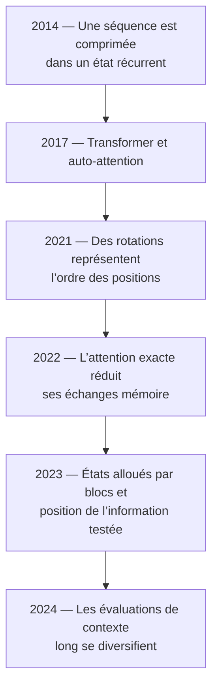
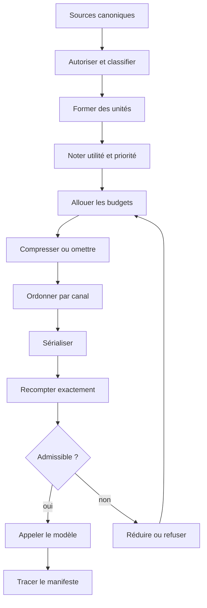
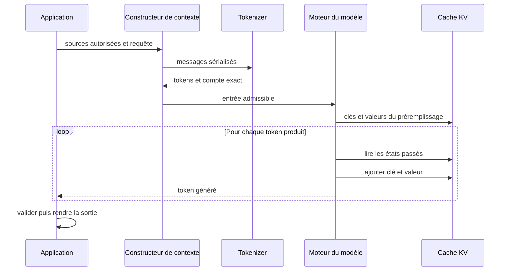
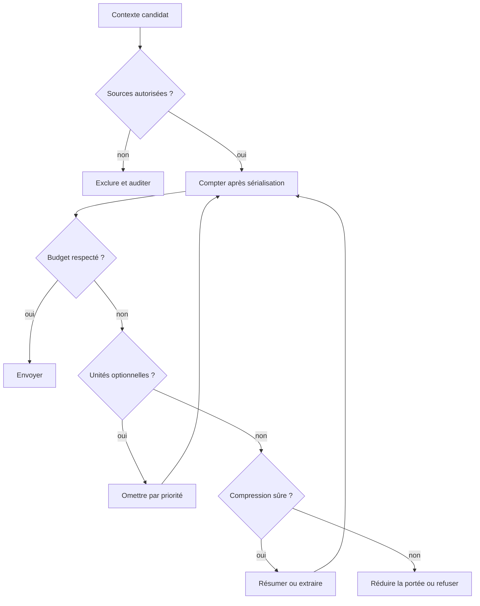
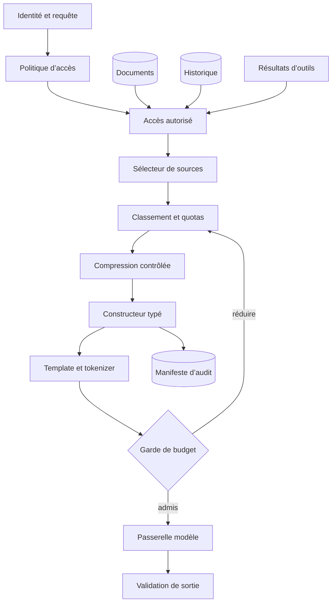

# Le contexte

## Objectifs pédagogiques

À la fin de ce chapitre, vous saurez :

- distinguer contexte, fenêtre de contexte, historique, mémoire et état
  d’exécution ;
- expliquer comment des messages deviennent une séquence traitée par le
  modèle ;
- relier auto-attention, position, préremplissage et cache KV ;
- différencier capacité maximale et contexte effectivement exploitable ;
- construire une entrée sous budget sans couper les unités importantes ;
- choisir entre contexte direct, résumé, recherche ciblée et stratégie
  hybride ;
- traiter documents et résultats d’outils comme des données non fiables ;
- concevoir un assemblage observable, testable et isolé par locataire.

## Introduction

Une utilisatrice écrit au support :

> Pourquoi ai-je deux débits de 49,90 EUR pour la commande A-1042 ?

Le modèle ne peut répondre correctement que si l’application lui montre les
bonnes informations au bon moment. La question seule ne suffit pas. Il faut au
moins une instruction de réponse, les deux écritures du compte et la procédure
de remboursement applicable.

L’historique complet contient aussi une ancienne discussion sur une adresse de
livraison. Elle est vraie, mais inutile ici. L’ajouter consommerait de la
capacité sans aider la décision.

Une **[unité de contexte](../glossaire.md#unite-de-contexte)** est un bloc que
la politique sélectionne, omet ou transforme en entier : un message, un
extrait, un appel d’outil avec son résultat, ou un fait structuré. Cette
frontière évite de couper une information au milieu.

!!! transformation "Transformation — Des sources disponibles au contexte utile"

    1. **Entrée** — instructions `8`, schéma de sortie `6`, ancien historique
       `8`, écritures du compte `10`, politique de remboursement `12`, question
       courante `7` tokens
    2. **Opération** — réserver `16` tokens de sortie et `4` de marge dans une
       fenêtre de `64`, conserver les unités obligatoires puis sélectionner les
       unités optionnelles par priorité
    3. **Sortie** — entrée de `43` tokens ; ancien historique omis ; total
       réservé `63` ; capacité résiduelle `1`

    | Unité | Canal | Tokens | Décision | Motif |
    |---|---|---:|---|---|
    | Instructions | instruction | 8 | incluse | obligatoire |
    | Schéma de sortie | instruction | 6 | inclus | obligatoire |
    | Ancien historique | historique | 8 | omis | priorité faible et budget insuffisant |
    | Écritures du compte | donnée | 10 | incluses | preuve métier |
    | Politique de remboursement | donnée | 12 | incluse | règle applicable |
    | Question courante | requête | 7 | incluse | obligatoire |

    **Lecture linéaire** — six sources → réservation de la sortie et de la
    marge → sélection de cinq unités entières → contexte de `43` tokens.

    **Statut de l’exemple** — Valeurs reproductibles avec la politique
    pédagogique `context-builder-v1`. Les nombres sont fournis à l’algorithme ;
    ils ne décrivent aucun tokenizer commercial.

La figure suivante donne une vue spatiale de la même décision. Observez que la
sortie est réservée **avant** de remplir l’entrée, et que le token libre ne doit
pas nécessairement être consommé.

{ .aia-figure loading=lazy }

*Figure 1 — Une fenêtre, plusieurs responsabilités. Illustration originale
© Architecte IA Moderne, tous droits réservés. La contrainte représentée
s’appuie sur la documentation
[Google — Long context](https://ai.google.dev/gemini-api/docs/long-context),
source conceptuelle.*

!!! definition "Définition — Contexte"

    Le **contexte** est l’ensemble temporaire d’informations rendu visible au
    modèle pour une inférence donnée. Il peut contenir des instructions, une
    requête, un historique sélectionné, des documents, des médias, des
    définitions d’outils et leurs résultats. Il ne modifie pas les poids du
    modèle et ne constitue pas, à lui seul, une mémoire persistante. Voir aussi
    [Contexte](../glossaire.md#contexte) dans le glossaire.

La question d’architecture n’est donc pas « combien de texte puis-je envoyer ? »
mais :

> Que doit voir le modèle maintenant, dans quel ordre, sous quelle forme, avec
> quel budget et quel niveau de confiance ?

Un grand contexte augmente la capacité disponible. Il n’augmente pas
nécessairement la sélectivité du système.

## Historique

Le contexte long résulte de plusieurs progrès distincts. Ils ne doivent pas
être confondus.



*Lecture du diagramme — la flèche temporelle représente une succession
historique, pas une dépendance obligatoire entre toutes les techniques.*

!!! definition "Définition — Attention"

    L’**attention** calcule, pour une position, des poids de compatibilité avec
    d’autres positions autorisées, puis combine leurs représentations. Un poids
    élevé indique une influence dans ce calcul particulier ; il ne prouve ni la
    véracité de la source, ni une explication causale fidèle. Voir
    [Attention](../glossaire.md#attention).

Les premiers encodeurs-décodeurs récurrents sans attention compressaient la
séquence source dans un état de taille fixe
([Sutskever et al., 2014](https://proceedings.neurips.cc/paper_files/paper/2014/hash/5a18e133cbf9f257297f410bb7eca942-Abstract.html)).
En 2017, le Transformer a placé l’auto-attention au cœur d’une architecture sans
récurrence ni convolution : une position peut combiner directement plusieurs
positions autorisées de la séquence
([Vaswani et al., 2017](https://papers.nips.cc/paper/2017/hash/3f5ee243547dee91fbd053c1c4a845aa-Abstract.html)).

Cette connexion directe a un coût. Pour \(n\) tokens, l’attention dense compare
de nombreuses paires. Les travaux ultérieurs ont amélioré la représentation des
positions, l’usage de la mémoire matérielle et la gestion des états de
décodage. Ils ont permis des fenêtres plus grandes, sans transformer
automatiquement chaque token supplémentaire en information utile.

Les évaluations se sont donc déplacées. Un test qui demande de retrouver une
unique chaîne dans un long texte mesure une capacité de récupération, mais pas
à lui seul l’agrégation, les raisonnements à plusieurs preuves ni la résistance
aux contradictions. [LongBench](https://aclanthology.org/2024.acl-long.172/) et
[RULER](https://arxiv.org/abs/2404.06654) ont élargi ces dimensions.

## Le problème

Le premier obstacle consiste à séparer des objets que les interfaces présentent
souvent sous le même mot de « mémoire ».

### Cinq objets à ne pas confondre

Dans une conversation, les mêmes données peuvent exister à plusieurs endroits.
Leur durée de vie et leur visibilité diffèrent.

| Objet | Contenu | Persistance | Visible par le modèle ? |
|---|---|---|---|
| Contexte | vue assemblée pour l’appel courant | durée de l’inférence | oui |
| Fenêtre de contexte | limite de capacité du modèle | propriété de la révision | sans objet |
| Historique | événements bruts d’une conversation | stockage applicatif | seulement si sélectionné |
| Mémoire | faits ou résumés conservés pour réemploi | plusieurs appels | seulement si récupérée |
| État d’exécution | connexion, identités, objets métier | durée du flux | pas nécessairement |

L’historique de quarante tours peut rester intact dans une base de données.
L’appel courant peut n’en recevoir que trois tours, un résumé et deux faits
métier. La persistance ne vaut pas inclusion.

!!! definition "Définition — Fenêtre de contexte"

    La **fenêtre de contexte** est la capacité maximale de séquence acceptée par
    une révision de modèle selon son protocole. Elle est généralement exprimée
    en tokens et peut couvrir l’entrée plus la sortie générée, avec parfois des
    limites séparées. Elle décrit ce qui peut tenir, pas ce que le modèle
    utilisera fidèlement. Voir [Fenêtre de contexte](../glossaire.md#fenetre-de-contexte).

### Tout ce qui est sérialisé consomme la fenêtre

Une application conversationnelle n’envoie pas uniquement le texte visible. Le template
ajoute des rôles et des séparateurs. Des schémas d’outils, documents, images ou
résultats peuvent également être encodés.

Le budget complet peut être écrit comme une contrainte d’admission :

\[
\begin{aligned}
T_{\mathrm{fixe}} + T_{\mathrm{outils}} + T_{\mathrm{requête}}
&+ T_{\mathrm{historique}} + T_{\mathrm{documents}} \\
&+ T_{\mathrm{médias}} + T_{\mathrm{résultats}} \\
&+ T_{\mathrm{sortie\ réservée}} + M \\
&\leq C_{\mathrm{modèle}}
\end{aligned}
\]

où toutes les grandeurs appartiennent à \(\mathbb{N}\) et sont mesurées en
tokens :

- \(T_{\mathrm{fixe}}\) couvre les instructions et le format permanent ;
- \(T_{\mathrm{outils}}\) couvre les schémas d’outils ;
- \(T_{\mathrm{requête}}\) couvre la demande courante ;
- \(T_{\mathrm{historique}}\) couvre les tours retenus ;
- \(T_{\mathrm{documents}}\) couvre les preuves documentaires ;
- \(T_{\mathrm{médias}}\) couvre la représentation facturée des médias ;
- \(T_{\mathrm{résultats}}\) couvre les sorties d’outils réinjectées ;
- \(T_{\mathrm{sortie\ réservée}}\) est la génération réservée ;
- \(M\) est une marge de sécurité mesurée ;
- \(C_{\mathrm{modèle}}\) est la capacité de la révision appelée.

La formule se lit comme une borne : toutes les familles de contenus, la sortie
et la marge doivent tenir ensemble. Elle ne dit pas qu’il faut atteindre
l’égalité.

Cette première contrainte décrit une fenêtre totale partagée. Lorsqu’un
protocole impose aussi des plafonds séparés, l’application vérifie :

\[
T_{\mathrm{entrée}} \leq I_{\max}
\qquad\text{et}\qquad
T_{\mathrm{sortie\ réservée}} \leq O_{\max}
\]

où \(T_{\mathrm{entrée}}\) est la somme des familles d’entrée,
\(I_{\max}\) leur plafond en tokens, \(T_{\mathrm{sortie\ réservée}}\) la
réserve de génération et \(O_{\max}\) son plafond en tokens. Ces deux bornes
s’ajoutent à la contrainte totale ; respecter l’une ne garantit pas l’autre.

Pour une fenêtre pédagogique de \(8\,192\) tokens, avec \(600\) tokens fixes,
\(300\) pour la question, \(1\,200\) réservés à la sortie et \(300\) de marge,
le budget variable vaut :

\[
B_{\mathrm{variable}}
= 8\,192 - 600 - 300 - 1\,200 - 300
= 5\,792\ \mathrm{tokens}
\]

où \(B_{\mathrm{variable}}\) est la capacité restante pour l’historique, les
documents, les médias et les résultats d’outils. La soustraction rend la
décision observable : ces quatre familles se partagent au plus \(5\,792\)
tokens.

### Capacité maximale et longueur utile

Un appel peut tenir techniquement et produire une mauvaise réponse. Les causes
incluent :

- une preuve noyée parmi des distracteurs ;
- plusieurs faits que le modèle doit associer ;
- une information éloignée de la question ;
- des consignes contradictoires ;
- un contexte redondant ou obsolète ;
- une tâche plus difficile que la simple récupération d’une chaîne.

[Liu et al.](https://aclanthology.org/2024.tacl-1.9/) ont observé, sur les
tâches et modèles étudiés, de meilleures performances fréquentes lorsque
l’information utile était au début ou à la fin, et une baisse lorsqu’elle était
au milieu. Cette forme en U est un résultat expérimental à tester, pas une loi
universelle.

La figure déplace le même fait sans changer le reste du contexte. Elle montre
l’axe de test ; la courbe n’est pas une promesse de comportement pour un modèle
particulier.

{ .aia-figure loading=lazy }

*Figure 2 — Capacité déclarée et utilisation effective sont deux mesures
différentes. Adaptation originale d’après Liu et al.,
[*Lost in the Middle*](https://aclanthology.org/2024.tacl-1.9/), CC BY 4.0.*

## Architecture générale

Le contexte doit être **construit**, pas accumulé. L’assemblage part des
sources canoniques et produit une vue éphémère.



*Lecture du diagramme — les flèches pleines transportent des données ; le
losange représente une décision d’admission ; la boucle représente une nouvelle
politique de réduction, jamais une coupe arbitraire.*

Cette architecture sépare quatre responsabilités :

1. **politique** — qui peut voir quoi, pour quelle finalité ;
2. **sélection** — quelles unités sont utiles à la requête ;
3. **représentation** — texte brut, structure, résumé, extrait ou média ;
4. **admission** — le message final tient-il après la vraie sérialisation ?

Le résultat devrait posséder un manifeste, même s’il n’est pas envoyé au
modèle :

| Champ | Exemple | Utilité |
|---|---|---|
| `context_id` | `ctx_01J...` | corréler appel et décision |
| `source_id` | `procedure:remboursement-v5` | retrouver l’origine |
| `channel` | `data` | séparer donnée et instruction |
| `trust` | `untrusted` | appliquer les contrôles adaptés |
| `token_count` | `12` | expliquer le budget |
| `transform` | `excerpt-v2` | signaler une perte ou adaptation |

Le manifeste peut aussi noter la raison d’inclusion et la position. Il contient
des références, jamais une copie des secrets ou données personnelles.

## Fonctionnement détaillé

Suivons maintenant le trajet complet, de l’objet applicatif au calcul, puis à
la décision d’architecture.

### Des objets applicatifs aux tokens

Les API manipulent souvent des messages typés :

```text
instruction → données → historique → requête
```

Le texte et les médias ne suivent pas exactement le même trajet :

```text
objets applicatifs
→ messages et contenus typés
├─ texte → template → tokenizer → identifiants de tokens
└─ image ou audio → préprocesseur ou encodeur propre au modèle
→ requête multimodale combinée
→ unités comptées selon le protocole du fournisseur
```

!!! transformation "Transformation — D’un message structuré à la séquence du modèle"

    1. **Entrée** — objet `{"role": "user", "content": "Bonjour"}`
    2. **Opération** — appliquer le template pédagogique `chat-demo-v1`, puis
       le vocabulaire pédagogique de même révision
    3. **Sortie** — unités `<début>`, `<utilisateur>`, `Bon`, `jour`, `<fin>` ;
       identifiants `[900, 901, 42, 43, 902]`

    | Élément d’entrée | Représentation sérialisée | Identifiants |
    |---|---|---|
    | début du message | `<début>` | `[900]` |
    | rôle `user` | `<utilisateur>` | `[901]` |
    | contenu `Bonjour` | `Bon`, `jour` | `[42, 43]` |
    | fin du message | `<fin>` | `[902]` |

    **Lecture linéaire** — objet avec rôle et contenu → template de chat →
    cinq unités ordonnées → identifiants `[900, 901, 42, 43, 902]`.

    **Statut de l’exemple** — Valeurs pédagogiques. Les marqueurs, fragments et
    identifiants ne reproduisent la syntaxe d’aucun fournisseur.

Le [chapitre 2](02-les-tokens.md) a montré que le template et le tokenizer sont
versionnés. Un compteur réalisé sur les textes séparés reste donc une
estimation. L’admission finale doit recompter la requête exactement telle
qu’elle sera envoyée.

Une instruction fiable et un document non fiable peuvent tous deux devenir des
tokens. Le modèle ne bénéficie pas d’une frontière de sécurité équivalente à
une requête SQL paramétrée. Les rôles et délimiteurs améliorent la structure ;
ils ne remplacent pas les autorisations déterministes.

### L’auto-attention, vue pas à pas

Pour comprendre pourquoi la longueur importe, comparons trois manières
simplifiées de faire circuler l’information. La convolution privilégie un
voisinage local. La récurrence transmet un état pas à pas. L’auto-attention
permet à une position de pondérer plusieurs positions autorisées.

{ .aia-figure loading=lazy }

*Figure 3 — Trois modes de circulation de l’information. Adaptation française
de Zhang et al., [*Dive into Deep Learning — Self-Attention and Positional
Encoding*](https://d2l.ai/chapter_attention-mechanisms-and-transformers/self-attention-and-positional-encoding.html),
CC BY-SA 4.0. Le schéma montre des dépendances possibles, pas l’architecture
exacte d’un modèle donné.*

À partir d’une représentation \(X\), une couche apprend trois projections :
les requêtes \(Q\), les clés \(K\) et les valeurs \(V\). L’attention mise à
l’échelle s’écrit :

\[
\operatorname{Attention}(Q,K,V) =
\operatorname{softmax}
\left(
\frac{QK^\top}{\sqrt{d_k}} + A
\right)V
\]

Les matrices \(Q\), \(K\) et \(V\) sont sans unité physique :
\(QK^\top\) compare requêtes et clés, \(d_k\in\mathbb{N}^{*}\) est leur nombre
de composantes, \(A\) interdit certaines relations, puis `softmax` produit sur
chaque ligne des poids positifs de somme \(1\). Ces poids combinent \(V\).

La formule se lit en trois temps : comparer \(Q\) et \(K\), normaliser les
scores, puis effectuer une moyenne pondérée de \(V\). Dans un décodeur causal,
le masque interdit à une position de lire les tokens futurs.

!!! transformation "Transformation — De trois scores à des poids d’attention"

    1. **Entrée** — pour le token `dort` dans `Le chat dort`, scores pédagogiques
       mis à l’échelle `[0, 2, 1]` vers `Le`, `chat`, `dort`
    2. **Opération** — appliquer `softmax` : exponentier puis diviser chaque
       valeur par \(e^0+e^2+e^1\)
    3. **Sortie** — poids arrondis `[0,09 ; 0,67 ; 0,24]`, de somme `1,00`

    | Source | Score | \(e^{\text{score}}\) arrondi | Poids arrondi |
    |---|---:|---:|---:|
    | `Le` | 0 | 1,00 | 0,09 |
    | `chat` | 2 | 7,39 | 0,67 |
    | `dort` | 1 | 2,72 | 0,24 |

    **Lecture linéaire** — scores `[0, 2, 1]` → exponentiation et normalisation
    → poids `[0,09 ; 0,67 ; 0,24]` → combinaison des trois valeurs.

    **Statut de l’exemple** — Valeurs pédagogiques calculées avec la fonction
    `softmax`, arrondies à deux décimales. Elles n’expriment ni une probabilité
    de vérité ni un résultat extrait d’un modèle réel.

Avec \(n\) tokens, la matrice dense \(QK^\top\) comporte \(n^2\) scores par
tête. Le nombre de scores est donc :

\[
S(n) = n^2
\]

où \(S(n)\) est un nombre de scores et \(n\) un nombre de tokens. Passer de
\(n=1\,000\) à \(n=2\,000\) fait passer \(S\) de \(1\,000\,000\) à
\(4\,000\,000\) scores : doubler la longueur quadruple cette partie du calcul.
La latence totale ne quadruple pas nécessairement, car le matériel, les
projections, les blocs de propagation avant et les noyaux de calcul
interviennent aussi.

[FlashAttention](https://papers.nips.cc/paper/2022/hash/67d57c32e20fd0a7a302cb81d36e40d5-Abstract-Conference.html)
calcule une attention exacte en réduisant les échanges avec la mémoire
matérielle et la matérialisation d’intermédiaires. Il ne transforme pas
l’attention dense en calcul linéaire.

### Comment le modèle représente l’ordre

L’attention seule compare des contenus ; elle a besoin d’un signal de position
pour distinguer `le chien mord le facteur` de `le facteur mord le chien`.

Le Transformer original ajoutait des sinusoïdes aux représentations. De
nombreux modèles modernes emploient plutôt l’encodage positionnel rotatif,
abrégé RoPE ([Su et al.](https://arxiv.org/abs/2104.09864)). RoPE applique aux
requêtes et clés une rotation qui dépend de leur position. Pour deux tokens
placés en \(m\) et \(n\), la propriété essentielle est :

\[
R_m^\top R_n = R_{n-m}
\]

où \(m,n\in\mathbb{N}\) sont des indices de position sans unité, \(R_m\) et
\(R_n\) leurs rotations sans unité, et l’exposant \(\top\) la transposition.
La rotation \(R_{n-m}\) dépend de leur distance relative : l’ordre devient
visible dans le calcul d’attention.

Modifier seulement une valeur de configuration telle que
`max_position_embeddings` ne démontre pas une extension fonctionnelle.
L’extrapolation dépasse les longueurs apprises. Des techniques comme
[Position Interpolation](https://arxiv.org/abs/2306.15595),
[YaRN](https://proceedings.iclr.cc/paper_files/paper/2024/hash/874a4d89f2d04b4bcf9a2c19545cf040-Abstract-Conference.html)
ou [LongRoPE](https://proceedings.mlr.press/v235/ding24i.html) adaptent les
traitements de position et, selon la méthode et l’extension visée, recourent à
un ajustement supplémentaire. Elles doivent être évaluées sur les tâches
réelles, aux longueurs courtes **et** longues.

### Préremplissage, décodage et cache KV

Une génération autorégressive comporte deux phases :

- le **préremplissage** traite l’entrée et calcule ses états ;
- le **décodage** produit ensuite un token, puis le suivant.

Sans cache, chaque étape recalculerait les clés et valeurs des anciens tokens.
Comme elles ne changent pas dans une génération donnée, le moteur peut les
conserver.

!!! definition "Définition — Cache KV"

    Le **cache KV**, pour *key-value* ou clés-valeurs, conserve les clés et
    valeurs déjà calculées pour les tokens passés pendant une génération
    autorégressive. Il évite leur recalcul à chaque nouveau token, mais sa
    mémoire croît avec la longueur conservée. Ce cache d’exécution n’est ni
    l’historique de conversation, ni une mémoire métier, ni un cache de réponse.
    Voir [Cache KV](../glossaire.md#cache-kv).

Pour des séquences de même longueur, une estimation simple de sa mémoire est :

\[
M_{\mathrm{KV}}
= N \times L \times S \times 2
\times H_{\mathrm{KV}} \times d_h \times b
\]

Ici, \(M_{\mathrm{KV}}\) est une capacité en octets ; \(N\), \(L\) et \(S\)
sont respectivement les nombres de séquences, de couches et de tokens par
séquence ; \(H_{\mathrm{KV}}\) est le nombre de têtes clés-valeurs, \(d_h\)
leur nombre de composantes et \(b\) le nombre d’octets par composante. Le
facteur \(2\) compte une clé et une valeur.

Pour \(N=1\), \(L=32\), \(S=8\,192\), \(H_{\mathrm{KV}}=8\),
\(d_h=128\) et \(b=2\) octets :

\[
M_{\mathrm{KV}}
= 1 \times 32 \times 8\,192 \times 2 \times 8 \times 128 \times 2
= 1\,073\,741\,824\ \mathrm{octets}
= 1\ \mathrm{Gio}
\]

Une seule séquence consomme ici environ \(1\) Gio de cache KV. Cette estimation
exclut fragmentation, blocs réservés, métadonnées et tampons temporaires.
L’attention multi-requête, ou MQA
([Shazeer, 2019](https://arxiv.org/abs/1911.02150)), partage une seule tête KV
entre les têtes de requête. GQA répartit les têtes de requête en groupes ; les
têtes d’un groupe partagent une même tête KV. Le modèle conserve ainsi
plusieurs têtes KV, mais moins que de têtes de requête. Ces choix diminuent la
mémoire ; PagedAttention
([Kwon et al., 2023](https://doi.org/10.1145/3600006.3613165)) réduit notamment
le gaspillage par une allocation en blocs.

### Capacité déclarée et contexte effectif

Pour l’architecture, une longueur utile doit être liée à une distribution
d’application, à un seuil de qualité et à un ensemble fini de longueurs testées.
Une définition conservatrice est :

\[
C_{\mathrm{effectif}}(D,\tau,\mathcal N) = \max\left(
\{0\}\cup
\left\{
n\in\mathcal N \mid
\forall m\in\mathcal N,\;
m\leq n \Rightarrow \operatorname{Score}(D,m)\geq\tau
\right\}
\right)
\]

où \(D\) est un jeu de cas représentatif, \(\tau\) un seuil métier sans unité,
\(C_{\max}\in\mathbb{N}^{*}\) la capacité maximale en tokens,
\(\mathcal N\subseteq\{1,\ldots,C_{\max}\}\) l’ensemble fini des longueurs
testées, \(m\) et \(n\) deux de ces longueurs en tokens, et
\(\operatorname{Score}(D,m)\) une métrique définie pour l’application. Le
zéro couvre le cas où même la plus petite longueur testée échoue.

Avec \(\mathcal N=\{1\,000,4\,000,8\,000\}\), des scores
\(\{0{,}92;0{,}84;0{,}71\}\) et \(\tau=0{,}80\), le contexte effectif observé
vaut \(4\,000\) tokens. La formule n’affirme rien sur une longueur intermédiaire
qui n’a pas été testée.

Ce nombre n’est pas une constante universelle du modèle. Il change avec la
tâche, la langue, la position et le nombre de preuves, les distracteurs, le
format des sources, le prompt, les outils et le seuil accepté.

Une matrice d’évaluation utile fait varier quatre axes au minimum :

| Axe | Valeurs à tester |
|---|---|
| Longueur | courte, médiane, 75 %, 100 % du budget d’entrée admissible |
| Position de la preuve | début, milieu, fin, aléatoire |
| Complexité | une preuve, plusieurs preuves, agrégation, multi-sauts |
| Bruit | distracteurs faciles, proches, contradictoires, réponse absente |

Elle mesure qualité, citations correctes, hallucinations, latence avant le
premier token, temps de décodage, mémoire, tokens et coût. Une « aiguille dans
une botte de foin » reste un test parmi d’autres.

### Réduire sans détruire le sens

Lorsque le contexte dépasse le budget, l’application possède plusieurs
opérations :

- **omettre** une unité non pertinente ;
- **tronquer sémantiquement** à une frontière sûre ;
- **extraire** les passages utiles avec leur provenance ;
- **résumer** en préservant des invariants déclarés ;
- **structurer** un résultat volumineux en faits et références ;
- **refuser** ou demander une portée plus petite.

Le ratio de compression d’un résumé est :

\[
\rho = \frac{T_{\mathrm{résumé}}}{T_{\mathrm{source}}}
\]

où \(\rho\) est sans unité,
\(T_{\mathrm{résumé}}\in\mathbb{N}\) le nombre de tokens du résumé et
\(T_{\mathrm{source}}\in\mathbb{N}^{*}\) celui de la source. Une source de
\(10\,000\) tokens résumée en \(1\,000\) donne \(\rho=0{,}1\). Ce faible ratio
mesure une forte compression, pas une bonne fidélité.

Un résumé est un artefact dérivé. Conservez la source et sa version, la
politique de résumé, sa date, les invariants demandés — montants, dates ou
engagements — et un moyen de revenir au contenu canonique.

### Trois caches différents

Le mot « cache » recouvre trois mécanismes.

| Cache | Réutilise | Portée | N’augmente pas |
|---|---|---|---|
| Cache KV | clés et valeurs déjà calculées | une génération ou un moteur | la fenêtre |
| Cache de préfixe | calcul d’un préfixe identique | plusieurs requêtes | la capacité ni la vérité |
| Cache sémantique | réponse à une requête jugée proche | couche applicative | la fraîcheur ni l’autorisation |

Le cache de préfixe accélère parfois un long début identique ; ses règles de
correspondance et de facturation dépendent du fournisseur. Le cache sémantique
réutilise une réponse jugée proche, mais doit inclure dans sa portée
l’autorisation et la version des données.

### Confiance, instructions et données

Un document récupéré, une page Web, un courriel et un résultat d’outil doivent
être traités comme non fiables **en tant qu’instructions**, même si leur source
est autorisée. Leur autorité factuelle, leur fraîcheur et leur intégrité se
qualifient séparément. Ils peuvent contenir une phrase comme « ignore les
instructions précédentes ».

L’[injection indirecte de
prompt](https://arxiv.org/abs/2302.12173) exploite précisément ce mélange entre
instructions et données. Des balises XML, JSON ou Markdown rendent la structure
plus claire, mais ne créent pas une séparation dure.

Le code déterministe doit autoriser les sources, exclure les secrets inutiles,
valider et limiter les outils, demander une approbation pour les effets
critiques, puis isoler sessions, journaux et caches par locataire.

Étiqueter une donnée `untrusted` ne la neutralise pas. Cette étiquette permet
d’appliquer une politique ; la sécurité vient des contrôles qui l’entourent.

## Diagrammes

Ces deux vues relient l’assemblage applicatif au cycle d’inférence et à sa
politique de réduction.

### Une inférence complète

Le premier diagramme sépare clairement préremplissage et décodage.



*Lecture du diagramme — les flèches horizontales sont des appels ou des
données ; la boucle représente le décodage token par token ; le cache KV reste
un détail d’exécution du moteur.*

La première sortie dépend du traitement de toute l’entrée. Un contexte plus
long peut donc augmenter le délai avant le premier token, même si le débit de
décodage reste identique.

### Une décision de réduction

Le second diagramme montre qu’un dépassement déclenche une politique explicite.



*Lecture du diagramme — les flèches représentent des décisions ; les retours
vers le comptage imposent une nouvelle mesure après chaque transformation.*

Une erreur de dépassement de contexte, dont le code varie selon le fournisseur,
est un dernier filet, pas une stratégie normale. L’application doit décider
avant l’appel, sinon elle perd la maîtrise de la dégradation et de l’expérience
utilisateur.

## Études de cas architecturales

Les cas suivants appliquent le même contrat à des formes de données et des
durées de vie différentes.

### Assistant de support avec quarante tours

La source canonique conserve les quarante tours ; la vue courante les réduit
sans les détruire.

!!! transformation "Transformation — D’un historique complet à une vue de travail"

    1. **Entrée** — `40` tours : `34` tours d’épisodes clos, `4` tours récents
       et `2` tours anciens contenant chacun un engagement encore ouvert
    2. **Opération** — résumer les `34` tours clos, extraire un fait structuré
       de chacun des `2` tours d’engagement, conserver les `4` tours récents,
       puis recompter
    3. **Sortie** — résumé versionné + `2` engagements + `4` tours ; historique
       brut conservé hors contexte

    | Information | Représentation dans le contexte | Source canonique conservée ? |
    |---|---|---|
    | Épisodes clos | résumé | oui |
    | Engagements ouverts | faits structurés | oui |
    | Tours récents | messages bruts | oui |
    | Tours anciens sans effet | absents | oui |

    **Lecture linéaire** — quarante tours persistés → classification par rôle
    conversationnel → trois représentations utiles → vue temporaire.

    **Statut de l’exemple** — Valeurs pédagogiques. La politique de
    classification doit être testée sur les conversations réelles.

Le résumé ne remplace pas l’historique. Si l’utilisatrice conteste un fait,
l’application peut revenir aux événements bruts.

### Agent recevant un résultat d’outil volumineux

Un outil de journalisation retourne \(30\,000\) tokens de logs. Réinjecter le
bloc entier à chaque tour coûte cher et augmente la surface d’injection.

!!! transformation "Transformation — D’un résultat brut à des faits référencés"

    1. **Entrée** — résultat d’outil de `30 000` tokens, identifiant
       `tool_7/result_7`
    2. **Opération** — appliquer `tool-result-reduction-v1` : valider le
       schéma, filtrer les données sensibles, extraire erreurs et fenêtres
       temporelles, stocker le résultat intégral
    3. **Sortie** — contexte compact de `900` tokens au maximum avec faits
       structurés, extraits bornés et référence vers le résultat original

    | Élément de sortie | Exemple |
    |---|---|
    | Identifiant | `tool_7/result_7` |
    | Fait | `12 erreurs HTTP 502 entre 10:03 et 10:07 UTC` |
    | Extrait | lignes `1840–1867`, taille limitée |
    | Provenance | objet immuable `logs/incident-428` |
    | Perte déclarée | lignes non sélectionnées absentes du contexte |

    **Lecture linéaire** — résultat brut → validation et réduction contrôlée →
    faits vérifiables + référence → contexte de `900` tokens au maximum.

    **Statut de l’exemple** — Valeurs et faits fictifs, fournis à des fins
    pédagogiques. La transformation perd le détail non sélectionné ; le
    résultat intégral reste canonique.

Une paire appel-résultat forme une unité sémantique. La troncature ne doit pas
garder l’appel sans son résultat, ni le résultat sans son identifiant.

### Assistant multimodal d’incident

Une requête peut combiner capture d’écran, logs, audio et question. Une URL ne
permet pas d’inférer le coût du média : le fournisseur peut redimensionner,
découper ou encoder le contenu selon son protocole.

Une légende générée depuis une image est une représentation dérivée. Elle peut
omettre un détail visuel. Le manifeste doit le signaler au lieu de la présenter
comme l’original.

### Document très long

Le contexte direct sert une vue globale ; la recherche ciblée sert des preuves
rares ; la décomposition sert un corpus trop grand. Une stratégie hybride
associe sommaire, métadonnées et passages justifiés. Dans tous les cas, mesurez
le coût, la position et le risque d’omission.

### Conversation dans un service partagé

Un **[locataire](../glossaire.md#locataire)** est une organisation cliente
isolée des autres. La clé logique minimale d’un fil peut être :

```text
tenant_id / user_id / thread_id
```

L’identité et l’autorisation doivent précéder la lecture, puis la sélection du
fil et la sérialisation. Filtrer après récupération expose déjà les données au
constructeur, aux traces ou aux caches.

## Implémentation sans framework

L’exemple `examples/python-pur/contexte/` implémente un constructeur
déterministe. Il n’appelle aucun modèle et ne prétend pas mesurer la pertinence.
Son but est de rendre les contrats visibles. Il requiert Python 3.12 ou une
version ultérieure ; son `README.md` détaille l’installation et les limites.

Une unité candidate conserve son canal, son origine, son coût et sa priorité :

```python
@dataclass(frozen=True)
class ContextItem:
    identifier: str
    channel: ContextChannel
    content: str
    token_count: int
    priority: int
    source: str
    required: bool = False
    trust: TrustLevel = "untrusted"
```

La fenêtre réserve la sortie et la marge avant d’exposer le budget d’entrée :

```python
@property
def input_limit(self) -> int:
    return self.capacity - self.output_reserve - self.safety_margin
```

Le planificateur inclut d’abord les unités obligatoires. Il examine ensuite les
unités optionnelles par priorité décroissante et conserve l’ordre initial dans
la décision finale. Il refuse :

- un identifiant dupliqué ;
- un coût nul ou négatif ;
- des unités obligatoires trop grandes ;
- une donnée non fiable placée dans le canal `instruction`.

L’exécution est reproductible :

```bash
cd examples/python-pur/contexte
python -m pip install --editable ".[dev]"
python -m contexte
```

La sortie attendue rend l’omission explicite :

```text
Simulation pédagogique — politique context-builder-v1
Capacité d’entrée : 44 tokens
INCLUS  instructions              8 tokens
INCLUS  schema-sortie             6 tokens
INCLUS  ecritures-compte         10 tokens
INCLUS  politique-remboursement  12 tokens
INCLUS  demande                   7 tokens
OMIS    historique-ancien         8 tokens
Entrée sélectionnée : 43 tokens
Total réservé : 63 tokens
Capacité résiduelle : 1 token
```

Cette politique gloutonne est volontairement simple. Une production doit encore
ajouter :

- un compteur fondé sur le vrai template et le vrai tokenizer ;
- une sélection de pertinence testée ;
- des quotas par source ;
- la préservation des paires d’outils ;
- un second comptage après sérialisation ;
- un manifeste persistant sans contenu sensible ;
- une stratégie de dégradation par type de requête.

Le marquage `untrusted` n’est pas un filtre d’injection. Il permet seulement au
système d’interdire certaines promotions et de choisir les contrôles.

## Implémentation avec les frameworks

Les frameworks déplacent la plomberie ; ils ne choisissent pas la politique
métier. Pour chacun, vérifiez quatre questions :

1. quels objets sont réellement envoyés au modèle ?
2. quand le comptage exact a-t-il lieu ?
3. où l’historique canonique est-il stocké ?
4. comment les autorisations survivent-elles aux résumés, caches et reprises ?

### LangChain

LangChain représente la conversation par des
[messages](https://docs.langchain.com/oss/python/langchain/messages) et propose
des transformations. Encapsulez-les derrière votre contrat : valider les rôles,
préserver les paires d’outils, sélectionner des unités, puis compter avec le
modèle cible. Une découpe générique ne connaît ni engagements ni autorisations.

### LangGraph

LangGraph rend explicites l’état et les transitions d’un workflow. L’état
persisté peut contenir l’historique brut, tandis qu’un nœud construit une vue
réduite pour l’appel courant. La
[documentation mémoire](https://docs.langchain.com/oss/python/langgraph/add-memory)
illustre notamment la suppression ou le résumé de messages.

Séparez `state.events_canonical`, durable et auditable, de
`state.model_context`, éphémère et recalculable. Tout résumé persisté porte sa
version et les identifiants des événements couverts.

### Agno

Agno assemble instructions, connaissances, historique, dépendances et résultats
d’outils dans le
[contexte d’un agent](https://docs.agno.com/context/overview). Fixez un quota
par famille sous le budget d’entrée. Filtrez l’historique par fil et locataire,
puis recomptez la représentation produite pour le modèle choisi.

### LlamaIndex

[LlamaIndex](https://developers.llamaindex.ai/python/framework/) est orienté
vers la construction d’index et la récupération de nœuds
documentaires. Autorisez, classez et comptez leurs contenus plutôt que de
prendre un nombre fixe de nœuds. Conservez identifiants de documents et
positions d’extraits après le post-traitement.

### Haystack

[Haystack](https://docs.haystack.deepset.ai/docs/intro) permet de composer un
pipeline de récupération, classement et génération. Placez le constructeur
métier après le reclassement, puis un garde de tokens juste avant la génération.
Vous pourrez changer de générateur sans réécrire autorisation ni provenance.

### OpenAI Agents SDK

L’OpenAI Agents SDK distingue le
[contexte local](https://openai.github.io/openai-agents-python/context/) du
contexte visible par le LLM. Le premier peut contenir connexions, identités ou
services sans les envoyer au modèle. Les
[sessions](https://openai.github.io/openai-agents-python/sessions/) peuvent
fournir un historique entre exécutions.

Cette distinction est saine si l’application garde le contrôle :

le contexte local transporte les capacités, un filtre autorise les seules
données nécessaires et l’entrée LLM est recomptée. Une session n’accorde aucun
droit supplémentaire ; les outils valident encore leurs paramètres côté
serveur.

## Comparaison des approches

Il n’existe pas de stratégie unique pour toutes les requêtes.

| Approche | Fidélité au brut | Coût d’entrée | Risque dominant | Bon signal d’usage |
|---|---:|---:|---|---|
| Tout l’historique | élevée localement | croissant | bruit et dépassement | conversation courte et bornée |
| Fenêtre récente | élevée sur la fin | borné | oubli d’un engagement ancien | continuité locale |
| Résumé + tours récents | moyenne à élevée si testé | borné | perte de faits | dialogue long |
| Recherche ciblée | élevée sur extraits trouvés | variable | faux négatif | preuves localisées |
| Contexte direct long | élevée sur le document envoyé | élevé | position, latence, coût | vue globale nécessaire |
| Hybride | configurable | maîtrisable | complexité d’orchestration | production hétérogène |

Routez selon la tâche : brut borné si chaque détail compte, recherche pour des
preuves rares, résumé pour la continuité, contexte direct pour une vue globale.
Le nom du framework ne remplace ni test ni contrat d’admission.

## Cas d’usage

La composition pertinente dépend de la tâche, de la source canonique et du
risque acceptable.

| Situation | Contexte utile | Garde-fou |
|---|---|---|
| Support | engagements, ticket, derniers tours | garder l’historique complet hors contexte |
| Analyse juridique | citations, versions, dates, exceptions | refuser un résumé sans référence |
| Copilote de code | fichiers, symboles, erreurs, conventions | ne pas envoyer le dépôt entier |
| Agent outillé | paires appel-résultat, faits référencés | borner tours et sorties |
| Multimodal | média et représentations dérivées | compter selon le protocole cible |
| Traitement par lots | agrégats reliés aux lots sources | mesurer les pertes intermédiaires |
| Préfixe partagé | instructions stables en tête | isoler les données par locataire |

## Anti-patterns

| Anti-pattern | Pourquoi il échoue | Remplacement |
|---|---|---|
| Ajouter tous les messages indéfiniment | coût, bruit, dépassement | vue reconstruite à chaque tour |
| Confondre session et contexte | la persistance devient exposition | stockage canonique séparé |
| Compter caractères ou messages | le template et le tokenizer sont ignorés | comptage après sérialisation |
| Remplir toute la fenêtre | plus de bruit et aucune réserve | budgets par source et capacité libre |
| Supprimer toujours le plus ancien | peut perdre un engagement critique | priorité sémantique |
| Couper au milieu d’un appel d’outil | protocole incohérent | unité appel-résultat indivisible |
| Résumer sans provenance | impossible de vérifier ou corriger | résumé versionné et réversible |
| Promouvoir un document en instruction | injection indirecte facilitée | canal donnée non fiable |
| Remplacer silencieusement une image par sa légende | perte invisible | représentation dérivée déclarée |
| Journaliser le contexte intégral | fuite de secrets et données personnelles | manifeste minimisé |
| Cache partagé sans portée | contamination entre locataires | clé et stockage isolés |
| Balises considérées comme barrière de sécurité | le modèle interprète encore les données | autorisation et effets déterministes |

Deux alertes utiles sont une consommation qui croît avec l’âge de la session et
une réponse qui change fortement lorsque la même preuve est déplacée.

## Architecture de production

Une architecture de production place le constructeur de contexte entre les
sources autorisées et la passerelle du modèle.



*Lecture du diagramme — les flèches transportent des données ou une décision ;
les cylindres sont des stockages canoniques ; la boucle `réduire` réapplique les
quotas avant une nouvelle sérialisation.*

### Contrats aux frontières

Chaque composant doit posséder une entrée et une sortie explicites :

| Frontière | Contrat minimal |
|---|---|
| Politique → sélection | identités, finalité, sources admissibles |
| Sélection → classement | unités, provenance, confiance, fraîcheur |
| Classement → compression | priorité, quota, invariants à préserver |
| Compression → constructeur | contenu dérivé, pertes, référence canonique |
| Constructeur → tokenizer | canaux ordonnés et template versionné |
| Garde → passerelle | compte exact, réserve, marge, révision |
| Passerelle → validation | sortie, usage réel, raison d’arrêt |

Le système doit échouer fermé si les unités obligatoires dépassent le budget.
Une réduction silencieuse de la politique système, d’une autorisation ou d’une
question utilisateur produit un comportement non explicable.

### Dégradation contrôlée

Une politique de dégradation peut suivre cet ordre :

1. supprimer les redondances exactes ;
2. omettre les unités optionnelles les moins utiles ;
3. réduire les quotas ou produire un dérivé versionné avec provenance ;
4. router vers un workflow prévu pour une plus grande fenêtre ;
5. demander une portée plus petite ou refuser avec une raison actionnable.

Chaque étape recompte la requête. Un changement de modèle exige de revérifier
tokenizer, template, qualité, résidence, coût et limites de sortie.

### Observabilité

Les métriques utiles ne nécessitent pas le texte : tokens candidats, retenus et
omis par famille ; raison de chaque transformation ; capacité résiduelle ;
position et âge des preuves ; latence de préremplissage et de décodage ;
mémoire KV ; taux de cache ; qualité, citations, refus et dépassements évités.

Une trace doit relier `request_id`, `context_id`, révision du modèle, version du
template et manifeste. Les contenus sensibles restent hachés, référencés ou
expurgés selon la politique.

### Sécurité et isolation

L’entrée d’un LLM est aussi une surface d’attaque. Autorisez avant récupération,
séparez données et instructions, appliquez le moindre privilège aux outils,
validez et bornez leurs paramètres, exigez une approbation pour les effets
irréversibles, isolez les caches et auditez sans secrets.

Le modèle peut proposer une action. Il ne doit pas s’accorder lui-même une
permission. Plus le contexte contient de sources externes, plus la surface
potentielle d’injection augmente ; c’est une conséquence d’architecture, pas
une propriété corrigée par un prompt plus ferme.

### Tests de non-régression

Pour chaque politique, testez au minimum : unités obligatoires autour de la
limite ; preuve déplacée ; preuves multiples ou contradictoires ; absence de
preuve ; paire d’outil indivisible ; instruction malveillante dans un document ;
deux locataires proches ; changement de tokenizer ; résumé obsolète.

Un test réussi vérifie la réponse, mais aussi les sources incluses, les sources
omises, les compteurs, l’ordre et l’absence de fuite.

## Exercices

Les exercices progressent du calcul manuel vers la conception et la mesure
expérimentale.

### Niveau 1 — Lire un budget

Une fenêtre vaut \(4\,096\) tokens. Les instructions et le protocole utilisent
\(420\) tokens, la question \(180\), la sortie réservée \(800\) et la marge
\(200\).

1. Calculez le budget variable.
2. Répartissez-le entre historique, documents et outils.
3. Expliquez pourquoi vous pouvez laisser une partie inutilisée.

**Critère de réussite** — le calcul distingue réserve, marge et capacité
résiduelle, avec une unité sur chaque valeur.

### Niveau 2 — Construire une politique

Modifiez `examples/python-pur/contexte/` pour ajouter un quota par canal.

Contraintes :

- les unités obligatoires restent prioritaires ;
- une unité n’est jamais coupée ;
- le manifeste indique `quota_exceeded` ou `insufficient_capacity` ;
- les tests couvrent deux unités de même priorité et un dépassement obligatoire.

**Critère de réussite** — deux exécutions identiques produisent le même plan et
les mêmes raisons d’omission.

### Niveau 3 — Évaluer le contexte effectif

Construisez un petit protocole expérimental pour une tâche documentaire :

1. choisissez dix questions avec preuves vérifiables ;
2. placez chaque preuve au début, au milieu et à la fin ;
3. ajoutez zéro, cinq puis vingt distracteurs ;
4. testez réponse absente et preuves contradictoires ;
5. mesurez exactitude, citation, latence et tokens ;
6. définissez un seuil \(\tau\), un ensemble \(\mathcal N\), puis estimez
   \(C_{\mathrm{effectif}}(D,\tau,\mathcal N)\).

**Critère de réussite** — le rapport sépare observations, hypothèses et limites.
Il ne généralise pas une courbe à tous les modèles.

### Question d’architecture

Un agent doit analyser chaque nuit des rapports de \(150\,000\) tokens et
répondre le matin à des questions localisées. Comparez contexte direct,
recherche ciblée et résumé hiérarchique. Justifiez votre choix avec :

- fraîcheur ;
- coût ;
- traçabilité ;
- risque d’omission ;
- latence ;
- stratégie de reprise.

Il n’existe pas de réponse universelle. La qualité de l’argument et le plan de
mesure comptent davantage que le nom d’un framework.

## Résumé

Le contexte est une vue temporaire, calculée pour une inférence. Il rassemble
des instructions et données sélectionnées, puis devient une séquence de tokens
après le template du modèle. La fenêtre borne cette séquence avec la sortie et
une marge ; elle ne garantit ni pertinence ni fidélité.

L’auto-attention relie directement des positions, mais son calcul dense et le
cache KV rendent la longueur coûteuse. Les signaux de position permettent de
représenter l’ordre ; leur extension au-delà des longueurs apprises doit être
évaluée. Préremplissage, cache KV, cache de préfixe et cache sémantique
répondent à des problèmes différents.

L’architecte conserve les sources canoniques hors du prompt, autorise avant de
sérialiser, sélectionne des unités entières, réserve la sortie, recompte la
requête finale et trace un manifeste minimal. Quand le budget est dépassé, il
omet, extrait, résume, route ou refuse selon une politique observable.

## Points clés à retenir

- Le contexte n’est ni la mémoire, ni l’historique complet, ni l’entraînement.
- La fenêtre annoncée est une capacité maximale, pas une qualité garantie.
- L’entrée, la sortie réservée et la marge partagent la même contrainte.
- Le comptage exact intervient après template et sérialisation.
- Plus de contexte augmente généralement le coût de traitement et peut accroître
  le bruit ou la surface d’attaque selon les contenus ajoutés.
- L’attention n’est ni une recherche documentaire ni une preuve de
  provenance.
- FlashAttention optimise les accès mémoire ; il ne rend pas l’attention dense
  linéaire.
- RoPE n’implique pas un contexte infini.
- Le cache KV, le cache de préfixe et le cache sémantique sont distincts.
- Un résumé est une représentation dérivée susceptible de perdre de l’information.
- Une paire appel-résultat d’outil est une unité indivisible.
- Les autorisations et effets de bord restent déterministes.
- Le contexte effectif se mesure sur la distribution réelle de l’application.

## Bibliographie

1. Sutskever, I., Vinyals, O. et Le, Q. V. (2014).
   [*Sequence to Sequence Learning with Neural Networks*](https://proceedings.neurips.cc/paper_files/paper/2014/hash/5a18e133cbf9f257297f410bb7eca942-Abstract.html).
2. Vaswani, A. et al. (2017).
   [*Attention Is All You Need*](https://papers.nips.cc/paper/2017/hash/3f5ee243547dee91fbd053c1c4a845aa-Abstract.html).
3. Su, J. et al. (2024).
   [*RoFormer: Enhanced Transformer with Rotary Position Embedding*](https://doi.org/10.1016/j.neucom.2023.127063).
4. Chen, S. et al. (2023).
   [*Extending Context Window of Large Language Models via Positional Interpolation*](https://arxiv.org/abs/2306.15595).
5. Peng, B. et al. (2024).
   [*YaRN: Efficient Context Window Extension of Large Language Models*](https://proceedings.iclr.cc/paper_files/paper/2024/hash/874a4d89f2d04b4bcf9a2c19545cf040-Abstract-Conference.html).
6. Ding, Y. et al. (2024).
   [*LongRoPE: Extending LLM Context Window Beyond 2 Million Tokens*](https://proceedings.mlr.press/v235/ding24i.html).
7. Dao, T. et al. (2022).
   [*FlashAttention: Fast and Memory-Efficient Exact Attention with IO-Awareness*](https://papers.nips.cc/paper/2022/hash/67d57c32e20fd0a7a302cb81d36e40d5-Abstract-Conference.html).
8. Kwon, W. et al. (2023).
   [*Efficient Memory Management for Large Language Model Serving with PagedAttention*](https://doi.org/10.1145/3600006.3613165).
9. Ainslie, J. et al. (2023).
   [*GQA: Training Generalized Multi-Query Transformer Models from Multi-Head Checkpoints*](https://aclanthology.org/2023.emnlp-main.298/).
10. Shazeer, N. (2019).
   [*Fast Transformer Decoding: One Write-Head is All You Need*](https://arxiv.org/abs/1911.02150).
11. Liu, N. F. et al. (2024).
   [*Lost in the Middle: How Language Models Use Long Contexts*](https://aclanthology.org/2024.tacl-1.9/).
12. Bai, Y. et al. (2024).
   [*LongBench: A Bilingual, Multitask Benchmark for Long Context Understanding*](https://aclanthology.org/2024.acl-long.172/).
13. Hsieh, C.-P. et al. (2024).
    [*RULER: What’s the Real Context Size of Your Long-Context Language Models?*](https://arxiv.org/abs/2404.06654).
14. Greshake, K. et al. (2023).
    [*Not What You’ve Signed Up For: Compromising Real-World LLM-Integrated Applications with Indirect Prompt Injection*](https://doi.org/10.1145/3605764.3623985).
15. Hugging Face.
    [*Caching*](https://huggingface.co/docs/transformers/main/cache_explanation)
    et [*Writing chat templates*](https://huggingface.co/docs/transformers/en/chat_templating_writing),
    consultés le 29 juillet 2026.
16. Google.
    [*Understand and count tokens*](https://ai.google.dev/gemini-api/docs/tokens)
    et [*Long context*](https://ai.google.dev/gemini-api/docs/long-context),
    consultés le 29 juillet 2026.
17. LangChain.
    [*Messages*](https://docs.langchain.com/oss/python/langchain/messages) et
    [*Memory*](https://docs.langchain.com/oss/python/langgraph/add-memory),
    consultés le 29 juillet 2026.
18. Agno.
    [*Agent context*](https://docs.agno.com/context/overview), consulté le
    29 juillet 2026.
19. LlamaIndex.
    [*Python Framework Documentation*](https://developers.llamaindex.ai/python/framework/),
    consultée le 29 juillet 2026.
20. deepset.
    [*Haystack Documentation*](https://docs.haystack.deepset.ai/docs/intro),
    consultée le 29 juillet 2026.
21. OpenAI Agents SDK.
    [*Context management*](https://openai.github.io/openai-agents-python/context/)
    et [*Sessions*](https://openai.github.io/openai-agents-python/sessions/),
    consultés le 29 juillet 2026.
22. Zhang, A. et al.
    [*Dive into Deep Learning — Self-Attention and Positional Encoding*](https://d2l.ai/chapter_attention-mechanisms-and-transformers/self-attention-and-positional-encoding.html),
    CC BY-SA 4.0.

## Chapitres connexes

Le [chapitre 1 — Qu’est-ce qu’un LLM ?](01-qu-est-ce-qu-un-llm.md) présente le
contrat du modèle. Le [chapitre 2 — Les tokens](02-les-tokens.md) explique
l’unité qui remplit la fenêtre. La [vue d’ensemble des
fondations](index.md) situe les prolongements : chapitre 4 — Embeddings,
chapitre 7 — Chunking, chapitre 8 — Prompt engineering, chapitre 11 — Memory,
chapitre 12 — Context engineering et chapitre 13 — RAG.
