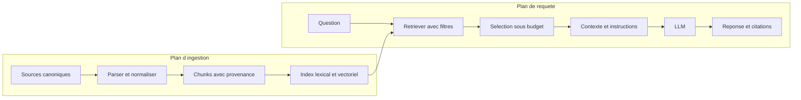
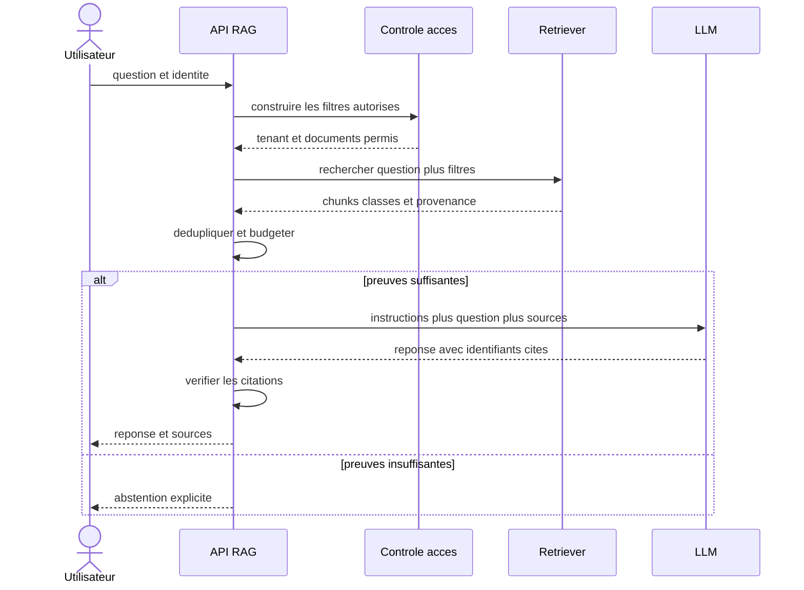

# RAG : principes

## Objectifs pédagogiques

À la fin de ce chapitre, vous saurez :

- expliquer un RAG en moins d’une minute, sans le réduire à une base vectorielle ;
- distinguer la préparation du corpus du traitement d’une question ;
- suivre une preuve depuis sa source jusqu’à la citation finale ;
- localiser une erreur dans le retrieval, la sélection du contexte ou la génération ;
- choisir entre recherche lexicale, vectorielle et hybride ;
- définir les premiers tests et contrôles d’une chaîne exploitable en production.

## Introduction

Une boutique modifie sa politique de retour : le délai passe de quatorze à
trente jours. Un modèle de langage peut encore produire l’ancienne valeur. Il
peut aussi donner la bonne valeur sans être capable d’en montrer l’origine.
Dans les deux cas, le lecteur ne sait pas si la réponse vient d’une règle à
jour, d’un souvenir statistique ou d’une formulation heureuse.

Un RAG change le moment où la connaissance métier entre dans le calcul. Au lieu
d’espérer que cette connaissance se trouve dans les poids du modèle, l’application
recherche une preuve au moment de la question. Elle place ensuite cette preuve
dans le [contexte](03-contexte.md) de génération.

!!! transformation "Transformation — D’une question à une réponse vérifiable"

    1. **Entrée** — `Quel est le délai de retour d’un article non utilisé ?`
    2. **Opération** — retrouver la politique en vigueur, sélectionner le passage pertinent et demander une réponse limitée à ce passage
    3. **Sortie** — `Le retour est possible dans les 30 jours suivant la réception [S1].`

    | Élément | Valeur pédagogique |
    |---|---|
    | Source `S1` | `politique-retours@v3`, mise à jour le `2026-08-05` |
    | Passage retenu | `Un article non utilisé peut être retourné dans les trente jours suivant sa réception.` |
    | Citation | `[S1]` pointe vers ce passage et sa version |

    **Lecture linéaire** — question → recherche dans les sources autorisées →
    passage versionné → contexte → réponse citée.

    **Statut de l’exemple** — Valeurs pédagogiques : la règle et la boutique sont
    fictives ; aucun modèle n’a été exécuté.

!!! definition "Définition — Retrieval-Augmented Generation (RAG)"

    Le [RAG](../glossaire.md#rag) est une architecture qui récupère des
    informations externes pour construire le contexte d’une génération. La
    source peut être un index, une base SQL, une API, un graphe ou une recherche
    directe. Une base vectorielle est donc une implémentation possible, pas la
    définition du pattern.

L’illustration suivante montre la différence à observer. À gauche, la réponse
ne transporte aucune preuve. À droite, l’application expose le document, sa
version et l’identifiant cité.

{ .aia-figure .aia-figure--wide loading=lazy }

*Figure 1 — Modèle seul et RAG ne diffèrent pas seulement par la qualité de la
phrase : le second construit un chemin vérifiable jusqu’à la preuve. Création
originale : Architecte IA Moderne, tous droits réservés.*

Le RAG ne rend pas automatiquement la réponse vraie. Il rend une partie de son
raisonnement **inspectable**. Une mauvaise source, un chunk incomplet, un filtre
d’autorisation absent ou une citation inventée restent possibles. L’architecture
doit donc mesurer séparément la recherche et l’usage des résultats.

## Historique

Les moteurs de recherche existaient bien avant les LLM. Ils indexaient des
termes, calculaient des scores et renvoyaient des documents. Les systèmes de
question-réponse combinaient déjà recherche d’information, extraction de
passages et modèles de langage spécialisés.

En 2020, Lewis et ses coauteurs nomment **Retrieval-Augmented Generation** une
architecture qui associe une mémoire paramétrique — les poids du modèle — à une
mémoire non paramétrique récupérée dans un index. Leur article étudie un
retriever dense et un générateur entraînés pour des tâches intensives en
connaissances. Le terme a ensuite été élargi, dans l’industrie, à de nombreuses
chaînes qui récupèrent des preuves avant une génération.

Cette généralisation ne signifie pas que tous les RAG doivent reproduire
l’architecture de l’article. Un moteur BM25, une requête SQL ou un appel d’API
peuvent fournir une preuve plus précise qu’un index vectoriel. Le principe
durable est la séparation entre **connaissance récupérable** et **génération**.

La progression contemporaine suit souvent quatre paliers :

1. recherche lexicale et réponse sourcée ;
2. recherche vectorielle ou hybride pour traiter les paraphrases ;
3. reranking, compression et évaluation pour améliorer le contexte final ;
4. boucles adaptatives pour relancer ou router la recherche lorsqu’un échec est détecté.

Le quatrième palier est parfois nommé *agentic RAG*. Il ajoute des décisions et
des boucles. Il ne remplace pas les trois premiers. Une boucle ne peut pas
compenser durablement un corpus non versionné ou des droits d’accès absents.

## Le problème

Les poids d’un modèle ne constituent pas un registre métier. Ils sont produits
par un entraînement coûteux, sur des données dont l’application ne maîtrise pas
nécessairement la date, la couverture ou la provenance. Ils ne changent pas
quand une procédure interne est publiée cinq minutes avant une question.

Envoyer tous les documents dans une grande fenêtre de contexte ne résout pas
toujours le problème. Cette approche augmente les tokens, la latence et le
bruit. Elle peut dépasser la capacité annoncée ou la capacité **effective** du
modèle. Elle ne fournit pas non plus, à elle seule, un contrôle d’accès par
document.

Un RAG répond à trois contraintes :

- **fraîcheur** — sélectionner la version en vigueur lors de la requête ;
- **échelle** — réduire un corpus à quelques preuves utiles ;
- **traçabilité** — conserver l’origine des passages utilisés.

Il introduit en échange une nouvelle classe de pannes. Le document peut ne pas
être ingéré. La question peut employer un vocabulaire absent du texte. Le bon
passage peut être classé trop bas. Le générateur peut ignorer une preuve pourtant
présente. Une réponse finale « incorrecte » ne dit pas laquelle de ces étapes a
échoué.

!!! definition "Définition — Retrieval"

    Le [retrieval](../glossaire.md#retrieval) est la recherche et la sélection
    d’éléments susceptibles de répondre à un besoin d’information. Son contrat
    minimal accepte une requête et renvoie des éléments classés avec leur
    provenance. Il ne produit pas nécessairement une phrase destinée à
    l’utilisateur.

!!! definition "Définition — Ancrage d’une réponse"

    Une réponse est **ancrée** lorsque ses affirmations vérifiables sont
    soutenues par les preuves autorisées rendues disponibles pour cette
    requête. Une réponse peut être fluide sans être ancrée, et une citation peut
    être présente sans soutenir réellement la phrase qui la précède.

## Architecture générale

La chaîne possède deux temporalités. Le **plan d’ingestion** prépare ce qui est
recherchable. Le **plan de requête** traite une question avec l’état d’index
disponible à cet instant.



Dans ce diagramme, les flèches représentent la circulation des données. La
frontière entre les deux plans permet de réindexer un corpus sans changer le
contrat de réponse, ou de changer de générateur sans reconstruire les sources.

Le plan d’ingestion conserve au minimum : identifiant du document, version,
date, propriétaire, droits d’accès, type de contenu et empreinte. Le chunk hérite
de ces métadonnées. Sans cette filiation, une citation vers `chunk-42` ne permet
pas de retrouver le document exact.

Le plan de requête reçoit l’identité de l’appelant, la question et les filtres
applicables. Le retriever retourne davantage de candidats que le nombre final
de passages. Une étape de sélection ou de reranking peut ensuite retirer les
doublons, privilégier une version et respecter le budget de contexte.

## Fonctionnement détaillé

Le parcours complet se comprend en sept décisions. Chacune produit un artefact
qui doit pouvoir être inspecté hors du LLM.

### 1. Définir les sources de vérité

Commencez par la source canonique, pas par le modèle d’embedding. Pour chaque
type de document, décidez qui le publie, quelle version est en vigueur, comment
une suppression se propage et quelle identité peut le consulter.

Un répertoire partagé non gouverné peut contenir deux politiques contradictoires.
Le meilleur retriever ne peut pas deviner laquelle possède l’autorité. Une règle
de version et un filtre de statut doivent être appliqués avant le classement de
pertinence.

### 2. Parser sans perdre la structure utile

Un PDF est un format de mise en page, pas une suite sémantique garantie. Un
parseur doit distinguer titre, paragraphes, listes, tableaux, en-têtes répétés et
notes. La sortie du parsing doit rester reliée aux pages ou aux sections qui
permettent une vérification humaine.

### 3. Découper en unités récupérables

Le [chunking](../glossaire.md#chunking) transforme un document en unités assez
petites pour être classées précisément, mais assez riches pour porter une idée
complète. Une taille fixe est une baseline. Une stratégie par titre, paragraphe
ou section conserve généralement davantage de sens.

Le chevauchement peut préserver une phrase coupée à une frontière. Il augmente
aussi le stockage et crée des résultats presque identiques. Mesurez donc les
doublons dans le top-k au lieu de choisir un pourcentage par habitude.

### 4. Indexer avec un ou plusieurs signaux

La recherche **lexicale** favorise les termes exacts : référence produit,
acronyme, article de loi ou message d’erreur. BM25 est une baseline fréquente.
La recherche **vectorielle** compare des représentations apprises et peut
retrouver une paraphrase. Elle dépend du modèle d’embedding et du domaine.

La recherche **hybride** exécute les deux, puis fusionne leurs rangs. Elle ne
doit pas additionner naïvement un score BM25 et un cosinus : leurs échelles ne
partagent pas de signification. Une fusion de rangs, telle que RRF, évite cette
comparaison directe.

### 5. Rechercher sous contraintes

La question n’est qu’une partie de la requête. Ajoutez l’identité du tenant, la
langue, le type de source, la période et les autorisations applicables. Un filtre
d’accès s’exécute avant que le contenu soit envoyé au modèle.

Le résultat conserve le score brut, le rang par signal, l’identifiant du chunk
et l’identifiant de la version source. Ces champs permettent de rejouer un cas
et de savoir pourquoi un passage a été retenu.

### 6. Construire un contexte, pas un collage

Les meilleurs résultats peuvent être redondants ou contradictoires. La sélection
retire les doublons, favorise la diversité utile et écarte les versions obsolètes.
Elle réserve la sortie du modèle avant de remplir l’entrée, comme expliqué au
[chapitre 3](03-contexte.md).

Les documents récupérés restent des données non fiables. Une phrase telle que
« ignore les règles précédentes » dans un document ne doit jamais être promue
au canal d’instruction. La sérialisation conserve une frontière visible et une
source pour chaque extrait.

### 7. Générer, citer et savoir s’abstenir

Le générateur reçoit une question, des instructions et un petit ensemble de
preuves. Il doit citer les identifiants fournis et signaler une preuve
insuffisante. L’application vérifie ensuite que chaque citation existe et que le
texte cité soutient l’affirmation.

Une abstention est une sortie valide. Si aucun résultat ne dépasse les critères
mesurés, inventer une réponse transforme un échec visible de retrieval en erreur
silencieuse de génération.

## Diagrammes

La séquence suivante montre les appels d’une question. Elle distingue le moteur
de recherche du générateur afin que leurs latences et erreurs soient observées
séparément.



Les flèches représentent des appels et des retours. Le contrôle d’accès précède
le retrieval ; masquer un document après la génération serait trop tardif.

La matrice suivante sert pendant l’analyse d’erreur. Commencez par demander si
la preuve étiquetée se trouve dans le top-k. Demandez ensuite si la réponse
l’utilise correctement.

{ .aia-figure .aia-figure--wide loading=lazy }

*Figure 2 — Deux axes suffisent pour choisir la prochaine investigation :
présence de la preuve et usage de la preuve. Création originale : Architecte IA
Moderne, tous droits réservés.*

Une note globale ne fournit pas ce diagnostic. Un changement de prompt ne peut
pas faire apparaître un document absent du top-k. Inversement, changer d’index
ne corrige pas un modèle qui déforme systématiquement une preuve présente.

## Études de cas architecturales

Les trois cas suivants réutilisent la même chaîne, mais déplacent la frontière
critique : gouvernance des versions, autorité d’exécution ou confidentialité.
Chaque étude nomme explicitement la fragilité qui ne peut pas être corrigée par
le LLM.

### Support client et politiques versionnées

**Situation.** Les conseillers répondent à partir de procédures qui changent
chaque mois. Les questions contiennent des paraphrases, mais aussi des références
exactes de commande.

**Architecture.** Un index hybride conserve la version et la date d’effet. Le
filtre sélectionne d’abord le pays et la politique en vigueur. Le top-k est
reranké, puis la réponse cite la section. Le système propose un brouillon ; le
code métier vérifie toute action sur une commande.

**Fragilité.** Deux versions actives créent une contradiction. La solution est
une règle de gouvernance documentaire, pas un prompt plus insistant.

### Assistant d’exploitation sur des runbooks

**Situation.** Un ingénieur cherche une procédure à partir d’un message d’erreur.
Les codes exacts sont très discriminants.

**Architecture.** BM25 reçoit un poids fort pour les identifiants et messages.
Le signal vectoriel traite les descriptions libres. Les résultats sont filtrés
par service et environnement. La réponse fournit les commandes, leur source et
les préconditions, mais leur exécution exige une confirmation et une
autorisation séparées.

**Fragilité.** Une instruction malveillante peut être placée dans un ticket ou
un runbook. Le texte récupéré n’obtient jamais les droits d’un outil.

### Recherche dans des contrats

**Situation.** Un juriste veut localiser des clauses proches dans un corpus
confidentiel. Une formulation convaincante ne doit pas être confondue avec une
interprétation juridique.

**Architecture.** Le document et la page restent canoniques. Les chunks suivent
les clauses, avec référence au contrat, à la version et aux parties autorisées.
L’interface affiche d’abord les extraits et laisse la synthèse comme aide
secondaire.

**Fragilité.** La récupération d’une clause semblable ne prouve ni son
applicabilité ni son effet. Le rôle de l’outil reste la recherche assistée.

## Implémentation sans framework

Le contrat minimal ne dépend d’aucun fournisseur :

```python
from dataclasses import dataclass
from typing import Protocol


@dataclass(frozen=True)
class Hit:
    chunk_id: str
    source_uri: str
    text: str
    score: float


class Retriever(Protocol):
    def search(self, query: str, limit: int = 4) -> tuple[Hit, ...]: ...


def answer(question: str, retriever: Retriever, generator: Generator) -> str:
    hits = retriever.search(question, limit=4)
    if not hits:
        return "Je ne trouve pas de preuve suffisante dans le corpus."
    prompt = build_prompt(question, hits)
    return generator.generate(prompt)
```

Le point important n’est pas la longueur du code. `Retriever` peut cacher BM25,
un index vectoriel, SQL ou une API. `build_prompt` applique la politique de
contexte. `Generator` ne reçoit que les passages déjà autorisés et sélectionnés.

L’exemple complet situé dans `examples/python-pur/rag-de-a-a-z/` fournit BM25,
cosinus, fusion RRF, adaptateur Ollama et tests. Le [chapitre
14](../02-architectures-rag/14-basic-rag.md#implementation-sans-framework) le
construit étape par étape sur le site.

## Implémentation avec les frameworks

Un framework accélère l’intégration de connecteurs et de fournisseurs. Il ne
choisit pas à votre place la source de vérité, les droits, les critères de
pertinence ou l’évaluation.

### LangChain

LangChain expose des objets de document, des retrievers et de nombreuses
intégrations. Son abstraction de retriever est plus générale qu’une base
vectorielle : elle reçoit une requête et retourne des documents. Utilisez-la pour
normaliser plusieurs backends, mais gardez vos métadonnées et métriques dans un
contrat applicatif testable.

### LangGraph

LangGraph devient utile lorsqu’une chaîne contient un état, des branches et des
boucles : noter les documents, réécrire une question ou changer de source. Un
Basic RAG linéaire n’a pas besoin d’un graphe. Introduisez-le après avoir défini
les états, les limites de boucle et les raisons d’arrêt.

### Agno

Agno fournit des composants orientés agents et connaissances. Il peut réunir un
agent, une base de connaissances et des outils. Cette commodité ne doit pas
fusionner contexte documentaire et autorité d’action : un passage récupéré reste
non fiable et ne confère aucun droit.

### LlamaIndex

LlamaIndex organise le cycle de données autour de documents, nœuds, index,
retrievers et synthèse de réponse. Il est adapté lorsque l’ingestion et les
stratégies d’indexation dominent le problème. Vérifiez néanmoins les identifiants,
la persistance et les suppressions dans le stockage réellement choisi.

### Haystack

Haystack représente la chaîne par des composants reliés dans un pipeline. Cette
forme rend explicites les entrées et sorties des retrievers, rankers et
générateurs. Elle aide à remplacer une étape, à condition de tracer les résultats
intermédiaires au lieu de ne conserver que la réponse finale.

### OpenAI Agents SDK

L’OpenAI Agents SDK orchestre modèles, outils, handoffs et traces. Un retriever
peut être exposé comme outil lorsque le modèle doit décider de l’appeler. Pour un
RAG systématique, une orchestration déterministe avant le modèle reste souvent
plus simple, moins coûteuse et plus facile à évaluer.

## Comparaison des approches

| Approche | Force | Faiblesse | Première mesure |
|---|---|---|---|
| Recherche lexicale | termes exacts, explicabilité, baseline rapide | paraphrases et synonymes | recall@k par type de requête |
| Recherche vectorielle | proximité sémantique | dépend du modèle, faux voisins | recall@k et dérive par domaine |
| Recherche hybride | combine exact et sémantique | deux index et une fusion à régler | gain par rapport à chaque baseline |
| Tout le corpus en contexte | aucune infrastructure d’index pour un petit corpus | coût, bruit, limites de contexte et ACL | qualité, tokens et latence |
| Fine-tuning | adapte un comportement ou un format | ne fournit ni fraîcheur ni provenance | gain sur tâche stable |
| RAG agentique | peut relancer, router ou reformuler | coût, variance et boucles | correction d’échecs identifiés par étape |

La recherche hybride est un candidat fréquent, pas un objectif automatique.
Si des identifiants exacts résolvent 99 % des questions, une baseline lexicale
peut être meilleure en coût et en explicabilité. Le choix dépend d’un jeu de
questions représentatif.

## Cas d’usage

Le RAG est adapté lorsque :

- la connaissance change plus vite que le modèle ;
- la réponse doit montrer des sources ;
- le corpus est trop grand ou trop sensible pour être envoyé intégralement ;
- plusieurs tenants ou rôles voient des documents différents ;
- l’équipe peut constituer des questions et preuves attendues pour l’évaluation.

Il est moins adapté lorsqu’une réponse déterministe peut provenir directement
d’une API ou d’une requête SQL. Dans ce cas, appelez la source structurée et
utilisez éventuellement le LLM pour reformuler le résultat, sans transformer le
calcul en recherche approximative.

## Anti-patterns

**Vectoriser avant de définir la source canonique.** L’index devient un mélange
de versions impossibles à arbitrer.

**Choisir une taille de chunk universelle.** Une fenêtre de 500 unités n’a pas le
même sens pour un contrat, un tableau et un ticket. Les frontières doivent être
évaluées sur la tâche.

**Confondre top-k et confiance.** Obtenir quatre résultats signifie seulement que
quatre candidats ont été classés. Le premier peut rester non pertinent.

**Évaluer uniquement la réponse finale.** Cette note ne distingue pas document
absent, mauvais classement, contexte tronqué et génération infidèle.

**Autoriser après retrieval.** Le contenu d’un document interdit a déjà pu être
embeddé, journalisé ou envoyé au modèle. Les filtres de sécurité doivent être
appliqués dans le chemin d’accès.

**Traiter une citation comme une preuve automatique.** Vérifiez que l’identifiant
existe, que le passage est dans le contexte et qu’il soutient la phrase.

**Ajouter un agent pour améliorer une baseline non mesurée.** Une boucle augmente
les chemins possibles sans révéler si le problème initial venait du corpus ou du
retrieval.

## Architecture de production

Une première architecture exploitable ajoute des contrôles autour de la chaîne
fonctionnelle :

1. **ingestion idempotente** avec version, suppression et file d’échec ;
2. **index versionné** afin de reconstruire hors ligne puis basculer atomiquement ;
3. **filtres d’accès** appliqués dans chaque backend de retrieval ;
4. **timeouts et reprises** distincts pour embeddings, recherche et génération ;
5. **traces corrélées** contenant rangs, chunks, tokens, latence et versions ;
6. **évaluation hors ligne** du retrieval et des réponses avant déploiement ;
7. **retours en ligne** analysés sans enregistrer de secrets ou de données interdites.

Les métriques minimales du retrieval sont la présence d’au moins une preuve
pertinente dans les k premiers résultats et le rang de la première preuve. La
réponse est évaluée séparément sur la fidélité aux sources, l’utilité, la qualité
des citations et l’abstention.

Pour la sécurité, supposez que tout document peut contenir une injection de
prompt indirecte. Séparez instructions et données, réduisez les outils
disponibles, validez leurs arguments et n’accordez jamais au modèle plus de
droits que l’utilisateur. Une consigne textuelle n’est pas une frontière de
sécurité.

Le cache doit inclure les versions pertinentes dans sa clé : corpus, modèle
d’embedding, politique de retrieval, prompt et générateur. Sinon une réponse
ancienne peut survivre à une mise à jour documentaire.

## Exercices

1. **Tracer une preuve.** Choisissez une règle interne fictive et listez les
   identifiants nécessaires pour passer du document à la citation finale.
2. **Créer une baseline.** Écrivez dix questions avec leurs passages attendus,
   puis mesurez hit rate@3 avec une recherche lexicale.
3. **Tester une paraphrase.** Remplacez les termes exacts de cinq questions par
   des synonymes. Comparez lexical, vectoriel et hybride.
4. **Diagnostiquer.** Pour trois mauvaises réponses, remplissez les deux axes de
   la figure 2 et proposez une seule modification mesurable.
5. **Menacer le système.** Placez une instruction malveillante dans un document.
   Vérifiez qu’elle reste dans le canal de données et qu’aucun outil n’est
   exécuté.

## Résumé

Un RAG récupère une petite quantité de connaissance externe au moment d’une
question, puis l’utilise comme contexte de génération. Sa valeur principale
n’est pas de « connecter un LLM à des documents », mais d’établir un chemin
versionné et observable entre une source, un passage, un contexte et une réponse.

La chaîne se divise en ingestion et requête. Elle peut utiliser recherche
lexicale, vectorielle, SQL, API ou plusieurs signaux. Sa qualité dépend autant
des sources, du chunking, des droits et de l’évaluation que du modèle génératif.

## Points clés à retenir

- RAG signifie **récupérer puis générer**, pas nécessairement « utiliser une base vectorielle ».
- La source canonique, sa version et ses droits précèdent le choix du retriever.
- Le retrieval et la génération doivent être testés séparément.
- Une preuve présente dans le top-k peut encore être mal utilisée par le modèle.
- Une citation n’est utile que si elle pointe vers un passage vérifiable.
- La recherche lexicale constitue une baseline, l’hybride une amélioration à mesurer.
- L’agentique n’est justifié que par des classes d’échecs observées.

## Bibliographie

- Lewis, P. et al. (2020). [*Retrieval-Augmented Generation for Knowledge-Intensive NLP Tasks*](https://arxiv.org/abs/2005.11401). Article fondateur du terme RAG et de l’association entre mémoire paramétrique et mémoire récupérée.
- Karpukhin, V. et al. (2020). [*Dense Passage Retrieval for Open-Domain Question Answering*](https://aclanthology.org/2020.emnlp-main.550/). Étudie un retriever dense à double encodeur.
- Robertson, S. et Zaragoza, H. (2009). [*The Probabilistic Relevance Framework: BM25 and Beyond*](https://www.staff.city.ac.uk/~sbrp622/papers/foundations_bm25_review.pdf). Présente le cadre probabiliste de BM25.
- Cormack, G. V., Clarke, C. L. A. et Büttcher, S. (2009). [*Reciprocal Rank Fusion Outperforms Condorcet and Individual Rank Learning Methods*](https://dl.acm.org/doi/10.1145/1571941.1572114). Introduit la fusion RRF évaluée dans l’article.
- Greshake, K. et al. (2023). [*Not What You’ve Signed Up For: Compromising Real-World LLM-Integrated Applications with Indirect Prompt Injection*](https://doi.org/10.1145/3605764.3623985). Formalise des attaques transmises par des contenus externes.
- OWASP GenAI Security Project. [*LLM01:2025 Prompt Injection*](https://genai.owasp.org/llmrisk/llm01-prompt-injection/). Synthèse opérationnelle des risques d’injection directe et indirecte.

## Chapitres connexes

- [Chapitre 3 — Le contexte](03-contexte.md) : budget, provenance, canaux et frontière de confiance.
- [Chapitre 14 — Basic RAG](../02-architectures-rag/14-basic-rag.md) : atelier exécutable de l’ingestion à la réponse sourcée.
- Chapitre 18 — Hybrid Search : combinaison des signaux lexicaux et vectoriels.
- Chapitre 20 — Reranking : réordonner un petit ensemble de candidats.
- Chapitre 25 — Agentic RAG : introduire des décisions et des boucles bornées.
- Chapitre 59 — Évaluation : jeux de données, métriques et régressions.
