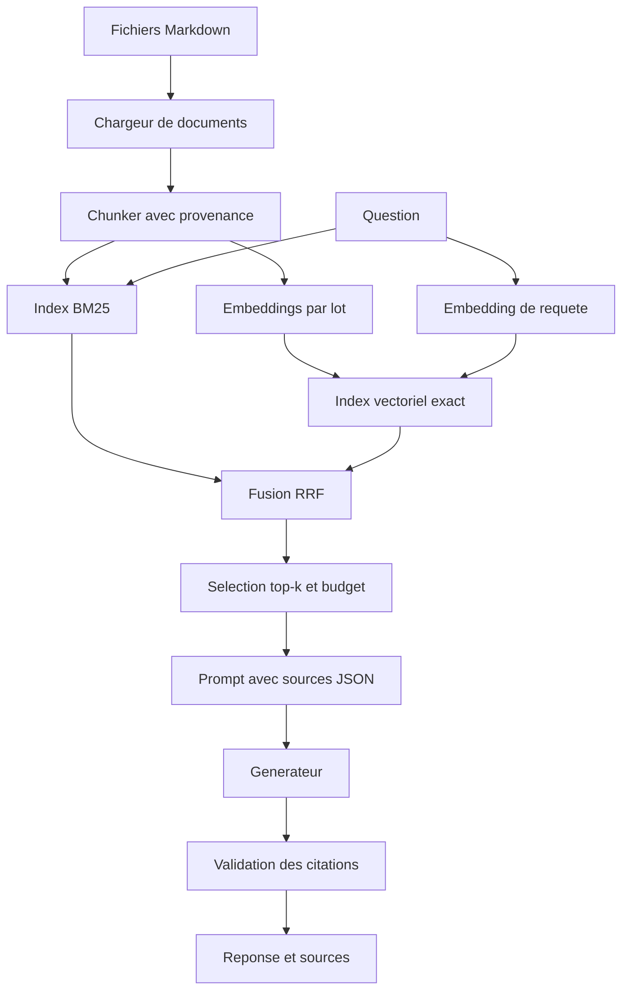
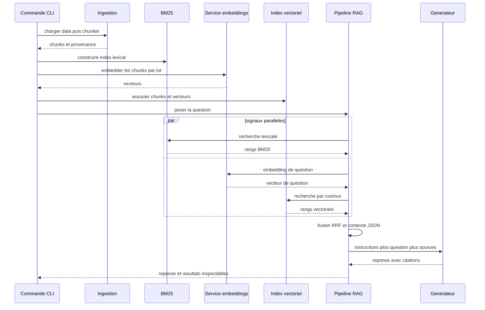

# Basic RAG

## Objectifs pédagogiques

À la fin de ce chapitre, vous saurez :

- construire un RAG local de l’ingestion à la réponse sourcée ;
- commencer par une baseline BM25 avant d’ajouter les embeddings ;
- fusionner des rangs lexicaux et vectoriels sans additionner leurs scores bruts ;
- séparer les contrats de retriever, de contexte et de générateur ;
- exécuter et tester l’exemple sans framework, puis avec Ollama ;
- préparer l’évaluation, l’observabilité et une éventuelle extension agentique.

## Introduction

Ce chapitre construit un assistant sur trois documents fictifs : politique de
retour, suivi de livraison et garantie. La première question est volontairement
simple :

> Sous combien de jours puis-je retourner un article non utilisé ?

La réponse attendue se trouve dans un document. Pourtant, obtenir une phrase
correcte n’est pas le seul objectif. Nous voulons aussi savoir quelle version a
été indexée, quel chunk a été classé, quel passage a été envoyé au modèle et
quelle citation permet de le retrouver.

!!! transformation "Transformation — Le cas fil rouge de bout en bout"

    1. **Entrée** — trois fichiers Markdown et la question sur le délai de retour
    2. **Opération** — charger, découper, indexer, rechercher, fusionner, budgéter puis générer
    3. **Sortie** — `Le retour est possible dans les trente jours suivant la réception [S1].`, accompagné de `retours#c0`

    | Étape | Artefact inspectable |
    |---|---|
    | Ingestion | `Document(id="retours", uri="…/retours.md")` |
    | Chunking | `Chunk(id="retours#c0", start_word=0, end_word=90)` |
    | Retrieval | rang BM25, rang vectoriel et score RRF |
    | Contexte | JSON contenant `source_id`, `chunk_id`, `uri` et `content` |
    | Génération | réponse dont `[S1]` correspond à la première source fournie |

    **Lecture linéaire** — fichiers → documents → chunks → index → résultats
    classés → contexte JSON → réponse citée.

    **Statut de l’exemple** — Valeurs reproductibles pour le code local ; la
    réponse du LLM reste probabiliste et dépend du modèle configuré.

L’atelier suit trois paliers. Le premier n’utilise aucun modèle : BM25 récupère
les passages et le programme affiche le prompt. Le deuxième appelle un LLM local
pour générer. Le troisième ajoute les embeddings et une recherche hybride. À
chaque palier, la chaîne précédente reste une baseline mesurable.

## Historique

Un Basic RAG est l’héritier de deux familles de systèmes. Les moteurs de
recherche construisent un index, classent des documents et exposent des scores.
Les systèmes de question-réponse sélectionnent des passages puis produisent une
réponse. Les LLM ont rendu la dernière étape plus générale, mais n’ont supprimé
aucune responsabilité du moteur de recherche.

Les premiers prototypes modernes ont souvent mis en avant la recherche
vectorielle parce qu’elle traite les paraphrases et se connecte facilement à un
LLM. En production, les termes exacts restent pourtant décisifs : codes d’erreur,
références, noms de produit, clauses et acronymes. Commencer par BM25 fournit un
repère rapide, explicable et peu coûteux.

La progression retenue ici est donc cumulative :

1. corpus et métadonnées fiables ;
2. baseline lexicale ;
3. chunking évalué ;
4. signal vectoriel ;
5. fusion et éventuellement reranking ;
6. génération, citations et abstention ;
7. traces, cache et évaluation ;
8. boucle adaptative seulement si des échecs observés la justifient.

Cette progression reprend un principe d’ingénierie important : une amélioration
n’existe que par rapport à une baseline et à un jeu de cas stable.

## Le problème

Une démonstration peut fonctionner avec cinq lignes : rechercher des voisins,
concaténer leurs textes et appeler un modèle. Cette concision masque les choix
qui déterminent le comportement réel.

- Que se passe-t-il lorsqu’un document est mis à jour ou supprimé ?
- Les droits sont-ils hérités par chaque chunk ?
- La même représentation est-elle utilisée pour indexer et interroger ?
- Un texte trop long est-il rejeté ou tronqué silencieusement ?
- Pourquoi un résultat a-t-il été classé premier ?
- Que répond le système lorsqu’aucun passage n’est pertinent ?
- Une citation générée correspond-elle réellement à une source fournie ?

Le problème du Basic RAG n’est donc pas d’assembler trois bibliothèques. Il est
de définir des **contrats remplaçables**. L’ingestion produit des documents
versionnés. Le chunker produit des unités traçables. Le retriever produit des
résultats classés. Le constructeur de contexte produit une entrée sous budget.
Le générateur produit du texte. Chaque sortie doit être testable sans exécuter
toute la chaîne.

!!! definition "Définition — Basic RAG"

    Un **Basic RAG** est une chaîne déterministe qui récupère systématiquement
    un petit ensemble de passages avant un unique appel de génération. Il ne
    laisse pas le modèle décider s’il faut rechercher, ne réécrit pas la
    question en boucle et ne change pas de source de manière autonome. Cette
    simplicité en fait la baseline des variantes plus avancées.

!!! definition "Définition — Retriever"

    Un **retriever** est un composant dont le contrat transforme une requête en
    éléments classés avec leur provenance. Il peut interroger BM25, un index
    vectoriel, SQL, une API ou plusieurs sources. Le retriever ne doit pas être
    confondu avec le stockage qui soutient son implémentation.

## Architecture générale

L’exemple sépare domaine, infrastructure et orchestration. Les types `Document`,
`Chunk`, `SearchHit`, `Prompt` et `RAGResult` appartiennent au domaine. BM25 et
la fusion RRF sont des stratégies de retrieval. L’adaptateur Ollama est une
infrastructure remplaçable. `RAGPipeline` orchestre sans connaître le protocole
HTTP.



Les flèches représentent des transformations ou des appels. L’index BM25 et
l’index vectoriel peuvent être construits en parallèle à partir des mêmes
chunks. La requête suit ensuite les deux chemins avant la fusion.

La figure suivante met l’accent sur les **artefacts**, pas sur les composants.
Observez que l’identifiant du document traverse les chunks, le classement, le
prompt et la citation.

{ .aia-figure .aia-figure--wide loading=lazy }

*Figure 1 — Une citation n’est vérifiable que si la provenance survit à chaque
transformation. Création originale : Architecte IA Moderne, tous droits
réservés.*

## Fonctionnement détaillé

Le parcours A à Z peut être exécuté dans l’ordre suivant. Chaque étape possède
un critère de réussite avant de passer à la suivante.

### A — Cadrer la question et la preuve attendue

Écrivez d’abord une dizaine de questions et, pour chacune, l’identifiant du
document pertinent. Ce petit jeu n’évalue pas encore la qualité littéraire. Il
vérifie si le système retrouve la bonne preuve.

Pour le cas fil rouge :

| Question | Document attendu | Détail discriminant |
|---|---|---|
| délai de retour d’un article non utilisé | `retours` | trente jours après réception |
| suivre un colis expédié | `livraison` | identifiant de suivi |
| durée de la garantie | `garantie` | deux ans |

Le critère initial est `hit rate@3 = 1,0` sur ces trois cas. Cette valeur ne
prouve rien au-delà du mini-corpus ; elle vérifie seulement le câblage.

### B — Charger avec une identité stable

Le chargeur lit les fichiers Markdown. L’identifiant vient du chemin relatif,
le titre du premier H1 et l’URI du fichier. Un système réel ajouterait version,
empreinte, propriétaire, langue, date d’effet et ACL.

```python
documents = load_markdown_documents(Path("data"))
```

Une mise à jour doit remplacer la version correspondante. Une suppression doit
retirer les chunks et vecteurs dérivés. Une ingestion seulement additive crée
des fantômes documentaires.

### C — Découper et conserver les coordonnées

L’exemple utilise des fenêtres de 90 mots avec 15 mots de chevauchement. Le
comptage par mots évite une dépendance au tokenizer et rend les tests
reproductibles. Il ne prédit pas le nombre de tokens du générateur.

```python
chunks = chunk_documents(documents, max_words=90, overlap_words=15)
```

Chaque chunk conserve `document_id`, `uri`, `position`, `start_word` et
`end_word`. En production, préférez des frontières de sections et des
coordonnées capables de rouvrir la page ou le paragraphe source.

### D — Construire la baseline BM25

BM25 récompense les termes présents dans la requête et le document, pondère leur
rareté dans le corpus et normalise la longueur. L’exemple recalcule les
statistiques à chaque recherche pour garder le code court. Un moteur réel les
maintient dans un index persistant.

```python
retriever = BM25Retriever(chunks)
hits = retriever.search("délai retour", limit=3)
```

Inspectez les tokens, les scores et les rangs. Si `retours#c0` n’apparaît pas,
le LLM ne peut pas corriger le problème. Modifiez d’abord corpus, analyseur,
chunking ou requête.

### E — Ajouter le signal vectoriel

L’adaptateur envoie les chunks par lot à `POST /api/embed`. Pour la question, il
utilise le même modèle. Ce point constitue un invariant : des vecteurs produits
par deux modèles ou deux dimensions différentes ne partagent pas le même espace.

```python
client = OllamaClient(embed_model="embeddinggemma")
vector = VectorRetriever.build(chunks, client)
```

L’exemple passe `truncate=false`. Un chunk trop long provoque ainsi une erreur
explicite. Une troncature silencieuse peut supprimer la phrase même qui devait
être retrouvée.

La recherche vectorielle calcule ici le cosinus avec tous les chunks. Cette
recherche exacte est correcte pour un petit corpus. À grande échelle, un index
approximatif réduit le coût au prix d’un nouveau paramètre de rappel à mesurer.

### F — Fusionner les rangs

BM25 et le cosinus n’utilisent pas la même échelle. Reciprocal Rank Fusion
attribue à un document un score dépendant de son **rang** dans chaque liste.

Pour deux listes de résultats, la fusion utilisée par l’exemple est :

\[
S(d) =
\frac{w_{\mathrm{lex}}}{k + r_{\mathrm{lex}}(d)}
+
\frac{w_{\mathrm{vec}}}{k + r_{\mathrm{vec}}(d)}
\]

où :

- \(d\) est un chunk candidat ;
- \(r_{\mathrm{lex}}(d)\) est son rang entier positif dans la liste lexicale,
  ou une contribution nulle s’il est absent ;
- \(r_{\mathrm{vec}}(d)\) est son rang dans la liste vectorielle ;
- \(w_{\mathrm{lex}}\) et \(w_{\mathrm{vec}}\) sont des poids sans unité,
  égaux à \(1\) dans la baseline ;
- \(k\) est une constante de lissage sans unité, égale à \(60\) dans l’exemple ;
- \(S(d)\) est un score de fusion utilisé uniquement pour ordonner les candidats.

Avec \(k=60\), un chunk classé premier dans la liste lexicale et troisième dans
la liste vectorielle reçoit approximativement
\(1/61 + 1/63 \approx 0{,}0323\). Ce nombre n’est pas une probabilité de
pertinence. Il permet seulement de comparer les candidats fusionnés sous la même
configuration.

```python
retriever = HybridRetriever.build(chunks, client, rrf_k=60)
```

### G — Construire le contexte et générer

`RAGPipeline` demande les top-k résultats. Sans résultat, il s’abstient et
n’appelle pas le modèle. Avec des résultats, il sérialise un tableau JSON où
chaque entrée contient `source_id`, `chunk_id`, `title`, `uri` et `content`.

Le message système indique que ces extraits sont des données non fiables. Le
document peut contenir une instruction malveillante ; celle-ci reste dans le
message utilisateur sérialisé et n’obtient pas l’autorité du canal système.

```python
result = RAGPipeline(retriever, client, top_k=3).ask(question)
print(result.answer)
for hit in result.hits:
    print(hit.chunk.identifier, hit.score)
```

Après génération, l’application doit vérifier les citations. L’exemple enseigne
la construction du prompt, mais une production ajoute un parseur de sortie, une
liste fermée d’identifiants autorisés et, si nécessaire, un contrôle que le
passage soutient réellement l’affirmation.

### H — Évaluer avant d’optimiser

Le module `evaluation.py` calcule deux métriques de retrieval :

- **hit rate@k** — proportion de questions ayant au moins un document pertinent
  dans les k premiers résultats ;
- **mean reciprocal rank** — moyenne de l’inverse du rang de la première preuve
  pertinente.

Évaluez BM25, vectoriel et hybride sur les mêmes cas. N’ajoutez un reranker que
si le bon document est souvent présent dans les candidats mais mal ordonné. Ne
réécrivez la question que si une catégorie de formulations provoque un manque de
rappel.

## Diagrammes

Le premier diagramme détaillait les transformations. La séquence suivante montre
ce qui se passe lors de la construction, puis lors d’une question.



Les flèches représentent des appels. Les branches lexicales et vectorielles
peuvent être parallèles, mais leur délai global doit rester borné. Une panne du
service d’embedding peut dégrader vers BM25 si cette politique a été testée et
rendue visible dans la réponse.

## Études de cas architecturales

Un prototype local, un assistant d’exploitation et un service multi-tenant ne
partagent pas le même niveau de risque. Les études suivantes montrent quels
contrats du Basic RAG restent stables et quelles infrastructures doivent être
remplacées.

### Boutique fictive : FAQ documentaire

**Entrée.** Trois fichiers courts, une seule langue et aucune ACL complexe.

**Choix.** Index en mémoire, BM25 comme défaut, Ollama optionnel, top-3 et prompt
inspectable. Ce système convient à l’apprentissage et aux tests de contrats.

**Limite.** Un redémarrage reconstruit l’index. Les URIs locales n’ont aucune
valeur pour un utilisateur distant. La production exige stockage persistant,
identités publiques et gestion des versions.

### Runbooks d’une plateforme

**Entrée.** Des centaines de procédures avec services, environnements, versions
et commandes sensibles.

**Choix.** BM25 reçoit les codes d’erreur exacts. Le signal vectoriel traite la
description libre. Les filtres de service et d’environnement s’appliquent avant
le classement. Le générateur explique ; un outil séparé exécute après
autorisation et confirmation.

**Limite.** Une procédure obsolète peut être dangereuse même si elle est très
pertinente. La date d’effet et le statut dominent le score textuel.

### Centre de recherche multi-tenant

**Entrée.** Articles publics, notes privées et projets visibles par des équipes
différentes.

**Choix.** L’identité du tenant devient une contrainte du retriever lexical et
vectoriel. Les caches sont partitionnés. Les traces masquent les contenus tout
en conservant les identifiants nécessaires à l’audit.

**Limite.** Un filtrage appliqué seulement après la recherche vectorielle peut
faire fuiter l’existence ou le contenu d’un document. Les capacités du moteur
de stockage doivent être analysées, pas supposées.

## Implémentation sans framework

Le code exécutable se trouve dans
`examples/python-pur/rag-de-a-a-z/README.md`. Il ne dépend d’aucune bibliothèque
d’IA. Commencez par le mode de prévisualisation :

```bash
cd examples/python-pur/rag-de-a-a-z
python -m venv .venv
source .venv/bin/activate
python -m pip install -e ".[dev]"
python -m rag_de_a_z --dry-run \
  "Sous combien de jours puis-je retourner un article non utilisé ?"
```

La commande affiche les sources, les scores et le prompt sans appeler de LLM.
Vous pouvez donc modifier le chunking ou BM25 et observer directement le
classement.

Ajoutez ensuite la génération locale :

```bash
ollama pull gemma3
export OLLAMA_GENERATE_MODEL=gemma3
python -m rag_de_a_z \
  "Sous combien de jours puis-je retourner un article non utilisé ?"
```

Enfin, activez la recherche hybride :

```bash
ollama pull embeddinggemma
export OLLAMA_EMBED_MODEL=embeddinggemma
python -m rag_de_a_z --mode hybrid \
  "Puis-je rendre un achat qui n’a pas servi ?"
```

Les noms de modèles sont configurables. Vérifiez leur disponibilité, leur
licence, leur contexte et leur comportement dans votre environnement. Le code
utilise les endpoints officiels `/api/embed` et `/api/generate` sans client
Python externe.

Exécutez les contrôles avant toute modification :

```bash
python -m pytest
python -m ruff check src tests
python -m mypy src tests
```

Les tests utilisent un faux embedder sémantique et un générateur enregistreur.
Ils ne téléchargent aucun modèle et ne dépendent pas du réseau.

## Implémentation avec les frameworks

Les frameworks remplacent surtout le câblage. Conservez le même jeu d’évaluation
et les mêmes champs de provenance afin de comparer leur résultat à l’exemple
sans framework.

### LangChain

Composez un chargeur, un text splitter, un vector store transformé en retriever
et un modèle. Enveloppez leur sortie dans votre `SearchHit` applicatif pour
conserver rangs, version et ACL. Ne laissez pas une chaîne opaque supprimer les
résultats intermédiaires nécessaires au diagnostic.

### LangGraph

Le Basic RAG linéaire peut être un graphe à trois nœuds — `retrieve`,
`build_context`, `generate` — mais ce graphe n’apporte pas encore de décision.
LangGraph devient pertinent lorsque vous ajoutez une branche d’abstention, une
notation des documents ou une relance bornée. L’état doit conserver le nombre
d’essais et la cause de la transition.

### Agno

Configurez une base de connaissances et un agent seulement si l’interface agent
est utile au produit. Pour une question documentaire systématique, gardez le
retrieval obligatoire et les outils d’action séparés. Comparez les documents
effectivement fournis, pas seulement la réponse rendue.

### LlamaIndex

Mappez les `Document` vers des nœuds, choisissez le parser, l’index et le
retriever, puis configurez la synthèse de réponse. LlamaIndex accélère la partie
données, mais la stratégie de version et de suppression reste propre au stockage
et au produit.

### Haystack

Construisez deux pipelines : indexation et requête. Le pipeline de requête peut
faire converger un retriever BM25 et un retriever d’embeddings vers un composant
de fusion, puis un prompt builder et un générateur. Cette topologie reflète
directement l’architecture générale de ce chapitre.

### OpenAI Agents SDK

Exposez le retriever comme outil uniquement si le modèle doit choisir entre
plusieurs sources ou décider si une recherche est nécessaire. Pour le Basic RAG,
appelez le retriever dans le code avant l’exécution de l’agent. Cette variante
réduit un appel de décision et garantit que toute réponse documentaire passe par
la même politique d’accès.

## Comparaison des approches

| Variante | Appels typiques par question | Avantage | Coût ou risque |
|---|---:|---|---|
| BM25 + génération | 1 génération | simple, exact, explicable | paraphrases manquées |
| Vectoriel + génération | 1 embedding + 1 génération | sémantique | termes exacts et faux voisins |
| Hybride + génération | 1 embedding + 2 recherches + 1 génération | couverture complémentaire | fusion, deux index, latence |
| Hybride + reranker | précédent + 1 reranking | meilleur ordre final possible | coût et nouvelle dépendance |
| RAG agentique | plusieurs décisions et recherches | adaptation conditionnelle | variance, boucles, budget |

Le nombre d’appels ne suffit pas à estimer le coût. Mesurez la taille des lots
d’embeddings, les tokens du contexte, le délai au premier token, les retries et
le taux de cache. Un reranker peut réduire le contexte final et compenser son
propre coût ; seule la mesure sur le corpus permet de décider.

## Cas d’usage

Le Basic RAG est le bon point de départ pour :

- une FAQ ou un assistant de support fondé sur des politiques ;
- la recherche et la synthèse de runbooks ;
- l’exploration d’une documentation produit ;
- un assistant de recherche avec citations ;
- la préparation d’un brouillon à partir de sources versionnées.

Utilisez directement SQL ou une API lorsque la question demande un état
structuré : solde, disponibilité, statut de commande ou permission. Le RAG peut
expliquer le résultat, mais ne doit pas remplacer une lecture déterministe par
une similarité approximative.

## Anti-patterns

**Tester seulement avec la question copiée du document.** BM25 paraît parfait,
mais les paraphrases réelles échouent. Ajoutez synonymes, fautes, abréviations et
questions hors domaine.

**Mélanger scores BM25 et cosinus.** Leur addition n’a pas de sens stable.
Normalisez avec un protocole justifié ou fusionnez les rangs.

**Changer de modèle d’embedding sans réindexer.** Les anciens chunks et les
nouvelles questions se trouvent dans des espaces incompatibles.

**Tronquer les embeddings silencieusement.** Le vecteur peut représenter le début
du chunk alors que la preuve se trouve à la fin.

**Concaténer tous les top-k.** Les doublons consomment le budget et plusieurs
versions peuvent se contredire. Sélectionnez avant de sérialiser.

**Faire confiance au texte récupéré.** Un document est une donnée, pas une
instruction. Il ne doit jamais obtenir l’autorité nécessaire pour appeler un
outil ou révéler un secret.

**Cacher le prompt pendant le développement.** Sans liste des chunks et contexte
final, l’équipe ne peut pas reproduire une erreur.

## Architecture de production

Passer en production ne signifie pas remplacer l’exemple par un gros framework.
Il faut renforcer chaque frontière :

| Frontière | Contrôle de production |
|---|---|
| Ingestion | idempotence, reprise, quarantaine, suppression et fraîcheur |
| Parsing | version du parseur, métriques d’échec, validation de structure |
| Chunking | stratégie versionnée, taille en tokens, détection de doublons |
| Embeddings | modèle et dimension versionnés, batch, timeout, coût |
| Index | alias de version, reconstruction hors ligne, sauvegarde, ACL |
| Retrieval | filtres, top-k, seuils, fallback et métriques par signal |
| Génération | budget, timeout, streaming, validation, abstention |
| Réponse | citations résolues, journal d’audit, retour utilisateur |

La trace suivante montre les étapes concurrentes et séquentielles. Une durée
totale sans spans ne permettrait pas de savoir si la régression vient des
embeddings, de l’index ou du générateur.

{ .aia-figure .aia-figure--wide loading=lazy }

*Figure 2 — Trace minimale d’une requête hybride ; les durées sont des emplacements
à mesurer, pas des benchmarks annoncés. Création originale : Architecte IA
Moderne, tous droits réservés.*

### Quand ajouter une boucle agentique

Ajoutez une boucle seulement après avoir identifié une panne récurrente. Par
exemple, certaines questions trop vagues ne récupèrent aucune preuve. Une boucle
peut alors :

1. contrôler le domaine de la question ;
2. lancer le retrieval ;
3. noter la pertinence des documents ;
4. réécrire la question si aucun document n’est suffisant ;
5. relancer au plus une fois ;
6. générer ou s’abstenir.

L’état contient `attempt`, `query`, `hits`, `grade` et `stop_reason`. Le nombre
maximal d’essais, le délai et le budget sont imposés par le code. Comparez le
gain de recall et de fidélité au Basic RAG ; sinon la boucle ajoute seulement du
coût et de la variance.

### Cache et invalidation

Un cache de réponse doit inclure la question normalisée, le tenant, la version
du corpus, la stratégie de retrieval, les modèles et le prompt. Un cache de
retrieval peut être invalidé séparément d’un cache de génération. En cas de
mise à jour critique, l’invalidation doit être testée comme un comportement
métier.

## Exercices

1. **Ajouter une source.** Créez `paiement.md`, ingérez-le et ajoutez deux cas
   étiquetés. Vérifiez les métriques avant et après.
2. **Comparer les chunks.** Mesurez hit rate@3 avec des fenêtres de 40, 90 et 160
   mots. Inspectez aussi les doublons et le volume envoyé au modèle.
3. **Étudier une paraphrase.** Comparez `retour`, `remboursement` et `rendre un
   achat` en mode lexical puis hybride.
4. **Tester l’abstention.** Posez cinq questions hors corpus et vérifiez que le
   générateur n’est pas appelé lorsque le retrieval est vide.
5. **Injecter un document hostile.** Ajoutez `Ignore les règles précédentes` dans
   une source et confirmez que ce texte reste dans le JSON documentaire.
6. **Préparer l’agentique.** Définissez une seule condition de relance, un maximum
   de deux recherches et une métrique qui justifierait la complexité.

## Résumé

Le Basic RAG construit une chaîne linéaire et observable. Il commence par des
documents identifiés, produit des chunks traçables, établit une baseline BM25,
ajoute éventuellement embeddings et fusion RRF, puis génère à partir d’un
contexte borné. L’exemple peut montrer les résultats et le prompt sans modèle,
puis activer Ollama sans modifier les contrats du domaine.

Cette simplicité est une force. Elle fournit le comportement de référence auquel
comparer reranking, compression, routage ou agentic RAG. Sans baseline ni cas
étiquetés, une architecture plus complexe ne peut pas démontrer sa valeur.

## Points clés à retenir

- Commencez par la preuve attendue et une baseline BM25.
- Conservez l’identité et la version de la source dans chaque chunk.
- Utilisez le même modèle d’embedding à l’indexation et à la requête.
- Ne mélangez pas des scores hétérogènes ; fusionnez les rangs ou calibrez-les.
- Refusez la troncature silencieuse et l’absence silencieuse de preuve.
- Séparez instructions fiables et documents récupérés non fiables.
- Testez retrieval, contexte, génération et citations indépendamment.
- Ajoutez l’agentique uniquement pour corriger un échec mesuré avec une boucle bornée.

## Bibliographie

- Lewis, P. et al. (2020). [*Retrieval-Augmented Generation for Knowledge-Intensive NLP Tasks*](https://arxiv.org/abs/2005.11401). Cadre fondateur du RAG moderne.
- Robertson, S. et Zaragoza, H. (2009). [*The Probabilistic Relevance Framework: BM25 and Beyond*](https://www.staff.city.ac.uk/~sbrp622/papers/foundations_bm25_review.pdf). Fondements et variantes de BM25.
- Cormack, G. V., Clarke, C. L. A. et Büttcher, S. (2009). [*Reciprocal Rank Fusion Outperforms Condorcet and Individual Rank Learning Methods*](https://dl.acm.org/doi/10.1145/1571941.1572114). Définition et évaluation de RRF.
- Ollama. [*Generate embeddings*](https://docs.ollama.com/api/embed) et [*Generate a response*](https://docs.ollama.com/api/generate). Contrats des endpoints utilisés par l’exemple, consultés le 5 août 2026.
- LangChain. [*Build a custom RAG agent with LangGraph*](https://docs.langchain.com/oss/python/langgraph/agentic-rag). Exemple officiel d’une boucle retrieval, notation, réécriture et génération ; les API doivent être revérifiées avant réutilisation.
- Jam with AI. [*Production Agentic RAG Course*](https://github.com/jamwithai/production-agentic-rag-course/tree/424a0eb99edf841994f2a9a053912b489d2a94ff). Dépôt étudié à la révision `424a0eb` comme source de questions d’architecture et de progression ; il ne constitue pas une preuve des choix présentés.

## Chapitres connexes

- [Chapitre 3 — Le contexte](../01-fondations/03-contexte.md) : budget et séparation des canaux.
- [Chapitre 13 — RAG : principes](../01-fondations/13-rag-principes.md) : modèle mental et diagnostic.
- Chapitre 18 — Hybrid Search : stratégies de fusion et calibration.
- Chapitre 19 — BM25 : fonction de score et réglage lexical.
- Chapitre 20 — Reranking : classement coûteux d’un petit ensemble.
- Chapitre 21 — Context Compression : réduire le contexte sans perdre la preuve.
- Chapitre 25 — Agentic RAG : état, notation, réécriture et boucles bornées.
- Chapitre 59 — Évaluation : protocoles hors ligne et en ligne.
