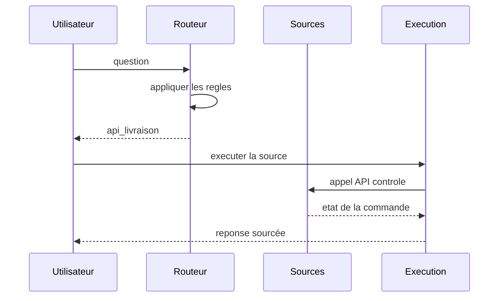

# Database Routing

## Objectifs pédagogiques

À la fin de ce chapitre, vous saurez :

- expliquer pourquoi interroger toutes les sources à chaque question est
  coûteux et bruité ;
- construire un routeur par règles, par LLM, ou hybride ;
- définir un contrat de source : schéma de requête, coût, latence, droits ;
- organiser le repli et l’abstention quand aucune source ne convient ;
- mesurer l’exactitude du routage et le coût évité.

## Introduction

Le chapitre 28 a montré que certaines questions appartiennent à SQL, pas
aux documents. Une boutique réaliste a pourtant **plusieurs** sources :
la base des commandes, l’index des documents, le graphe des garanties
(chapitre 26), et peut-être une API de livraison. La question :

> Où en est ma commande 4821 ?

appartient à l’API de livraison. La question :

> La garantie couvre-t-elle une surtension ?

appartient au graphe ou aux documents. La question :

> Combien de retours ce mois-ci ?

appartient à SQL. Interroger les quatre sources pour chaque question est
un gaspillage — et surtout un **bruit** : la réponse de la mauvaise source
pollue la bonne.

Le Database Routing décide **avant** la recherche : une question, une
destination.

!!! transformation "Transformation — Une question, la bonne source"

    1. **Entrée** — « Où en est ma commande 4821 ? »
    2. **Opération** — le routeur classifie l’intention et aiguille vers l’API de livraison
    3. **Sortie** — réponse avec l’état exact de la commande, aucune autre source interrogée

    | Règle ou signal | Destination |
    |---|---|
    | mention d’un numéro de commande | API livraison |
    | question d’agrégat sur retours | SQL |
    | question de garantie | graphe / documents |
    | question de politique | index documentaire |

    **Lecture linéaire** — question → classification → destination →
    exécution → réponse.

    **Statut de l’exemple** — Classification probabiliste si LLM, règles
    déterministes sinon.

Le routage est le chapitre 24 appliqué aux **sources** : la complexité y
était le critère, ici c’est la nature de la demande.

## Historique

Le routage d’intention est une pratique ancienne des moteurs de
recherche : distinguer une requête de navigation d’une requête de recherche,
puis choisir l’index adapté. Les assistants vocaux et les chatbots l’ont
généralisé avec des classifieurs d’intention, puis les LLM ont permis la
classification en langage naturel.

Dans les systèmes RAG, le routage est devenu une décision d’architecture à
part entière : le routeur choisit entre index vectoriels, bases
relationnelles, graphes et APIs. Les frameworks l’exposent sous des noms
différents — routeurs de chaînes, retrieveurs de sélection, aiguillages de
pipeline — mais le contrat est le même : **une décision, prise avant
l’exécution, qui évite les recherches inutiles**.

Le chapitre 24 a routé par complexité ; ce chapitre route par destination.
Les deux mécanismes se combinent : le routeur de destination choisit la
source, le routeur de complexité choisit la stratégie dans la source.

## Le problème

Interroger toutes les sources à chaque question échoue de quatre manières :

**Le coût.** Chaque source coûte : tokens, appels, latence. Multiplier les
sources multiplie le coût pour chaque question, même quand une seule
source est pertinente.

**Le bruit.** La question « combien de retours ? » interroge aussi les
documents : le contexte reçoit des passages hors sujet qui concurrencent
les lignes exactes de SQL.

**Les droits.** Toutes les sources ne sont pas ouvertes à tous les
utilisateurs. Une recherche globale traverse des frontières d’accès.

**La contradiction.** Deux sources peuvent donner des réponses différentes
à la même question. Interroger les deux impose un arbitrage (chapitre 30)
que le routage évite quand une source est clairement la bonne.

!!! definition "Définition — Database Routing"

    Le **Database Routing** choisit, avant toute exécution, la source qui
    répondra à la question : index documentaire, base relationnelle,
    graphe, API, ou aucune. Le routeur peut être des règles
    déterministes, un LLM, ou les deux ; la décision est journalisée et
    mesurée.

Le problème central : **l’erreur de routage est coûteuse dans les deux
sens**. Router vers la mauvaise source produit une réponse fausse ou
« je ne sais pas » ; router vers plusieurs sources par prudence coûte
cher et brouille le contexte. Le routeur doit pouvoir dire **« aucune
source »** et déclencher une abstention ou une escalade.

## Architecture générale

Le routeur se place devant un registre de sources, chacune avec un contrat
explicite.

```mermaid
flowchart TD
    question[Question] --> router[Routeur]
    router -->|regles| rules[Règles : codes, termes, motifs]
    router -->|llm| llm[Classification LLM]
    router --> registry[Registre des sources]
    registry --> docs[Index documentaire]
    registry --> sql[Base SQL]
    registry --> graph[Graphe]
    registry --> api[API externe]
    docs --> exec[Execution de la source choisie]
    sql --> exec
    graph --> exec
    api --> exec
    exec --> answer[Reponse]
    router -->|aucune source| abstain[Abstention ou escalade]
```

Les flèches représentent des décisions. Le registre des sources est la
donnée centrale : chaque source y déclare son contrat, son coût et ses
droits.

{ .aia-figure .aia-figure--wide loading=lazy }

*Figure 1 — Aiguiller avant de chercher. Création originale : Architecte
IA Moderne, tous droits réservés.*

## Fonctionnement détaillé

Le parcours se déroule en six étapes, du registre à la mesure.

### A — Définir le registre des sources

Chaque source déclare :

- un **identifiant** et une description pour le routeur ;
- un **contrat de requête** (texte, SQL, Cypher, API) ;
- un **coût estimé** (tokens, appels, latence) ;
- les **droits** requis (rôle, tenant, périmètre) ;
- les **exemples** de questions qu’elle sert.

Le registre est la documentation que le routeur — et les humains — lisent.

### B — Router par règles

Les règles sont déterministes et testables :

```python
def route_by_rules(question: str) -> SourceId | None:
    if re.search(r"\b\d{4}\b", question) and "commande" in question:
        return "api_livraison"
    if any(word in question for word in ("combien", "total", "moyenne")):
        return "sql_retours"
    if "garantie" in question:
        return "graph_garanties"
    return None
```

Les règles priment : elles sont gratuites, stables et expliquables. Le
LLM ne reçoit que ce que les règles n’ont pas su classer.

### C — Router par LLM

Le LLM reçoit la question et le registre — identifiants, descriptions,
exemples — et produit une destination avec une raison :

```python
decision = route_with_llm(client, question, registry)
# {"source": "graph_garanties", "reason": "question de couverture de garantie"}
```

Les exemples par source sont essentiels : sans eux, le modèle choisit par
le nom de la source, souvent trompeur.

### D — Gérer le doute

Le routeur LLM peut produire une **confiance faible** ou une destination
hors registre. Deux politiques :

- **repli en cascade** : essayer la source la plus probable, puis la
  seconde si la première échoue (borné) ;
- **abstention** : répondre que la question dépasse les sources
  disponibles, avec une escalade optionnelle.

La cascade doit être bornée : deux sources maximum, sinon le routage
redevient la recherche globale qu’il devait éviter.

### E — Exécuter et répondre

La source choisie s’exécute avec son propre pipeline : SQL (chapitre 28),
documents (chapitre 14), graphe (chapitre 26), API (appel contrôlé). La
réponse porte la source comme provenance.

### F — Mesurer

Trois métriques :

- **exactitude du routage** : destination attendue vs destination choisie ;
- **coût évité** : appels et tokens économisés par rapport à la recherche
  multi-sources ;
- **taux d’abstention** : part des questions sans destination, et leur
  justesse.

{ .aia-figure .aia-figure--wide loading=lazy }

*Figure 2 — Trois façons de décider la destination. Création originale :
Architecte IA Moderne, tous droits réservés.*

## Diagrammes

La séquence d’une question routée par règles :



Les flèches représentent des appels. Une seule source est touchée.

## Études de cas architecturales

Trois situations montrent comment le routage s’adapte au produit : une
boutique multi-sources, une plateforme de données et un centre de
recherche multi-tenant.

### Boutique fictive : quatre sources

**Entrée.** Documents, base SQL, graphe des garanties, API de livraison.

**Choix.** Règles pour les signaux forts (numéro de commande, agrégats),
LLM pour le reste, abstention hors périmètre. Le registre documente les
quatre sources avec leurs exemples.

**Limite.** Les règles françaises (« combien », « où en est ») ne
couvrent pas toutes les formulations ; le LLM prend le relais, au prix
d’un appel par question non routée.

### Plateforme de données

**Entrée.** Un entrepôt, des dashboards, des APIs métier.

**Choix.** Le routage s’appuie sur le **dictionnaire métier** du chapitre
28 : chaque terme route vers la définition autorisée. Les questions
ambiguës sont routées vers un assistant de clarification, pas vers une
source au hasard.

**Limite.** Deux sources répondent parfois légitimement (un chiffre et son
explication). Le routeur peut alors choisir une **composition** explicite :
SQL pour le chiffre, documents pour l’explication — le chapitre 30 traite
cette fusion.

### Centre de recherche multi-tenant

**Entrée.** Des sources par tenant avec des droits différents.

**Choix.** Le routeur ne voit que les sources autorisées pour le tenant :
le registre est filtré **avant** la classification, pour que le LLM ne
puisse même pas nommer une source interdite.

**Limite.** Une question légitime mais formulée bizarrement peut être
routée vers une source autorisée mais fausse. L’exactitude du routage se
mesure par tenant.

## Implémentation sans framework

Les extraits ci-dessous étendent le domaine de l’exemple du chapitre 14 avec le registre des sources et le routeur. Ils suivent ses conventions ; la CLI de l’exemple ne les expose pas encore.

```python
@dataclass
class Source:
    identifier: str
    description: str
    examples: list[str]
    cost: float
    required_role: str | None = None
```

```bash
cd examples/python-pur/rag-de-a-a-z
python -m pytest
python -m ruff check src tests
python -m mypy src tests
```

Les tests vérifient l’ordre règles → LLM, le filtrage du registre par
tenant, la borne de la cascade et l’abstention hors périmètre.

## Implémentation avec les frameworks

Les frameworks exposent des routeurs prêts à l’emploi ; le filtrage par
droits et la mesure restent applicatifs.

### LangChain

LangChain propose des routeurs de chaînes (`RouterChain`, routeurs
sémantiques) qui sélectionnent une destination par similarité ou par
LLM. Le registre des sources se construit comme une liste de descriptions
avec exemples ; la politique de droits reste dans le code.

### LangGraph

Le routage est un nœud `route` avec des transitions conditionnelles vers
les sous-graphes des sources. La cascade de repli est une transition
bornée par l’état : le même motif que la boucle du chapitre 25.

### Agno

L’agent Agno peut choisir ses outils — c’est un routage implicite. Si le
produit exige un routage **déterministe**, placez le routeur dans le code
et ne donnez à l’agent que l’outil de la source choisie.

### LlamaIndex

LlamaIndex expose des routeurs de query engines avec descriptions et
exemples. Le framework gère la sélection ; le filtrage du registre par
tenant et la mesure restent applicatifs.

### Haystack

Haystack accepte un composant routeur dans le pipeline, suivi de
sous-pipelines par source. La topologie rend le routage visible et chaque
branche testable.

### OpenAI Agents SDK

Les garde-fous du SDK peuvent réaliser le routage : une étape
`classify_source` avant l’exécution de l’agent de la source. L’agent
final ne reçoit que la question et la source choisie.

## Comparaison des approches

| Approche | Déterminisme | Coût | Couverture | Risque |
|---|---|---|---|---|
| Recherche multi-sources | aucun | élevé | large | bruit, droits |
| Règles seules | total | nul | signaux forts | paraphrases ratées |
| LLM seul | aucun | 1 appel | formulations libres | erreurs, coût |
| Hybride règles + LLM | partiel | 1 appel si besoin | large | erreurs du LLM |
| Hybride + cascade bornée | partiel | 1-2 sources | large | latence |

## Cas d’usage

Le Database Routing convient lorsque :

- plusieurs sources distinctes existent avec des contrats différents ;
- une partie des questions a des signaux déterministes (numéros, codes) ;
- le coût de la recherche multi-sources est mesurable et significatif ;
- chaque source a des droits et une équipe de maintenance propres.

Il ne convient pas lorsqu’une seule source existe (le routeur est un
appel inutile), lorsque les questions sont toujours transverses (le
chapitre 30 est plus adapté), ou lorsque le registre ne peut pas être
maintenu à jour.

## Anti-patterns

**Router après avoir cherché.** Le routage décide avant ; une recherche
préalable annule son intérêt.

**Faire confiance au nom des sources.** Le LLM choisit par la description
et les exemples, pas par le nom. Écrivez le registre pour le modèle.

**Cascade illimitée.** Le repli multi-sources redevient la recherche
globale. Bornez la cascade à deux sources.

**Exposer le registre complet au LLM.** Le modèle peut nommer une source
interdite. Filtrez le registre par les droits du demandeur avant la
classification.

**Ne pas mesurer le routage.** Une erreur de routage produit une réponse
fausse avec assurance. L’exactitude du routage est une métrique de
production.

## Architecture de production

| Frontière | Contrôle de production |
|---|---|
| Registre | versionné, revu, avec exemples testés |
| Règles | testées unitairement, prioritaires sur le LLM |
| Classification | modèle versionné, exactitude suivie |
| Droits | registre filtré avant classification |
| Cascade | bornée, journalisée |
| Abstention | explicite, catégorisée, escalade optionnelle |
| Mesure | exactitude, coût évité, taux d’abstention |

## Exercices

1. **Construire le registre.** Quatre sources avec descriptions et trois
   exemples chacune.
2. **Mesurer l’exactitude.** Trente questions étiquetées ; comparez règles
   seules, LLM seul et hybride.
3. **Tester l’abstention.** Cinq questions hors périmètre : le routeur
   doit refuser, pas choisir au hasard.
4. **Filtrer par tenant.** Vérifiez que le LLM ne peut jamais nommer une
   source interdite.
5. **Borne de cascade.** Activez le repli et vérifiez qu’il s’arrête après
   deux sources.

## Résumé

Le Database Routing choisit la source avant d’exécuter : règles pour les
signaux forts, LLM pour le reste, abstention quand rien ne convient. Le
registre des sources — descriptions, exemples, coûts, droits — est la
donnée centrale, filtrée par les droits du demandeur avant toute
classification. Le routage évite le coût et le bruit de la recherche
multi-sources ; il se mesure par l’exactitude de ses décisions. Quand les
questions sont réellement transverses, le chapitre suivant prend le
relais : la fusion multi-sources.

## Points clés à retenir

- Le routage décide avant la recherche : une question, une destination.
- Les règles déterministes priment ; le LLM ne reçoit que le reste.
- Le registre des sources est écrit pour le modèle : descriptions et exemples.
- Filtrez le registre par les droits avant la classification.
- La cascade de repli est bornée, sinon elle redevient la recherche globale.
- « Aucune source » est une réponse légitime : abstention ou escalade.
- L’exactitude du routage est une métrique de production.

## Bibliographie

- LangChain. [*Routing*](https://python.langchain.com/docs/how_to/routing/). Documentation des routeurs de chaînes ; API à revérifier.
- LlamaIndex. [*RouterQueryEngine*](https://docs.llamaindex.ai/en/stable/module_guides/querying/router/). Documentation du routeur de query engines ; API à revérifier.
- Haystack. [*Pipeline branching*](https://docs.haystack.deepset.ai/docs/intro). Documentation des branchements de pipelines, consultée le 5 août 2026.
- Ollama. [*Generate a response*](https://docs.ollama.com/api/generate). Contrat de l’endpoint utilisé par l’exemple, consulté le 5 août 2026.
- Jam with AI. [*Production Agentic RAG Course*](https://github.com/jamwithai/production-agentic-rag-course/tree/424a0eb99edf841994f2a9a053912b489d2a94ff). Dépôt étudié à la révision `424a0eb` pour son garde-fou de domaine, un routage binaire avant recherche ; il ne constitue pas une preuve des choix présentés.

## Chapitres connexes

- [Chapitre 24 — Adaptive RAG](24-adaptive-rag.md) : le routage de complexité, complément du routage de destination.
- [Chapitre 25 — Agentic RAG](25-agentic-rag.md) : l’agent choisit les outils — le routage devient une décision de boucle.
- [Chapitre 28 — SQL RAG](28-sql-rag.md) : la destination SQL et son contrat.
- Chapitre 26 — Graph RAG : la destination graphe.
- Chapitre 30 — Multi-source RAG : quand la question exige plusieurs destinations.
