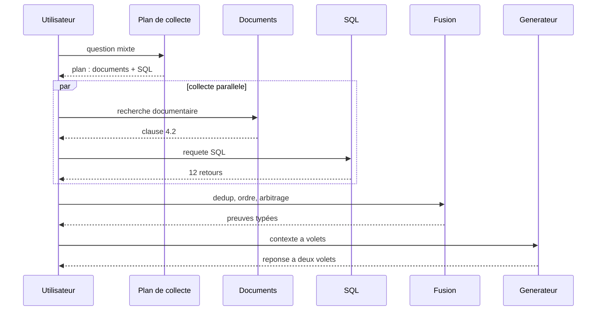

# Multi-source RAG

## Objectifs pédagogiques

À la fin de ce chapitre, vous saurez :

- expliquer quand une question exige plusieurs sources malgré le routage ;
- définir un plan de fusion : par source, par confiance, par date d’effet ;
- conserver la provenance de chaque preuve dans le contexte ;
- arbitrer les contradictions entre sources, ou refuser de trancher ;
- mesurer la valeur ajoutée de chaque source sur un jeu de cas.

## Introduction

Le chapitre 29 a routé chaque question vers une source. Mais certaines
questions sont **transverses par nature** :

> La garantie étendue du R-240 couvre-t-elle les surtensions, et combien de
> retours ce type de panne a-t-il généré le trimestre dernier ?

La première partie est dans le graphe des garanties (chapitre 26) ou les
documents ; la seconde est dans la base SQL (chapitre 28). Aucune source
ne contient la réponse complète. Le Multi-source RAG assemble les preuves
de plusieurs mondes — documents, bases, graphes, APIs, visuel — dans un
contexte unique, avec une provenance par preuve.

!!! transformation "Transformation — Des preuves venues de plusieurs mondes"

    1. **Entrée** — question mixte garantie + statistiques de retours
    2. **Opération** — recherche documentaire, requête SQL, parcours du graphe ; les preuves sont dédupliquées et ordonnées
    3. **Sortie** — réponse à deux volets, chaque volet citant sa source

    | Source | Preuve | Provenance |
    |---|---|---|
    | Graphe | EXT-2 exclut les surtensions | `graphe#EXT-2` |
    | Documents | clause 4.2 du manuel | `manuel#c4` |
    | SQL | 12 retours liés au trimestre | `SELECT …` |

    **Lecture linéaire** — question → N sources → preuves → fusion →
    contexte typé → réponse à deux volets.

    **Statut de l’exemple** — Les preuves des sources exactes sont
    déterministes ; l’extraction par LLM reste probabiliste.

Le Multi-source RAG est le point d’arrivée de cette partie : il suppose
les chapitres 14 à 29 maîtrisés, et n’ajoute qu’un contrat — la **fusion
de preuves hétérogènes**.

## Historique

Les systèmes de question-réponse ouverte ont toujours dû combiner des
sources : textes, tables, connaissances structurées. Les approches
classiques sélectionnaient une source par type de question ; les systèmes
hybrides modernes fusionnent les preuves quand la question est
transverse.

Deux lignées nourrissent le Multi-source RAG. La première est la **fusion
de résultats** : RRF (chapitre 18) combine des listes de rangs, la
déduplication et les votes combinent des preuves. La seconde est le
**routage composé** : le chapitre 29 route vers une source, et sa
généralisation naturelle route vers **plusieurs** sources quand la
question est multi-parties.

Les systèmes agentiques (chapitre 25) réalisent ce multi-source
implicitement : l’agent appelle plusieurs outils et rassemble les
résultats. Ce chapitre le rend **déterministe** : un plan de collecte,
une fusion explicite, un arbitrage des contradictions — sans laisser le
modèle improviser la méthode.

## Le problème

Le routage du chapitre 29 échoue sur quatre familles de questions :

**Les questions multi-parties.** « Couverture ET statistiques » : chaque
partie a sa source. Aucun routeur honnête ne peut choisir une seule
destination.

**Les questions de recoupement.** « Les retours de surtensions
contredisent-ils la clause d’exclusion ? » : la réponse exige de
**comparer** deux sources.

**Les questions multi-modalités.** « Ce graphique et ce tableau
disent-ils la même chose ? » : le texte, le visuel et les données se
complètent (chapitre 27).

**Les questions de confiance.** Quand les sources divergent, la réponse
doit exposer l’accord et le désaccord, pas choisir en silence.

!!! definition "Définition — Multi-source RAG"

    Le **Multi-source RAG** collecte des preuves auprès de plusieurs
    sources (documents, SQL, graphe, API, visuel) pour une même question,
    puis les consolide dans un contexte typé : chaque preuve garde sa
    source, sa confiance et sa date d’effet. La fusion est un plan
    explicite, pas une concaténation.

!!! definition "Définition — Plan de fusion"

    Un **plan de fusion** déclare, pour une question : quelles sources
    interroger, dans quel ordre, comment dédupliquer, comment ordonner les
    preuves, et comment arbitrer les contradictions. Il peut être statique
    (règles) ou construit par le LLM — mais il est toujours **inspectable**.

Le problème central : **les sources hétérogènes ne se comparent pas
directement**. Un score vectoriel, une ligne SQL et une arête de graphe
n’ont pas la même unité. La fusion doit travailler sur des métadonnées
communes — source, confiance, date — et non sur des scores.

## Architecture générale

L’architecture étend le routeur du chapitre 29 en un **collecteur
multi-source** suivi d’un plan de fusion.

```mermaid
flowchart TD
    question[Question] --> plan[Plan de collecte]
    plan --> docs[Documents]
    plan --> sql[SQL]
    plan --> graph[Graphe]
    plan --> api[API]
    docs --> evidence[Preuves avec provenance]
    sql --> evidence
    graph --> evidence
    api --> evidence
    evidence --> dedup[De-duplication]
    dedup --> order[Ordre et budget]
    order --> conflict[Arbitrage des contradictions]
    conflict --> context[Contexte type]
    context --> gen[Generateur]
    gen --> answer[Reponse a volets]
```

Les flèches représentent des transformations. Chaque source garde son
contrat ; la fusion travaille sur les preuves et leurs métadonnées.

{ .aia-figure .aia-figure--wide loading=lazy }

*Figure 1 — Consolider des preuves hétérogènes. Création originale :
Architecte IA Moderne, tous droits réservés.*

## Fonctionnement détaillé

Le parcours se déroule en sept étapes, du plan de collecte à la mesure.

### A — Établir le plan de collecte

Le plan déclare les sources et leurs rôles. Deux formes :

- **statique** : les règles du chapitre 29 étendues — si la question
  contient « et » + un agrégat, collecter SQL + documents ;
- **généré** : le LLM produit le plan (sources, ordre, rôle de chaque
  source), validé par le code.

Le plan généré est une sortie structurée, bornée : au plus trois sources,
au plus deux appels par source.

### B — Collecter les preuves

Chaque source s’exécute avec son propre pipeline (chapitres 14, 26, 28,
27). Les preuves sont normalisées dans un contrat commun :

```python
@dataclass
class Evidence:
    source_id: str        # "sql_retours"
    item_id: str          # identifiant dans la source
    content: str
    confidence: float     # propre à la source, documentée
    effective_date: str | None
    access_scope: str     # tenant, rôle requis
```

La normalisation ne convertit pas les scores : elle les **documente**
chacun dans son échelle.

### C — Dédupliquer

La même information peut venir de deux sources (un fait dans les documents
et dans le graphe). La déduplication se fait par **identifiant d’entité**
normalisé, comme au chapitre 26 — jamais par similarité de texte, qui
rapprocherait des preuves différentes.

### D — Ordonner sous budget

L’ordre des preuves suit le plan : les sources exactes (SQL) priment sur
les sources approximatives (documents) pour les faits chiffrés ; la date
d’effet départage les versions. Le budget du chapitre 3 s’applique, avec
une réserve par source : aucune source ne doit écraser les autres.

### E — Arbitrer les contradictions

Quand deux preuves se contredisent, trois issues :

- **départager** : la date d’effet ou la confiance documentée désigne la
  preuve ; l’autre est citée comme divergent ;
- **contextualiser** : les deux sont vraies dans des conditions différentes
  (garantie légale vs commerciale) — le contexte typé le rend visible ;
- **refuser de trancher** : la réponse expose le désaccord et demande une
  décision humaine.

{ .aia-figure .aia-figure--wide loading=lazy }

*Figure 2 — Gérer les contradictions, pas les ignorer. Création
originale : Architecte IA Moderne, tous droits réservés.*

### F — Générer avec un contexte typé

Le contexte sérialise chaque preuve avec sa source : `[SQL]`, `[DOC]`,
`[GRAPHE]`, `[API]`, `[VISUEL]`. Le prompt demande une réponse à volets,
chaque volet citant ses sources. Les citations sont validées contre la
liste des preuves fournies.

### G — Mesurer la valeur des sources

La métrique propre au multi-source : la **valeur ajoutée marginale** de
chaque source. On mesure la qualité de la réponse avec toutes les sources,
puis en retirant chaque source une à une. Une source qui ne change rien
sort du plan.

## Diagrammes

Une question à deux volets, collectée puis fusionnée :



Les flèches représentent des appels ; la collecte est parallèle et bornée.

## Études de cas architecturales

Trois situations montrent comment la fusion s’adapte au produit : une
boutique multi-domaines, une plateforme de données et un centre de
recherche multi-tenant.

### Boutique fictive : assistance multi-domaines

**Entrée.** Documents, SQL, graphe, API de livraison.

**Choix.** Plan statique : agrégat → SQL ; garantie → graphe ; les deux →
les deux sources. Contexte typé, réponse à volets.

**Limite.** Les questions à volets coûtent deux fois plus ; le plan doit
refuser les collectes inutiles quand un volet est déjà couvert par le
premier.

### Plateforme de données

**Entrée.** Un entrepôt et des rapports narratifs.

**Choix.** SQL fournit le chiffre, les documents fournissent
l’interprétation. La contradiction entre un rapport obsolète et la base
est arbitrée par la date d’effet, avec citation des deux.

**Limite.** La confiance « SQL > documents » n’est pas universelle : une
requête mal écrite (chapitre 28) produit un chiffre faux avec assurance.
L’arbitrage doit connaître la qualité de chaque exécution.

### Centre de recherche multi-tenant

**Entrée.** Des corpus, des bases et des graphes par tenant.

**Choix.** Le plan de collecte est filtré par les droits du demandeur
avant exécution ; une preuve interdite est marquée `non visible`, jamais
« absente » — la réponse expose l’existence sans le contenu, ou s’abstient
selon la politique.

**Limite.** La fusion trans-tenant est interdite : un utilisateur ne peut
jamais recevoir une preuve d’un tenant auquel il n’accède pas, même
résumée.

## Implémentation sans framework

Les extraits ci-dessous étendent le domaine de l’exemple du chapitre 14 avec le contrat `Evidence` et la fusion multi-source. Ils suivent ses conventions ; la CLI de l’exemple ne les expose pas encore.

```python
def collect(question, plan, clients) -> list[Evidence]: ...
def merge(evidence: list[Evidence], budget) -> MergedContext: ...
```

```bash
cd examples/python-pur/rag-de-a-a-z
python -m pytest
python -m ruff check src tests
python -m mypy src tests
```

Les tests vérifient : le plan borné, la déduplication par identifiant,
l’arbitrage par date d’effet, la réserve de budget par source, et
l’interdiction des preuves trans-tenant.

## Implémentation avec les frameworks

Les frameworks excellent dans la collecte parallèle ; l’arbitrage des
contradictions reste votre code.

### LangChain

Composez un `RunnableParallel` des retrievers et exécuteurs des sources,
puis un post-processeur de fusion. Le framework excelle dans la collecte
parallèle ; l’arbitrage des contradictions reste votre code.

### LangGraph

Le graphe multi-source a un nœud `plan`, des nœuds par source en
parallèle, un nœud `merge`. C’est le chapitre 25 sans la boucle : un
graphe en éventail, borné et observable.

### Agno

L’agent Agno peut collecter multi-sources par ses outils. Pour garder le
contrôle, donnez-lui un outil unique `collect_evidence(plan)` qui exécute
le plan et retourne les preuves typées — l’agent rédige, la fusion reste
déterministe.

### LlamaIndex

LlamaIndex compose des query engines par source et des routeurs ; le
multi-source se construit avec un query engine de synthèse recevant les
résultats typés de chaque source.

### Haystack

Le pipeline Haystack exprime la collecte parallèle et la fusion comme des
composants. La topologie du chapitre 29 s’étend : le routeur devient un
collecteur, chaque branche un sous-pipeline.

### OpenAI Agents SDK

L’agent est l’hôte naturel du multi-source : il appelle les outils des
sources et synthétise. Imposez le plan dans le code — nombre d’outils,
ordre, budget — et exigez que chaque affirmation porte sa source dans la
sortie.

## Comparaison des approches

| Approche | Couverture | Coût | Contradictions | Contrôle |
|---|---|---|---|---|
| Routage mono-source | partielle | faible | évitées | total |
| Multi-source déterministe | transverse | moyen | arbitrées | total |
| Agent multi-outils | transverse | élevé | gérées par le modèle | partiel |
| Recherche globale | toutes | très élevé | ignorées | nul |

Le multi-source déterministe est le meilleur compromis quand les questions
transverses sont prévisibles ; l’agent (chapitre 25) prend le relais
quand elles sont ouvertes.

## Cas d’usage

Le Multi-source RAG convient lorsque :

- les questions transverses sont fréquentes et identifiables ;
- chaque source a un contrat stable et une équipe responsable ;
- les contradictions sont possibles et doivent être visibles ;
- le budget permet une collecte multi-sources bornée.

Il ne convient pas lorsque le routage mono-source couvre la plupart des
questions (le multi-source ajoute du coût et du bruit), lorsque les
sources sont instables, ou lorsque l’arbitrage ne peut pas être fondé
(date d’effet ou confiance absentes).

## Anti-patterns

**Concaténer sans plan.** Empiler les sorties des sources sans
normalisation ni ordre produit un contexte incohérent.

**Fusionner les scores.** Un score vectoriel et une ligne SQL ne se
comparent pas ; la fusion travaille sur les rangs, les dates et les
confiances documentées.

**Ignorer les contradictions.** Laisser le générateur choisir en silence
fabrique une réponse fausse avec assurance. L’arbitrage est explicite ou
le refus est explicite.

**Dédupliquer par similarité de texte.** Deux sources décrivent le même
fait différemment : la déduplication passe par les identifiants d’entité.

**Oublier la réserve de budget.** Une source volumineuse peut écraser
toutes les autres. Réservez une part du budget par source.

**Laisser fuiter entre les tenants.** Une preuve interdite n’entre jamais
dans le contexte, même résumée.

## Architecture de production

| Frontière | Contrôle de production |
|---|---|
| Plan de collecte | borné, validé, journalisé |
| Sources | contrat, timeout, coût par appel |
| Normalisation | `Evidence` avec source, confiance, date, droits |
| Déduplication | par identifiant d’entité |
| Arbitrage | politique versionnée : date, confiance, refus |
| Budget | réserve par source, vérifiée après fusion |
| Provenance | typée dans le contexte et les citations |

## Exercices

1. **Construire un jeu multi-source.** Dix questions transverses avec la
   réponse attendue et les sources nécessaires.
2. **Mesurer la valeur marginale.** Retirez chaque source une à une et
   mesurez la qualité.
3. **Créer une contradiction.** Mettez une clause obsolète en face de la
   base et vérifiez l’arbitrage par date d’effet.
4. **Tester le refus.** Deux sources contradictoires sans date : la
   réponse doit exposer le désaccord, pas trancher.
5. **Vérifier la réserve de budget.** Une source volumineuse ne doit pas
   écraser les autres dans le contexte final.

## Résumé

Le Multi-source RAG collecte les preuves de plusieurs mondes — documents,
SQL, graphe, API, visuel — et les consolide dans un contexte typé. Le plan
de collecte est borné et inspectable ; la déduplication passe par les
identifiants ; l’arbitrage des contradictions est explicite, fondé sur la
date d’effet ou la confiance, ou refuse de trancher. Chaque source garde
son contrat et sa provenance. C’est le point d’arrivée des architectures
RAG de cette partie : la boucle agentique du chapitre 25 en est
l’orchestration ouverte, le routage du chapitre 29 en est la forme
réduite, et ce chapitre en est la forme composée.

## Points clés à retenir

- Certaines questions exigent plusieurs sources : le routage mono-source ne suffit pas.
- Le plan de collecte est explicite, borné et journalisé.
- Les preuves sont normalisées : source, confiance, date d’effet, droits.
- La déduplication passe par les identifiants d’entité, jamais par la similarité.
- Les contradictions sont arbitrées ou exposées, jamais ignorées.
- Le contexte est typé par source ; les citations suivent.
- Mesurez la valeur marginale de chaque source.

## Bibliographie

- Cormack, G. V., Clarke, C. L. A. et Büttcher, S. (2009). [*Reciprocal Rank Fusion Outperforms Condorcet and Individual Rank Learning Methods*](https://dl.acm.org/doi/10.1145/1571941.1572114). La fusion par rangs, brique de la consolidation multi-listes.
- LangGraph. [*Parallel branches*](https://langchain-ai.github.io/langgraph/). Documentation des exécutions parallèles dans les graphes, consultée le 5 août 2026.
- Packt Publishing. [*Unlocking Data with Generative AI and RAG*](https://github.com/PacktPublishing/Unlocking-Data-with-Generative-AI-and-RAG). Dépôt étudié à la révision `70240d9` pour ses exemples de retrieval en ensemble et de vérification de pertinence ; il ne constitue pas une preuve des choix présentés.
- Ollama. [*Generate a response*](https://docs.ollama.com/api/generate). Contrat de l’endpoint utilisé par l’exemple, consulté le 5 août 2026.

## Chapitres connexes

- [Chapitre 3 — Le contexte](../01-fondations/03-contexte.md) : le contexte typé et le budget par réserve.
- [Chapitre 25 — Agentic RAG](25-agentic-rag.md) : l’orchestration ouverte de la collecte.
- [Chapitre 26 — Graph RAG](26-graph-rag.md) : une source relationnelle du plan.
- [Chapitre 27 — Vision RAG](27-vision-rag.md) : une source visuelle du plan.
- [Chapitre 28 — SQL RAG](28-sql-rag.md) : la source exacte du plan.
- [Chapitre 29 — Database Routing](29-database-routing.md) : la forme réduite, mono-source.
